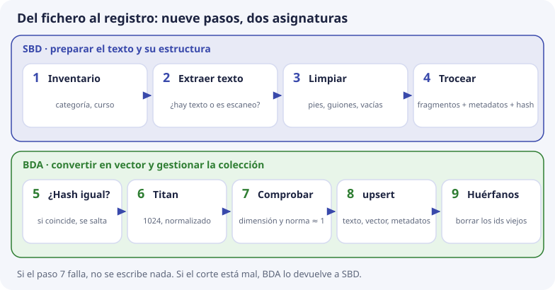

# El encargo de SBD y BDA

DocIA+ se evalúa con los instrumentos ordinarios de cada módulo. Esta página no sustituye a la programación: explica **qué trabajo concreto de la base vectorial corresponde a cada módulo, qué produce y en qué tema se aprende**.

## Los módulos, en una frase

| Módulo | Nombre | Qué aporta a DocIA+ |
| --- | --- | --- |
| **SBD** | Sistemas de Big Data | Gestionar datos de naturaleza diversa: convertir un montón de documentos distintos en fragmentos limpios y bien descritos |
| **BDA** | Big Data Aplicado | Procesar esos datos en el sistema donde viven: convertir los fragmentos en vectores, guardarlos en ChromaDB y mantenerlos |
| PIA | Programación de Inteligencia Artificial | Usar la base después: la API, la redacción de respuestas y el widget. No entra en esta unidad |

## El reparto, sobre el recorrido de un documento

Un documento llega a la base en nueve pasos ([tema 7](../01-bases-vectoriales/07-chunking-y-ciclo-de-indexacion.md)). Los cuatro primeros son de SBD y los cinco últimos de BDA:

Con el documento de ejemplo de la unidad, la oferta formativa del curso de especialización:

1. **SBD** lo anota en el inventario: categoría `g4`, curso `2026-2027`, identificador `oferta-iabd-2026`.
2. **SBD** extrae el texto del PDF y comprueba que no es un escaneo sin texto.
3. **SBD** lo limpia: quita el pie «IES Ataúlfo Argenta – Página 3» y el índice del PDF. En el [tema 9](../01-bases-vectoriales/09-calidad-y-fallos.md) se ve que un índice sin quitar baja el acierto y hace imposible el umbral.
4. **SBD** lo corta por secciones, sin partir «190 horas» por la mitad, y calcula los metadatos y el hash de cada fragmento.
5. **BDA** compara el hash con el guardado: si el texto no ha cambiado, no vuelve a pedir el vector.
6. **BDA** pide a Titan el vector de cada fragmento: 1024 números.
7. **BDA** comprueba que tiene 1024 números y longitud cercana a 1.
8. **BDA** lo escribe con `upsert`: `oferta-iabd-2026_000`, `oferta-iabd-2026_001`…
9. **BDA** borra los fragmentos de ese documento que ya no existen.

Si el corte del paso 4 está mal, BDA no lo arregla al calcular el vector: se lo devuelve a SBD.

## Sistemas de Big Data

El corpus del IES es **heterogéneo**: PDF, Word y páginas web, de varios departamentos, con fechas y versiones distintas. El resultado de aprendizaje que el proyecto ancla en SBD es el de gestionar y explotar datos de naturaleza diversa, y su criterio de evaluación central aquí es:

> **Definir metadatos, categorías y la estructura de la colección.**

Sin esos metadatos, la colección falla en tres cosas muy concretas:

| Sin… | No se puede… | Ejemplo |
| --- | --- | --- |
| `doc_id`, `titulo`, `pagina`, `seccion` | Citar la fuente | La respuesta dice «190 horas» pero no de dónde |
| `categoria` | Que cada grupo trabaje y revise su documentación | G4 no puede listar solo sus fragmentos |
| `curso`, `doc_id` | Borrar solo lo que ha caducado | La oferta de 2023 sigue saliendo junto a la de 2026 |

**Qué trabajo es de SBD:**

- extraer el texto de cada tipo de fichero y limpiarlo: cabeceras repetidas, páginas en blanco, índices, duplicados y documentos obsoletos ([tema 7](../01-bases-vectoriales/07-chunking-y-ciclo-de-indexacion.md));
- unificar fuentes distintas en un mismo formato de fragmento, cortando por la estructura del documento (tema 7);
- cerrar el esquema de metadatos, con los tipos correctos ([tema 6](../01-bases-vectoriales/06-metadatos-y-filtros.md));
- revisar con `get` que lo guardado es texto que se puede citar ([tema 8](../01-bases-vectoriales/08-operaciones-de-gestion.md)).

**Qué produce SBD:** el inventario de documentos de cada grupo, el esquema de metadatos cerrado y los fragmentos limpios de cada documento, con sus metadatos y su hash.

## Big Data Aplicado

En BDA el encargo es un **pipeline de procesamiento** sobre el sistema donde viven los datos: convertir los fragmentos en vectores y dejarlos guardados y al día en ChromaDB.

**Qué tiene que saber BDA al terminar la unidad:**

- qué entra y qué sale de un modelo de embeddings ([tema 2](../01-bases-vectoriales/02-embeddings.md));
- por qué el vector de la pregunta y el del documento tienen que salir del **mismo** modelo, con la **misma** dimensión y la **misma** normalización (temas 2 y 3);
- qué operaciones de escritura, consulta, actualización y borrado usa el pipeline, y cuáles fallan en silencio (tema 8);
- qué se rompe si se reindexa mal: identificadores inestables, vectores de otro modelo o fragmentos huérfanos (temas 7 y 8).

**Qué produce BDA:** los pasos 5 a 9 del pipeline, el procedimiento de actualización con su registro de cada ejecución (tema 8), y las copias de la base con una restauración probada ([tema 10](../01-bases-vectoriales/10-chromadb-en-docia.md)).

La otra mitad de BDA dentro del proyecto es un **cuadro de mando**: latencia, casos en que la base no encontró contexto suficiente y temas más consultados. Se aborda cuando la base ya recibe preguntas reales. Tendrá que respetar que DocIA+ no guarda las preguntas de los usuarios ni datos personales.

## Lo que se hace entre los dos

Algunas tareas no tienen sentido en un solo módulo:

| Trabajo | SBD | BDA | Tema |
| --- | --- | --- | --- |
| Esquema de metadatos | Propone los campos | Comprueba que ChromaDB los acepta: sin valores vacíos ni listas, fechas como número | 6 |
| Corte en fragmentos | Decide cómo se corta | Devuelve lo que no sirve | 7 |
| Conjunto de pruebas | Escribe las preguntas de su categoría, sin copiar el documento | Ejecuta las consultas | 9 |
| Medida y umbral | Revisa el texto cuando la medida falla | Calcula el recall@5 y el hueco para el umbral | 9 |

La medida es la que decide si el trabajo está bien: **más del 80 % de acierto con 3 a 5 fragmentos** (tema 9).

## Lo que queda fuera de estos dos módulos

| Pieza | Módulo que la lidera | Por qué no es el primer paso |
| --- | --- | --- |
| API FastAPI y estrategia fina de recuperación | PIA | Consulta una colección que primero hay que entender y llenar |
| Aplicar el umbral en cada respuesta | PIA | El valor sale de la medida de SBD y BDA |
| Redacción con Amazon Bedrock | PIA | No interviene en cómo se guardan los vectores |
| Widget en la web del IES | PIA, con revisión de la empresa colaboradora | Depende de la API |
| Servidor local del centro, fase final | Coordinación técnica | Llega cuando el sistema en la nube ya funciona |

## Criterio de «esto ya se entiende»

La unidad está asentada cuando un grupo puede explicar, sin leer los apuntes, estas ocho decisiones:

| Decisión | Tema |
| --- | --- |
| 1. Se guardan **fragmentos**, no documentos enteros | 7 |
| 2. Cada fragmento es un registro con identificador, texto, vector y metadatos | 5 |
| 3. La búsqueda ordena por **coseno** en el espacio de Titan Embeddings v2, con vectores normalizados. La distancia de ChromaDB es 1 − coseno | 3 |
| 4. La categoría es un **filtro**, no un vector más | 6 |
| 5. Actualizar un documento es un `upsert` de sus fragmentos y un borrado de los que ya no existen | 8 |
| 6. Cambiar de modelo de embeddings obliga a **crear otra colección** y reindexar | 2 y 10 |
| 7. La calidad se mide con preguntas escritas antes, como recall@5, y el umbral solo existe si hay hueco | 9 |
| 8. ChromaDB no se abre a internet: solo la API la consulta | 10 |

El [laboratorio](https://github.com/iesataulfoargentasor/DocIA-Plus/blob/main/laboratorio/README.md) comprueba la geometría y las operaciones con vectores escritos a mano, para no mezclar todavía el aprendizaje de la base de datos con el de la cuenta de AWS.

## Comprueba que lo has entendido

??? question "1. ¿Qué módulo decide cómo se corta un documento? ¿Y qué pasa si el corte está mal?"
    SBD. Si el corte está mal, BDA no lo puede arreglar al calcular el vector: se lo devuelve a SBD para que lo corrija.

??? question "2. ¿Por qué la limpieza del texto, que es de SBD, afecta a la medida de calidad?"
    Porque el ruido que queda se recupera como si fuera contenido. En el tema 9, un índice de PDF sin quitar bajaba el recall@1 de 4/4 a 3/4 y hacía imposible fijar un umbral.

??? question "3. Sin el metadato `curso`, ¿qué problema aparece?"
    No se pueden separar vigencias: la oferta de 2023 y la de 2026 se parecen igual a la pregunta y salen juntas. Tampoco se puede borrar solo lo caducado.

??? question "4. ¿Qué pasos del pipeline son de BDA?"
    Del 5 al 9: comparar el hash, pedir el vector a Titan, comprobar dimensión y longitud, escribir con `upsert` y borrar los fragmentos huérfanos.

??? question "5. ¿Quién escribe las preguntas del conjunto de pruebas y por qué no se sacan del propio buscador?"
    Las escribe quien conoce los documentos de su categoría, en SBD. Si se eligieran mirando lo que ya devuelve el buscador, siempre acertaría y la medida no serviría de nada.

??? question "6. ¿Aplicar el umbral en cada respuesta es trabajo de SBD o BDA?"
    Ninguno de los dos: lo aplica la API, que es de PIA. SBD y BDA miden y proponen el valor con el conjunto de pruebas.
