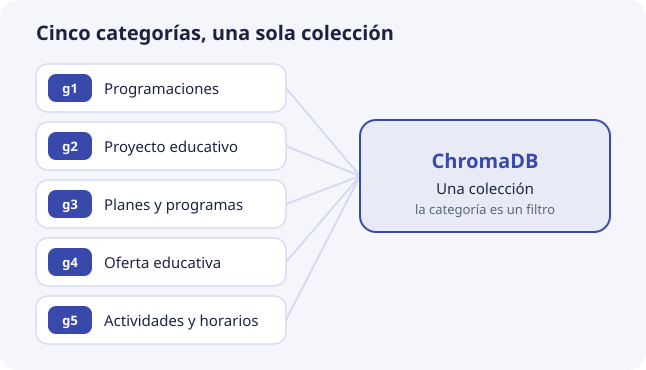
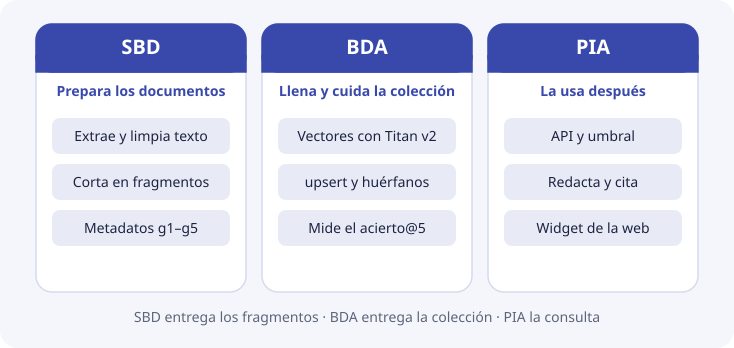

# Qué vamos a construir

Antes de entrar en la técnica, conviene tener claro el producto: quién va a usar DocIA+, qué verá, con qué documentos trabaja, qué piezas tiene y cuál de ellas nos toca en esta unidad.

## Qué verá quien lo use

DocIA+ es un asistente para consultar la documentación oficial del IES Ataúlfo Argenta. Lo usarán familias, alumnado y profesorado, desde la web del centro. Así sería una conversación:

> **Pregunta:** ¿Cuántas horas tiene el módulo de Big Data Aplicado?
>
> **Respuesta:** El módulo de Big Data Aplicado tiene una duración de 190 horas.
> *Fuente: oferta formativa del curso de especialización en IA y Big Data, 2026-2027.*

> **Pregunta:** ¿Hay beca de transporte este año?
>
> **Respuesta:** No tengo documentación suficiente para contestar a esa pregunta.

Son respuestas de ejemplo, pero muestran las tres cosas que DocIA+ tiene que hacer bien:

1. **Entender la pregunta aunque use otras palabras.** El documento dice «duración del módulo», no «cuántas horas tiene».
2. **Citar el documento de donde sale la respuesta**, para que la persona pueda comprobarla.
3. **Decir que no lo sabe** cuando la respuesta no está en los documentos, en lugar de inventarla.

## Por qué no basta un buscador

Un buscador por palabras falla en el punto 1. Si la persona escribe «¿cómo me matriculo?» y el PDF dice «procedimiento de formalización de matrícula», no hay palabras en común y no encuentra nada. Lo viste en [Inicio](../index.md) y se explica con detalle en el [tema 1](../01-bases-vectoriales/01-busqueda-literal-y-semantica.md).

Tampoco basta con preguntarle directamente a un modelo de lenguaje, como un chat de IA. Ese modelo no ha leído los documentos del IES: puede contestar con algo que suena bien pero es falso, y no puede citar de dónde lo saca. Falla en los puntos 2 y 3.

## Cómo lo consigue: primero buscar, después redactar

DocIA+ hace dos cosas seguidas, como quien hace un examen con el libro abierto:

1. **Buscar.** Primero localiza en los documentos los 3 a 5 trozos que hablan de lo que se pregunta. Cada trozo es de unos pocos párrafos y lo llamaremos **fragmento**. Es como marcar las páginas del libro que tratan el tema.
2. **Redactar.** Después, un modelo de lenguaje escribe la respuesta **usando solo esos fragmentos**, y dice de qué documento salen. Si en la búsqueda no apareció nada lo bastante parecido, DocIA+ contesta que no lo sabe.

Este diseño se llama **RAG**, de *Retrieval-Augmented Generation*: generación de texto apoyada en lo que se ha recuperado antes.

La **base de datos vectorial** es la que hace posible el paso 1. Guarda cada fragmento de documento junto con una lista de números que representa de qué habla, y dada una pregunta devuelve los fragmentos más parecidos. **Esta unidad trata de esa base.** El paso 2 lo construye más adelante el módulo de PIA.

## De qué documentos hablamos

Los documentos oficiales del centro se organizan en cinco categorías. Cada una es el encargo de un grupo de alumnos. Dentro de la base, la categoría se escribe con un código de `g1` a `g5`:

| Grupo | Código en la base | Categoría | Ejemplos de contenido |
| --- | --- | --- | --- |
| G1 | `g1` | Programaciones educativas | Programaciones didácticas, resultados de aprendizaje |
| G2 | `g2` | Proyecto educativo de centro | PEC, convivencia, criterios pedagógicos |
| G3 | `g3` | Planes y programas | Acción tutorial, orientación, igualdad, autoprotección |
| G4 | `g4` | Oferta educativa | Ciclos, módulos, duración, acceso, titulaciones |
| G5 | `g5` | Actividades, orientación y horarios | Calendario, horarios, actividades complementarias |

Las cinco categorías van a **una sola colección**, y la categoría es un dato más de cada fragmento, que sirve para filtrar cuando hace falta ([tema 6](../01-bases-vectoriales/06-metadatos-y-filtros.md)).

En los temas usaremos siempre tres documentos de ejemplo:

| Documento | Identificador | Categoría |
| --- | --- | --- |
| Oferta formativa del curso de especialización | `oferta-iabd-2026` | `g4` |
| Proyecto educativo de centro | `pec-2026` | `g2` |
| Calendario escolar | `calendario-2026` | `g5` |

## El objetivo, con números

El proyecto fija un objetivo que se puede comprobar:

| Objetivo | Qué significa | Dónde se trabaja |
| --- | --- | --- |
| Al menos **80 documentos** indexados | Convertidos en fragmentos con su vector y guardados en la base. Con unos 15 fragmentos por documento, unos 1.200 registros | [Tema 7](../01-bases-vectoriales/07-chunking-y-ciclo-de-indexacion.md) |
| Devolver los **3 a 5 fragmentos** más relevantes | Ni uno solo, que puede ser el equivocado, ni veinte, que son ruido | [Tema 4](../01-bases-vectoriales/04-busqueda-e-indices.md) |
| Precisión **por encima del 80 %** en pruebas controladas | En más de 8 de cada 10 preguntas de prueba, el documento correcto está entre esos 3 a 5 | [Tema 9](../01-bases-vectoriales/09-calidad-y-fallos.md) |

## Las piezas del sistema

| Pieza | Qué hace | Dónde se ve |
| --- | --- | --- |
| **Web del IES** | Recoge la pregunta y muestra la respuesta | PIA |
| **API** (FastAPI) | Coordina todo: pide el vector, consulta la base, decide si hay respuesta y pide la redacción | PIA, y [tema 10](../01-bases-vectoriales/10-chromadb-en-docia.md) |
| **Amazon Titan Embeddings v2** | Convierte un texto en una lista de 1024 números | [Tema 2](../01-bases-vectoriales/02-embeddings.md) |
| **ChromaDB** | La base de datos vectorial: guarda los fragmentos y devuelve los más parecidos | Temas 4 a 6 y 10 |
| **Indexador** | Lleva los documentos a la base: los trocea, pide sus vectores y los escribe | Temas 7 y 8 |
| **S3** | Almacén de AWS donde se guardan los documentos originales y las copias de la base | Temas 5 y 8 |
| **Amazon Bedrock** | El modelo de lenguaje que redacta la respuesta | PIA |

La API, ChromaDB y el indexador viven en la misma máquina de AWS, una instancia EC2 pequeña de 2 procesadores y 4 GB de memoria. Para unos 1.200 fragmentos sobra: la base entera ocupa unos 15 MB ([tema 10](../01-bases-vectoriales/10-chromadb-en-docia.md)).

## Dos fases del proyecto

1. **Fase en la nube.** Todo funciona en AWS, con Titan para calcular los vectores.
2. **Fase de servidor local.** Más adelante, los servicios pasan a un servidor del propio IES, y Titan puede sustituirse por un modelo que se ejecute en el centro.

El cambio de modelo de la fase 2 tiene una consecuencia que conviene saber desde ya: **hay que volver a calcular todos los vectores.** Cada modelo coloca los textos a su manera, y los números de dos modelos no se pueden comparar entre sí. En la práctica se crea una colección nueva y se reindexan los documentos desde los originales ([temas 2](../01-bases-vectoriales/02-embeddings.md) y [10](../01-bases-vectoriales/10-chromadb-en-docia.md)).

## Qué hace cada módulo

- **SBD** deja los documentos listos: extrae el texto, lo limpia, lo corta en fragmentos y decide qué datos acompañan a cada uno, como la categoría, el curso o la página (temas 5 a 7).
- **BDA** convierte esos fragmentos en vectores con Titan, los escribe en ChromaDB y mantiene la colección cuando los documentos cambian (temas 7 y 8). La medida de calidad del tema 9 la hacen SBD y BDA juntos.
- **PIA** usa después esa base: la API, el umbral para decir «no lo sé», la redacción con Bedrock y el widget de la web.

Si la base está mal diseñada, PIA no puede arreglarlo después: con fragmentos equivocados, la mejor redacción cita la cosa equivocada. El reparto detallado está en [El encargo de SBD y BDA](encargo-sbd-bda.md).

## Qué no se guarda

La base solo contiene **documentos del centro**. No se guardan las preguntas de los usuarios ni datos personales. La colección es un índice de documentación, no un registro de quién pregunta qué.

## Lo que esta unidad no implementa

La infraestructura de AWS, la API, el panel de administración y el chatbot de la web vienen después. Aquí el objetivo es que, cuando se abra ChromaDB de verdad, el grupo sepa:

- qué colección está creando y por qué la distancia es el coseno (temas 3 y 5);
- qué metadatos lleva cada fragmento y cómo se filtra por categoría y curso (tema 6);
- cómo se trocea un documento y cómo se actualiza cuando cambia (temas 7 y 8);
- cómo se comprueba que la búsqueda cumple el 80 % (tema 9).

## Comprueba que lo has entendido

??? question "1. ¿Qué tres cosas tiene que hacer bien DocIA+ con cada pregunta?"
    Entenderla aunque use palabras distintas a las del documento, citar el documento de donde sale la respuesta y decir que no lo sabe cuando la respuesta no está en los documentos.

??? question "2. ¿Por qué no basta con preguntar directamente a un modelo de lenguaje?"
    Porque no ha leído los documentos del IES: puede inventar una respuesta que suena bien y no puede citar la fuente. Por eso primero se buscan los fragmentos relevantes y el modelo redacta solo con ellos.

??? question "3. En el diseño RAG, ¿qué paso depende de la base de datos vectorial?"
    El primero, buscar: localizar los 3 a 5 fragmentos de documento más parecidos a la pregunta. La redacción es el segundo paso y la construye PIA.

??? question "4. Un documento del calendario escolar, ¿en qué categoría va y con qué código?"
    En la categoría de actividades, orientación y horarios, del grupo G5, con el código `g5`.

??? question "5. El proyecto pasa a un servidor del IES con otro modelo de embeddings. ¿Se pueden conservar los vectores calculados con Titan?"
    No. Los números de dos modelos no se comparan entre sí. Hay que crear otra colección y volver a calcular los vectores de todos los documentos desde los originales.

??? question "6. ¿Qué módulo corta los documentos en fragmentos y cuál los convierte en vectores?"
    SBD extrae, limpia y trocea, y define los metadatos. BDA calcula los vectores con Titan y los escribe en ChromaDB.
