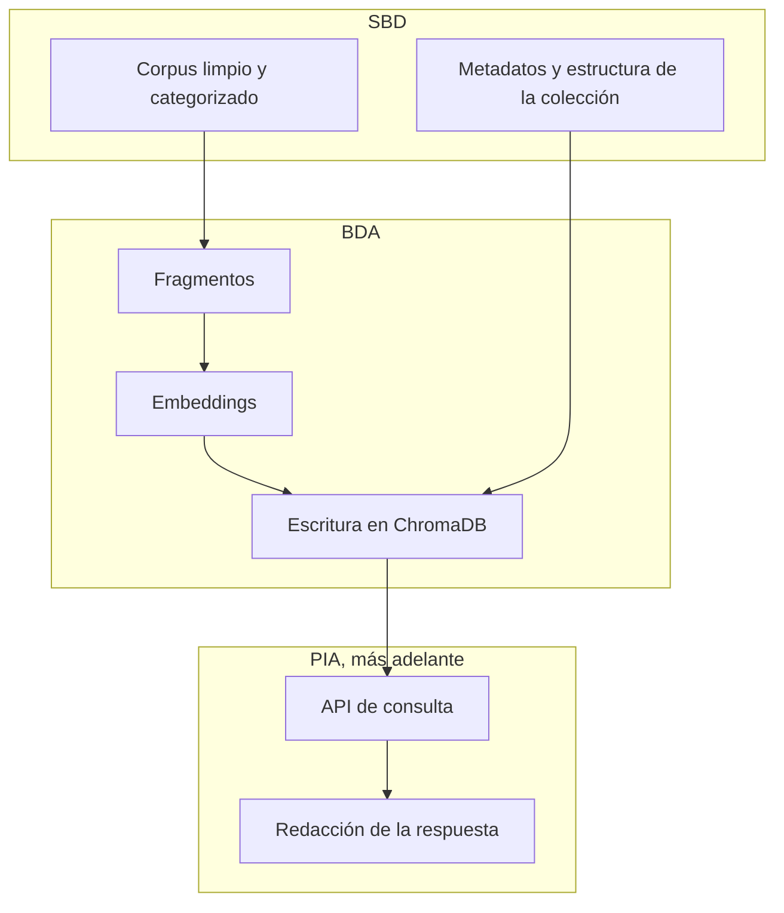

# Qué vamos a construir

DocIA+ es un asistente para consultar la documentación oficial del IES Ataúlfo Argenta. Una familia, un alumno o un docente escribe una pregunta con sus propias palabras y recibe una respuesta que **cita el documento de origen**.

El ejemplo que fija el proyecto es este tipo de pregunta:

> ¿Cuántas horas tiene el módulo de Big Data en el ciclo de IA y Big Data? ¿Puedo acceder con un grado medio?

Un buscador de palabras puede fallar esa pregunta si el PDF dice «duración del módulo» o «formalización de matrícula» y la persona no ha usado esas expresiones. DocIA+ no busca la frase literal: busca fragmentos de documento cercanos en significado y se los entrega a un modelo de lenguaje para que redacte la respuesta.

Ese diseño se llama **RAG** (*Retrieval-Augmented Generation*): primero se recupera evidencia, después se genera texto condicionado por esa evidencia. La base de datos vectorial es el almacén de la fase de recuperación.

## De qué documentos hablamos

El corpus previsto son los documentos oficiales del centro, organizados en cinco categorías. Cada categoría será el encargo de un grupo:

| Grupo | Categoría | Ejemplos de contenido |
| --- | --- | --- |
| G1 | Programaciones educativas | Programaciones didácticas, resultados de aprendizaje |
| G2 | Proyecto educativo de centro | PEC, convivencia, criterios pedagógicos |
| G3 | Planes y programas | Acción tutorial, orientación, igualdad, autoprotección |
| G4 | Oferta educativa | Ciclos, módulos, duración, acceso, titulaciones |
| G5 | Actividades, orientación y horarios | Calendario, horarios, actividades complementarias |

El objetivo verificable de la búsqueda semántica, en el propio proyecto, es:

- al menos **80 documentos** indexados con embeddings;
- ante una consulta, recuperar los **3 a 5 fragmentos** más relevantes;
- precisión de esa recuperación **por encima del 80 %** en pruebas controladas.

La base vectorial elegida en el proyecto es **ChromaDB**, alojada junto con la API en una instancia EC2. El modelo que convertirá texto en vectores en la fase cloud es **Amazon Titan Embeddings v2**. Más adelante, en la fase de servidor local del centro, ese modelo puede sustituirse por uno ejecutado en el propio IES. Esa sustitución obliga a **volver a calcular todos los vectores**: una colección no mezcla vectores de dos modelos distintos. Lo veremos en el tema de embeddings.

## Dónde encaja la base vectorial

SBD deja los documentos listos y define qué se guarda junto a cada vector. BDA convierte esos documentos en vectores y los persiste. PIA pregunta a esa base y compone la respuesta. Si la base está mal diseñada, la API solo puede devolver respuestas mal fundamentadas.

## Lo que esta unidad no implementa

La infraestructura AWS, la API, el panel de administración y el chatbot de la web vienen después. Aquí el objetivo es que, cuando abramos ChromaDB de verdad, el grupo sepa qué colección está creando, por qué el espacio de distancia es el coseno, qué metadatos son obligatorios y cómo se reindexa un documento que ha cambiado.
