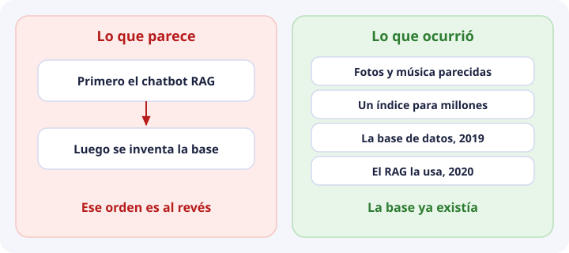
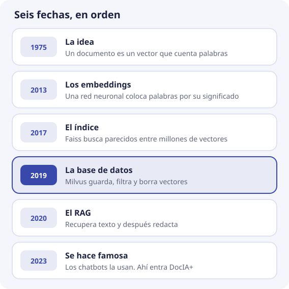
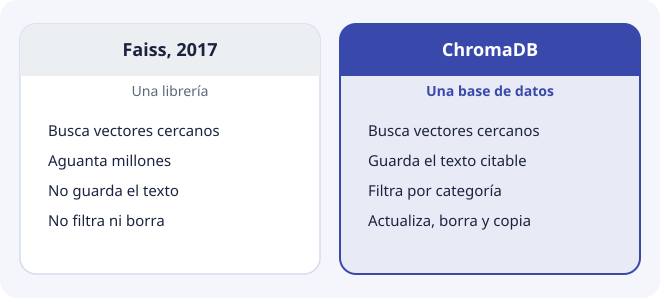

# Por qué existen las bases de datos vectoriales

Esta página viene después de la [sesión 1](sesion-01.md). Allí se ve el mapa y se imprime un vector. Aquí se responde cuándo apareció esta idea.

No nacieron para hacer un chatbot. El RAG, que es recuperar un fragmento y luego redactar la respuesta, llegó después y las hizo famosas. DocIA+ está en esa última etapa.

## Cinco fechas

**1975. La idea.** Gerard Salton describe el documento como un vector. Dos textos se parecen si el ángulo entre sus vectores es pequeño. Todavía no hay embeddings de una red neuronal ni una base de datos especializada. Sirve para buscadores de palabras.

**2017. El índice.** Ya hay millones de vectores: fotos, canciones, usuarios. Recorrerlos todos en cada búsqueda no da tiempo. Facebook publica Faiss para buscar parecidos a esa escala. El mismo año ya circula HNSW, el tipo de índice que usa ChromaDB. El artículo de Malkov y Yashunin es de 2016.

**2019. La base de datos.** Un índice busca. Una aplicación, además, tiene que guardar el texto, filtrar, borrar y hacer copias. Ese hueco es el producto. Milvus se publica en octubre de 2019. La expresión «base de datos vectorial» empieza entonces. El RAG todavía no es un producto de aula.

**2020. El RAG.** Patrick Lewis y colegas le ponen nombre: recuperar pasajes de un índice de vectores y, con esos pasajes, redactar. Usan un índice que ya existía. No inventan la base.

**2023. Se hace famosa.** A partir de ChatGPT, a finales de 2022, mucha gente quiere que un modelo conteste con sus propios documentos. El camino corto es un embedding más una base vectorial. Por eso en clase parece que la base nació para el chatbot. DocIA+ es de este momento.

## Un índice no es una base

Faiss resuelve la búsqueda. ChromaDB es lo que vamos a usar en el proyecto porque el fragmento tiene que seguir ahí, con su categoría, cuando el documento cambie.

## Qué nos importa en DocIA+

Con unos 1.200 fragmentos, mirarlos todos cabe en milisegundos. La base no es correcta por el índice. Es correcta si el fragmento, el modelo y los metadatos están bien. El índice existe porque otros trabajos buscan entre millones de vectores, y ChromaDB lo trae puesto.

El tema siguiente es el que DocIA+ sí tiene que resolver: una pregunta que no usa las mismas palabras que el documento.
