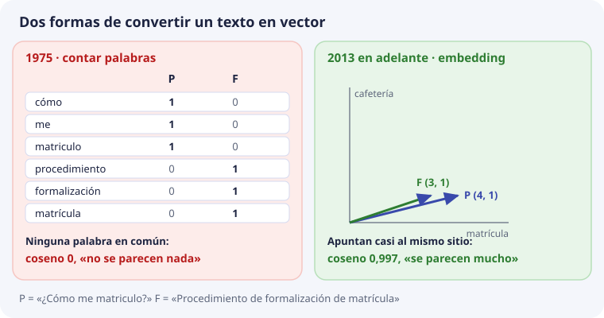

# Por qué existen las bases de datos vectoriales

Esta página viene después de la [sesión 1](sesion-01.md). Allí se vio que un texto se puede convertir en una lista de números y que una base como ChromaDB guarda esas listas y busca las más parecidas. Aquí se responde otra pregunta: **¿de dónde sale todo esto, y para qué se inventó?**

Conviene saberlo por una razón práctica. Hoy casi todo lo que se lee sobre bases vectoriales habla de chatbots, y parece que nacieron para eso. No es así. Cada pieza apareció para resolver un problema distinto, y entender qué problema resolvía cada una ayuda a saber cuál importa en DocIA+.


## Seis fechas


### 1975. La idea: un documento es un vector

Gerard Salton y su equipo proponen representar cada documento como una lista de números: **una posición por cada palabra del vocabulario**, con cuántas veces aparece. Dos documentos se parecen si sus vectores apuntan en direcciones parecidas, y eso se mide con el **coseno** del ángulo entre ellos. Es la misma cuenta del [tema 3](03-geometria-y-similitud.md), con 50 años.

Pero esos vectores cuentan palabras, no significados. Con la pregunta de siempre se ve el problema:



La pregunta P y el documento F no tienen **ninguna palabra en común** («matriculo» y «matrícula» son palabras distintas para quien cuenta). Todos los productos se anulan:

```text
P · F = 1·0 + 1·0 + 1·0 + 0·1 + 0·1 + 0·1 = 0      →   coseno 0
```

Para ese sistema, la pregunta y su respuesta no se parecen nada. Es el mismo fallo del `LIKE` del [tema 1](01-busqueda-literal-y-semantica.md), con vectores.

### 2013. Los embeddings: vectores que colocan por significado

Tomas Mikolov y su equipo, en Google, publican **word2vec**: una red neuronal que aprende a colocar cada palabra en un mapa leyendo muchísimo texto. Las palabras que aparecen en frases parecidas acaban cerca. Ya no hay una posición por palabra: hay unos cientos de números que nadie ha puesto a mano ([tema 2](02-embeddings.md)).

Poco después la idea se extiende de palabras a frases enteras. En 2019, Nils Reimers e Iryna Gurevych publican **Sentence-BERT**, de donde sale la librería `sentence-transformers` que usaste en la sesión 1. Titan, el modelo de DocIA+, pertenece a esta misma familia.

Con un embedding, P y F apuntan casi al mismo sitio: en los vectores de juguete del tema 1, coseno **0,997**. Ahora sí tiene sentido buscar por parecido.

### 2017. El índice: buscar entre millones

Con los embeddings, las empresas empiezan a tener millones de vectores: fotos, canciones, productos, usuarios. Comparar la pregunta con todos ellos en cada búsqueda es demasiado lento ([tema 4](04-busqueda-e-indices.md)):

```text
1.000.000 vectores × 1.024 números = unos 1.000 millones de multiplicaciones por pregunta
```

En 2017, Facebook publica **Faiss**, una librería para buscar los vectores más parecidos a esa escala sin compararlos todos. Por las mismas fechas se publica **HNSW** (Yury Malkov y Dmitry Yashunin, 2016), el tipo de índice que usa ChromaDB.

### 2019. La base de datos: guardar, filtrar y borrar

Un índice encuentra vectores cercanos, pero una aplicación necesita más: guardar el texto junto al vector, filtrar por categoría, actualizar un documento que ha cambiado, borrar lo caducado y hacer copias. Eso es lo que hace una base de datos.

En octubre de 2019 se publica como código abierto **Milvus**, uno de los primeros productos que se presentan como «base de datos vectorial». A partir de ahí aparecen otros. **ChromaDB**, la que usa DocIA+, nace más tarde, entre finales de 2022 y 2023.

### 2020. El RAG: recuperar y después redactar

Patrick Lewis y su equipo ponen nombre a una idea: para que un modelo de lenguaje conteste sobre unos documentos, **primero se recuperan los pasajes relevantes** de un índice de vectores y **después el modelo redacta** con ellos. Lo llaman RAG (*Retrieval-Augmented Generation*). Usan un índice que ya existía: no inventan la base.

### 2023. Se hace famosa

ChatGPT aparece a finales de 2022, y en 2023 muchas organizaciones quieren que un modelo conteste con **sus propios documentos**. El camino más corto es un RAG: embeddings, una base vectorial y un modelo que redacta. Por eso parece que la base nació para el chatbot. DocIA+ es de este momento.

## Un índice no es una base


| Necesidad de DocIA+ | Solo un índice, como Faiss | Una base, como ChromaDB | Tema |
| --- | --- | --- | --- |
| Encontrar los fragmentos más parecidos | Sí | Sí | 4 |
| Devolver el texto para citarlo | No: guarda vectores | Sí | 5 |
| Filtrar por categoría o curso | No por sí solo | Sí | 6 |
| Sustituir un documento que ha cambiado | Hay que programarlo aparte | `upsert` y `delete` | 8 |
| Seguir ahí tras reiniciar y hacer copias | Hay que programarlo aparte | Un directorio que se copia | 5 y 8 |

DocIA+ necesita las cinco filas. Por eso usa una base y no solo un índice.

## Qué pieza importa en DocIA+

Cada fecha resolvió un problema. En DocIA+ no pesan todos igual:

| Pieza | Problema que resolvió | ¿Es difícil en DocIA+? |
| --- | --- | --- |
| Vector y coseno (1975) | Medir parecido con números | No: es una cuenta |
| Embeddings (2013) | Que el parecido sea de significado | **Sí.** Si el modelo coloca mal los textos, nada funciona. Lo viste en la sesión 1 con el modelo en inglés |
| Índice (2017) | Buscar entre millones | No. Con 1.200 fragmentos, compararlos todos son 1.200 × 1.024 ≈ 1,2 millones de multiplicaciones, y ChromaDB responde en unos 13 ms (tema 10) |
| Base de datos (2019) | Guardar, filtrar, actualizar y borrar | **Sí.** Metadatos, identificadores y actualizaciones bien hechos son el trabajo de SBD y BDA (temas 5 a 8) |
| RAG (2020) | Redactar con los fragmentos | Es de PIA, más adelante |

La conclusión: **la base de DocIA+ no será buena por su índice, sino por sus fragmentos, su modelo y sus metadatos.** El índice viene puesto en ChromaDB porque otros sistemas buscan entre millones.

El tema siguiente empieza por el problema que DocIA+ sí tiene que resolver: una pregunta que no usa las mismas palabras que el documento.

## Comprueba que lo has entendido

??? question "1. ¿Las bases de datos vectoriales se inventaron para hacer chatbots?"
    No. El vector es de 1975, los embeddings de 2013, los índices para millones de vectores de 2017 y las bases de 2019. El RAG, de 2020, las usa, y los chatbots de 2023 las hicieron famosas.

??? question "2. Con el vector de Salton, que cuenta palabras, ¿qué coseno tienen «¿Cómo me matriculo?» y «Procedimiento de formalización de matrícula»? ¿Por qué?"
    0, porque no comparten ninguna palabra: «matriculo» y «matrícula» cuentan como palabras distintas. Contar palabras no captura el significado.

??? question "3. ¿Qué aportaron los embeddings de 2013 que no tenía el vector de 1975?"
    Que la posición del vector depende del significado, aprendido leyendo mucho texto, y no de qué palabras exactas aparecen. Así, textos con palabras distintas que dicen lo mismo quedan cerca.

??? question "4. ¿Qué diferencia hay entre Faiss y ChromaDB?"
    Faiss es un índice: encuentra vectores cercanos. ChromaDB es una base de datos: además guarda el texto, filtra por metadatos, actualiza, borra y persiste en disco.

??? question "5. ¿Por qué el índice HNSW no es el problema difícil de DocIA+?"
    Porque con unos 1.200 fragmentos la búsqueda es rápida incluso comparando con todos. Lo difícil es tener buenos fragmentos, un buen modelo y buenos metadatos.

??? question "6. ¿El RAG inventó la base de datos vectorial?"
    No. El trabajo que le puso nombre en 2020 usó un índice de vectores que ya existía. El RAG es una forma de usar la base, no su origen.
