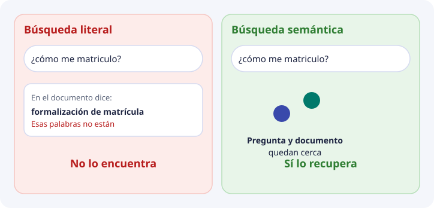
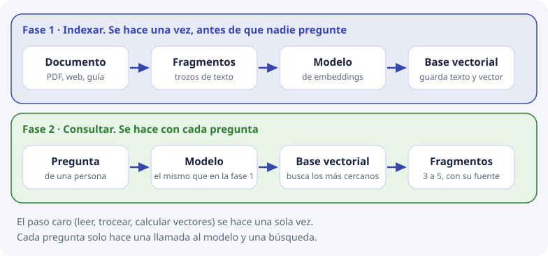

# 1. Búsqueda literal y búsqueda semántica

Este tema responde a una pregunta muy básica: **¿por qué hace falta un tipo nuevo de base de datos?** Si ya existen SQL, `grep` y los buscadores de palabras, ¿qué problema resuelve una base vectorial que ellos no resuelven?

La respuesta cabe en un ejemplo. Lo vamos a mirar despacio, veremos por qué fallan las herramientas de siempre, y después veremos la idea que las sustituye (y cuándo **no** las sustituye).

## Palabras que vamos a usar

Estas palabras aparecen en todos los temas. No hace falta memorizarlas ahora: vuelve a esta tabla cuando alguna se te olvide.

| Palabra | Qué es, en una línea |
| --- | --- |
| **Documento** | Un fichero completo: una guía, una programación didáctica, una página de la web |
| **Fragmento** | Un trozo de un documento (unos pocos párrafos). Es lo que realmente se busca |
| **Consulta o pregunta** | Lo que escribe la persona |
| **Embedding** | La posición de un texto en un «mapa de significado», escrita como una lista de números. Se ve en el [tema 2](02-embeddings.md) |
| **Vector** | Esa lista de números |
| **Similitud** | Cuánto se parecen dos textos, medido con sus vectores. Se ve en el [tema 3](03-geometria-y-similitud.md) |
| **Base de datos vectorial** | Un sistema que guarda fragmentos con sus vectores y devuelve los más parecidos a una pregunta |
| **RAG** | «Recuperar y luego redactar»: primero se buscan los fragmentos relevantes y después un modelo de lenguaje redacta la respuesta usándolos |

## El fallo que DocIA+ tiene que evitar

Una persona escribe esto en el chat del instituto:

> ¿cómo me matriculo en el ciclo de IA?

Y en la documentación del centro hay un texto que responde exactamente a eso, pero escrito así:

> Procedimiento de formalización de matrícula

Para una persona, los dos textos hablan de lo mismo. Pero **no comparten ninguna palabra útil**: uno dice «matriculo» y el otro «matrícula», y el resto ni se parece.



Y esto no es un caso raro. Le pasa todos los días a la documentación de un centro: programaciones, instrucciones de la Consejería, planes y la web no comparten un vocabulario único. Las familias, el alumnado y el profesorado preguntan con sus propias palabras, no con las del documento.

## Búsqueda literal: cómo funciona

La **búsqueda literal** (o por palabras) comprueba si unas letras aparecen escritas en el texto. Es lo que hacen:

- el `LIKE` de SQL;
- el comando `grep` de la terminal, o la búsqueda de un editor;
- las **expresiones regulares**, que son patrones de letras más flexibles;
- los buscadores por **índice invertido**, como Elasticsearch. Un índice invertido es como el índice alfabético del final de un libro: para cada palabra guarda en qué páginas aparece. Buscar una palabra es mirar en esa lista, y por eso es muy rápido.

Los cuatro tienen algo en común: comparan **letras**, no significado.

Vamos a probarlo con cuatro documentos de una tabla `fragmentos`:

| id | texto |
| --- | --- |
| 1 | Procedimiento de formalización de matrícula |
| 2 | Plazo de inscripción en el ciclo |
| 3 | Menú diario de la cafetería |
| 4 | Precio del bocadillo |

Y la pregunta «¿cómo me matriculo?». Probamos lo más natural:

```sql
SELECT id, texto FROM fragmentos
WHERE LOWER(texto) LIKE '%matriculo%';
```

Resultado: **ninguna fila**. La razón es doble: «matrícula» lleva tilde y termina en *a*, y «matriculo» no es un trozo de «matrícula». Un carácter distinto y la búsqueda ya no encuentra nada.

Se puede probar palabra por palabra, que es lo que hacen algunos buscadores:

| Palabra buscada | Filas que devuelve | Comentario |
| --- | --- | --- |
| `cómo` | ninguna | No aparece |
| `me` | **1** (la fila 3, «Menú diario de la cafetería») | Aparece dentro de «**Me**nú». Es una coincidencia sin ningún sentido |
| `matriculo` | ninguna | «matrícula» no lo contiene |

Así que la búsqueda literal falla de dos maneras a la vez:

1. **No encuentra lo que sí responde** (los documentos 1 y 2 hablan de matricularse y no salen).
2. **Encuentra lo que no responde** (sale el menú de la cafetería porque contiene las letras «me»).

### ¿Y si se arregla con sinónimos?

Se puede intentar remendar: una lista a mano que diga «matricularse = formalizar la matrícula = inscribirse», o reglas que recorten las palabras a su raíz («matriculo» → «matricul»). Ayuda en casos concretos, pero hay que **mantenerla a mano** y nunca termina: cada tema del centro tiene sus propias formas de decir las cosas, y nadie va a escribir la lista de todas.

## Qué sí resuelve bien la búsqueda literal

Conviene decirlo para no tirar una herramienta útil. La búsqueda por palabras es la opción correcta cuando:

- la persona conoce el identificador exacto: un código de módulo, un número de resolución, el nombre propio de un plan;
- hay que encontrar una cadena exacta, por ejemplo `CVE-2026-4540`;
- el corpus es tan pequeño que una persona puede abrir el fichero y leerlo.

DocIA+ no sustituye ese caso. Lo que no cubre es la pregunta formulada con otras palabras, que es la mayoría de las preguntas de la comunidad educativa.

## Búsqueda semántica: la idea

**Semántica** significa «del significado». La búsqueda semántica no compara letras. Compara **de qué habla cada texto**.

Para poder hacerlo, un modelo convierte cada texto en un punto de un mapa (esto es el embedding del tema 2), de manera que **los textos que hablan de lo mismo quedan cerca**. «Matricularse» y «formalizar la matrícula» caen en la misma zona. «Menú de la cafetería» cae en otra.

Buscar pasa a ser una pregunta de geometría: **¿qué puntos están más cerca del punto de la pregunta?**

Con el mismo ejemplo y dos ejes de juguete (cuánto habla de matrícula, cuánto habla de cafetería), el resultado sería este:

| Puesto | Texto | Parecido con la pregunta (de 0 a 1) |
| --- | --- | --- |
| 1 | Procedimiento de formalización de matrícula | 0,997 |
| 2 | Plazo de inscripción en el ciclo | 0,970 |
| 3 | Menú diario de la cafetería | 0,471 |
| 4 | Precio del bocadillo | 0,243 |

Ahora los dos textos que responden salen los primeros, sin repetir ni una palabra de la pregunta, y el menú de la cafetería queda por detrás. Esos números son de juguete y se calculan a mano en el [tema 3](03-geometria-y-similitud.md); con un modelo real serían 1024 números por texto, pero la idea es idéntica.

## Cómo se organiza: dos fases

Una duda habitual es si hay que calcular todo en cada pregunta. No. El trabajo se reparte en dos fases:



**Fase 1: indexar.** Se hace una vez (y otra vez solo cuando un documento cambia).

1. El documento se parte en **fragmentos**. No se busca en el documento entero porque un solo vector de un documento largo sería una media de muchos temas. Cómo cortar bien se estudia en el [tema 7](07-chunking-y-ciclo-de-indexacion.md).
2. Un modelo de embeddings convierte **cada fragmento** en un vector.
3. La base guarda, juntos, el texto del fragmento, su vector y sus metadatos (categoría, fuente, fecha).

**Fase 2: consultar.** Se hace con cada pregunta.

4. **El mismo modelo** convierte la pregunta en un vector. Tiene que ser el mismo, porque si no los mapas no coinciden.
5. La base devuelve los fragmentos cuyos vectores están más cerca del de la pregunta.
6. Esos fragmentos, no el documento entero, son la evidencia que recibe el modelo que redacta la respuesta. Este último paso es el **RAG** (recuperar y luego redactar).

Los pasos 3 y 5 son el trabajo de almacenamiento y búsqueda que estudia esta unidad. El paso 6 ya no es una base de datos: es la generación de texto, y en el proyecto la hace otro componente.

## Por qué no basta una tabla SQL clásica

Una tabla relacional (MySQL, PostgreSQL…) es excelente para lo que hace: guarda filas, y permite **filtrar con condiciones exactas** sobre columnas.

```sql
SELECT texto FROM fragmentos
WHERE fuente = 'guia_matricula.pdf' AND fecha > '2025-09-01';
```

Esas columnas (fuente, fecha, categoría) las vamos a seguir necesitando, con el nombre de **metadatos** ([tema 6](06-metadatos-y-filtros.md)). Lo que una tabla clásica no hace es **ordenar por parecido de significado**: no tiene ningún operador que responda «dame las filas cuyo texto se parezca más a esta pregunta».

Se podría guardar el vector como una columna de números y, en cada consulta, recorrer todas las filas calculando el parecido con la pregunta y quedarse con las mejores. Con el tamaño inicial de DocIA+ eso incluso funciona, y lo cuantificaremos en el [tema 4](04-busqueda-e-indices.md). Es, de hecho, una búsqueda vectorial: solo que el «índice» es recorrerlo todo.

Una **base de datos vectorial** es el sistema que trata esa operación como algo de primera clase, junto con el texto y los metadatos del fragmento. Esta tabla resume las diferencias:

| | Tabla SQL clásica | Buscador de palabras (índice invertido) | Base de datos vectorial |
| --- | --- | --- | --- |
| Qué compara | Valores exactos de columnas | Palabras escritas | Vectores (significado) |
| Encuentra «matriculo» al buscar «formalización de matrícula» | No | Solo con sinónimos hechos a mano | Sí, si el modelo los colocó cerca |
| Filtra por categoría o fecha | Sí | Sí | Sí, con metadatos |
| Devuelve un orden de parecido | No | Un orden por frecuencia de palabras | Sí, por cercanía de significado |
| Ejemplos | MySQL, PostgreSQL | Elasticsearch, `grep` | ChromaDB, Qdrant, Milvus |

Aviso para que no te líes: existen extensiones que dan capacidad vectorial a bases clásicas, como **pgvector** para PostgreSQL. Por eso el vídeo de más abajo usa PostgreSQL. La idea es la misma; en DocIA+ usamos ChromaDB.

## ¿Se sustituye una por otra o se combinan?

Se combinan. En DocIA+:

- La **búsqueda semántica** localiza los fragmentos que hablan de lo que se pregunta.
- Los **metadatos** filtran antes de buscar, por ejemplo «solo oferta educativa» (tema 6).
- La búsqueda **literal** sigue siendo la herramienta para cuando la persona da un código exacto, porque un embedding puede tratar dos códigos parecidos como casi iguales.

## Para verlo

[Dónde y cuándo generar los embeddings](https://www.youtube.com/watch?v=HHr96KF4fWQ), de CodelyTV. El arranque del vídeo es el mismo fallo de esta página: una tabla de cursos responde a `LIKE '%CSS%'`, y no responde a «¿dónde se enseñan las bases de la programación backend?» si esas palabras no están escritas. A partir de ahí enseña la búsqueda por embeddings: la pregunta se convierte en un vector y la tabla se ordena por cercanía.

La base del vídeo es PostgreSQL, no ChromaDB. El operador que escriben en la consulta no es el nuestro. Lo que hay que quedarse es la comparación: la búsqueda clásica encuentra la cadena; la semántica ordena por parecido.

El resto del vídeo compara en qué momento del programa se calcula el vector (al guardar, o más tarde, en la aplicación o dentro de PostgreSQL). En DocIA+ esa decisión ya está tomada y es simple: el vector del fragmento se calcula al indexar y se vuelve a calcular si el texto cambia. El de la pregunta se calcula al consultar, con el mismo modelo, y no se guarda.

## Lo que la semántica no garantiza

**Cercanía no es verdad.** La base devuelve lo que más se parece, y lo más parecido no siempre es lo correcto. Dos ejemplos:

- Un fragmento **desactualizado** («el plazo de matrícula es en junio») puede ser el más parecido a la pregunta y estar mal, porque este curso el plazo cambió. Para el embedding, el texto viejo y el nuevo hablan de lo mismo.
- Un **índice o una portada** contiene palabras de todos los temas, y puede parecerse un poco a muchas preguntas distintas.

Por eso el proyecto exige **cita de la fuente** y una precisión medida en pruebas controladas, no la confianza de que «la IA ya lo encontrará».

La base vectorial solo devuelve **candidatos ordenados**. Decidir si bastan para responder, y redactar sin inventar lo que no está en ellos, es una capa distinta. Si la capa de candidatos falla, la de redacción no tiene de dónde citar.

## Consecuencia para DocIA+

El indicador del proyecto no es «el chatbot contesta bonito». Es este: ante una pregunta de prueba cuya respuesta sabemos en qué documento está, los 3 a 5 fragmentos recuperados **incluyen ese documento**. Esa medida se define en el [tema 9](09-calidad-y-fallos.md). Todo lo que hay en medio (modelo, distancia, fragmentación, metadatos) existe para que esa medida salga bien.

## Comprueba que lo has entendido

??? question "1. Con `LIKE '%matriculo%'`, ¿por qué no sale «Procedimiento de formalización de matrícula»?"
    Porque `LIKE` compara letras, y «matriculo» no es un trozo de «matrícula» (cambian la tilde y la última letra). No mira el significado. Los dos textos hablan de lo mismo, pero no comparten esas letras.

??? question "2. ¿Por qué buscar `me` devuelve el menú de la cafetería?"
    Porque la búsqueda literal encuentra las letras «me» dentro de «Menú». No distingue una palabra suelta de un trozo de otra palabra. Es un ejemplo de que la búsqueda literal puede devolver cosas sin relación.

??? question "3. ¿En qué fase se calcula el vector de un fragmento, y en cuál el de la pregunta?"
    El del fragmento, en la fase 1 (indexar), una vez y se guarda. El de la pregunta, en la fase 2 (consultar), con cada pregunta, con el mismo modelo, y no se guarda.

??? question "4. ¿Por qué la pregunta tiene que pasar por el mismo modelo que los fragmentos?"
    Porque cada modelo tiene su propio mapa. Si el fragmento se colocó en un mapa y la pregunta en otro, comparar sus posiciones no significa nada.

??? question "5. Da un caso en el que la búsqueda literal sea mejor que la semántica."
    Cuando se busca un identificador exacto: un código de módulo, un número de resolución, `CVE-2026-4540`. Un embedding puede considerar casi iguales dos códigos parecidos; la búsqueda literal solo devuelve el exacto.

??? question "6. La base devuelve un fragmento muy parecido a la pregunta. ¿Se puede asegurar que la respuesta es correcta?"
    No. Cercanía no es verdad: puede ser un fragmento desactualizado. Por eso el proyecto exige citar la fuente y medir la precisión con preguntas de prueba.
