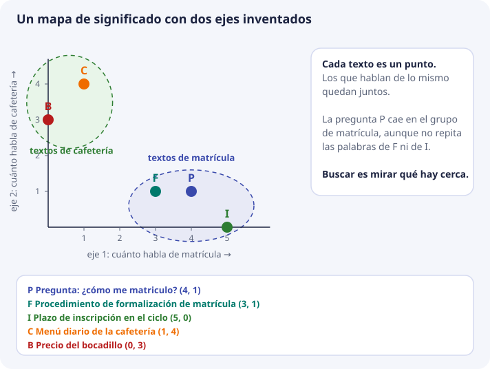
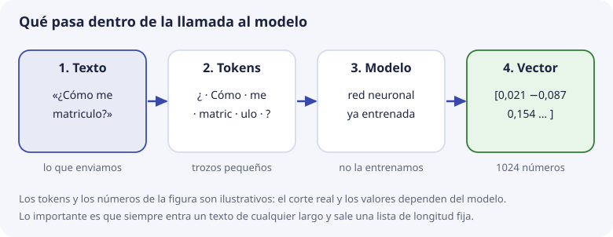
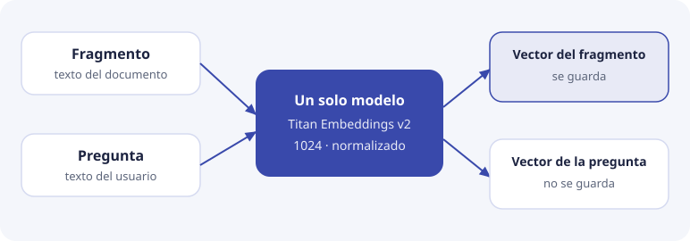
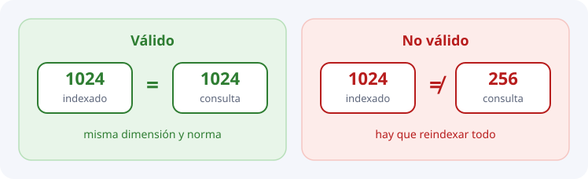

# 2. Embeddings

En el tema 1 vimos que buscar por significado necesita algo que la búsqueda literal no tiene: una forma de saber que «matrícula» e «inscripción» hablan de lo mismo. Este tema explica **qué es ese algo**. Se llama embedding y, una vez entendido, todo lo demás de la unidad (bases vectoriales, ChromaDB, el pipeline de DocIA+) es consecuencia.

Vamos por partes: primero la idea con un mapa que se pueda dibujar, luego cómo se pasa a los 1024 números reales, luego qué hace el modelo por dentro y, al final, las decisiones concretas de DocIA+.

## El problema: los ordenadores solo entienden números

Un ordenador no sabe qué significa «matrícula». Sabe comparar cadenas de letras: si dos cadenas son iguales o distintas. Por eso `LIKE '%matrícula%'` no encuentra «formalización de inscripción», aunque una persona vería que hablan de lo mismo.

Para que un programa pueda decir «estos dos textos se parecen», hay que convertir cada texto en **algo con lo que se pueda calcular**: números. Y hay que hacerlo de una manera especial: **que los textos con significado parecido acaben con números parecidos**.

Ese proceso de convertir un texto en una lista de números que conserva su significado es lo que se llama **crear un embedding** (en español, «incrustación», aunque se usa la palabra inglesa). La lista de números es el **vector** del texto.

## La idea con un mapa

Piensa en cómo se dice dónde está una ciudad: con dos números, la latitud y la longitud. Dos ciudades con números parecidos están cerca. Con solo dos números tienes un **mapa**.

Con el significado se puede hacer lo mismo. Imagina un mapa cuyo primer eje mide **cuánto habla un texto de matrícula** y cuyo segundo eje mide **cuánto habla de cafetería**. Cada texto es un punto en ese mapa:

| Letra | Texto | Eje 1: matrícula | Eje 2: cafetería |
| --- | --- | --- | --- |
| P | Pregunta: «¿Cómo me matriculo?» | 4 | 1 |
| F | Procedimiento de formalización de matrícula | 3 | 1 |
| I | Plazo de inscripción en el ciclo | 5 | 0 |
| C | Menú diario de la cafetería | 1 | 4 |
| B | Precio del bocadillo | 0 | 3 |



Mira lo que ha pasado:

- Los textos de matrícula (P, F, I) han quedado **juntos**, y los de cafetería (C, B), en otra zona.
- La pregunta P y el plazo de inscripción I **no comparten ninguna palabra**, y aun así están cerca. La cercanía viene del significado, no de las letras.
- Buscar es ahora una tarea de geometría: «dame los puntos más cercanos a P». Cómo se mide esa cercanía es el [tema 3](03-geometria-y-similitud.md).

Un **embedding** es exactamente esto: la posición de un texto en un mapa de significado. El vector `(4, 1)` es «4 en matrícula, 1 en cafetería».

## De 2 ejes a 1024

Este mapa de dos ejes es un invento de clase. Lo hemos hecho con dos ejes porque se puede dibujar. Un modelo real hace lo mismo con muchos más:

| | Mapa de juguete | Modelo pequeño (sesión 1) | Titan en DocIA+ |
| --- | --- | --- | --- |
| Ejes o componentes | 2 | 384 | 1024 |
| ¿Tienen nombre? | Sí, los pusimos nosotros | No | No |

Hay tres diferencias con el mapa de juguete que conviene tener claras:

1. **Nadie decide qué mide cada eje.** En el mapa de clase elegimos «matrícula» y «cafetería». En un modelo real los ejes los descubre el propio modelo durante su entrenamiento, y no tienen un nombre que se pueda leer. No tiene sentido preguntar «¿qué significa la componente 37?». El significado está en el **conjunto**: en dónde cae el punto respecto a los demás puntos.
2. **Más ejes, más matices.** Con dos ejes solo distingues «matrícula» de «cafetería». Con cientos de ejes puedes distinguir «matrícula de un ciclo formativo» de «matrícula de bachillerato», «plazo» de «requisito», o un tono formal de otro.
3. **No se puede dibujar**, pero las cuentas son las mismas que con dos. Un punto con 1024 números sigue teniendo vecinos más cercanos y más lejanos.

## Cómo sabe el modelo dónde colocar cada texto

El modelo de embeddings es un programa (una red neuronal) que **ya viene entrenado**. En DocIA+ no lo entrenamos: lo usamos, igual que usarías una calculadora sin construirla.

Para entender de dónde saca su criterio, basta esta idea del entrenamiento: el modelo ha leído una cantidad enorme de texto y ha ido ajustándose para que **las palabras y frases que aparecen en contextos parecidos reciban números parecidos**. Compara estas dos frases:

```text
Para ____ en el ciclo tienes que presentar el DNI.
Para hacer la ____ en el ciclo tienes que presentar el DNI.
```

En el hueco pueden aparecer «matricularte», «inscribirte», «formalizar la matrícula». Esas palabras aparecen en los mismos sitios, con las mismas palabras alrededor. El modelo aprende que son intercambiables y las coloca en zonas cercanas del mapa. «Cafetería» aparece en otros contextos («el menú de la ____», «cerrada los lunes») y queda en otra zona.

Dos consecuencias importantes:

- **Lo que el modelo sabe es lo que ha visto al entrenarse.** Conoce el español general. No conoce las siglas internas del IES ni un procedimiento inventado la semana pasada.
- **El mismo texto siempre da el mismo vector**, si el modelo y las opciones son los mismos. No hay azar. Si hoy el texto da un vector y mañana otro, es que algo ha cambiado en el modelo o en su configuración.

## Qué pasa dentro de la llamada

Cuando el pipeline envía un fragmento al modelo pasan cuatro cosas:



1. **Texto.** Entra una cadena ya limpia. Un fragmento, no un PDF binario.
2. **Tokens.** El modelo no lee letra a letra ni palabra a palabra, sino en trozos llamados **tokens**. Una palabra corta y frecuente suele ser un token. Una palabra larga o rara se parte en varios («matriculo» podría ser «matric» + «ulo»). En español, como orden de magnitud, cada palabra ocupa entre 1 y 2 tokens.
3. **Modelo.** La red neuronal combina los tokens teniendo en cuenta el orden y el contexto. Por eso «el banco de la plaza» y «el banco de la esquina, que da hipotecas» dan vectores distintos aunque compartan palabras.
4. **Vector.** Sale una lista de números reales, siempre de la misma longitud.

Lo más importante está en el último paso: **da igual que el texto sea una palabra o dos párrafos: siempre sale un vector con el mismo número de componentes**. Un fragmento largo no da un vector más largo. Da un vector que resume, en esos 1024 números, de qué habla el texto entero.

Ese número fijo de componentes es la **dimensión**. Si el modelo devuelve dimensión 1024, todos los vectores de la colección tienen 1024 componentes. No se puede meter uno de 768 al lado de uno de 1024.

## Dos usos del mismo modelo

En DocIA+ el modelo se llama en dos momentos distintos:

- **Embedding de documento.** Se calcula una vez, al indexar cada fragmento, y se guarda en la base.
- **Embedding de consulta.** Se calcula cuando llega una pregunta y sirve solo para buscar. El proyecto no guarda la pregunta ni datos de quien la hace.



Los dos tienen que pasar por **el mismo modelo con las mismas opciones**. Piensa en un mapa dibujado por un cartógrafo y otro mapa distinto dibujado por otro: si marcas un punto en uno y buscas el vecino en el otro, las posiciones no significan nada. Lo mismo con la dimensión:



## Para verlo

[Qué son las búsquedas semánticas y los embeddings](https://www.youtube.com/watch?v=5rvUTeb0be4), de CodelyTV. Coloca gatos y perros en un eje, luego añade el color y luego la velocidad. Cada eje nuevo es una dimensión más. Después pasa un texto por un modelo de embeddings y busca los puntos más cercanos. Es la misma idea del mapa de este tema, contada con animales.

Tres avisos para no mezclarlo con el proyecto:

- En el vídeo la base es PostgreSQL. En DocIA+ es ChromaDB. La idea del mapa es la misma.
- Un eje del dibujo significa «color» o «tipo de animal» porque lo han puesto ellos para poder verlo. En un embedding real, como dice el propio vídeo al llegar a cientos de números, un eje suelto no tiene nombre. En la sesión 1 el modelo pequeño devuelve 384 números. Titan, en el proyecto, devuelve 1024.
- La resta «perro negro menos perro más gato» es un dibujo. Con las frases del centro no va a fabricar una frase nueva.

Para ver un embedding real, sin dibujo, abre el [cuaderno de la sesión 1](sesion-01.md): calcula los 384 números de varias frases y comprueba que las que hablan de lo mismo quedan más cerca.

## No es un resumen, ni un cifrado, ni un hash

Es fácil confundir el embedding con otras cosas que también «convierten un texto en otra cosa». Esta tabla las separa:

| Técnica | Qué produce | ¿Sirve para buscar por significado? |
| --- | --- | --- |
| **Resumen** | Otro texto, más corto | No es un número con el que se pueda calcular cercanía |
| **Cifrado** | El mismo contenido ilegible, que se puede descifrar | No. Se diseña para que no se pueda comparar |
| **Hash** (como SHA-256) | Un código fijo del texto | No. Cambiar una letra cambia el resultado por completo |
| **TF-IDF** (bolsa de palabras) | Un número por cada palabra del vocabulario, según cuánto aparece | Solo si comparten palabras |
| **Embedding denso** | Unos cientos de números que sitúan el texto en un mapa de significado | Sí, dentro de lo que el modelo haya aprendido |

**TF-IDF**, que verás en SBD, cuenta palabras: da más peso a las que aparecen mucho en un documento y poco en los demás. Sigue siendo muy útil para explorar un corpus: ver los términos dominantes o detectar documentos casi duplicados. Pero no resuelve «matrícula» frente a «formalización de matrícula» si no comparten palabras. El embedding denso sí puede, porque el modelo ha visto esas formulaciones en contextos parecidos durante el entrenamiento.

Un hash del texto sí lo usaremos en DocIA+, pero con otro fin: como **metadato de control** para saber si un fragmento ha cambiado y hay que recalcular su vector. El hash no se consulta por similitud.

## El modelo elegido en el proyecto

En la fase cloud, DocIA+ usa **Amazon Titan Text Embeddings v2**, que se invoca a través de Bedrock (el servicio de AWS para usar modelos). Estas propiedades condicionan el diseño y hay que volver a leerlas en la ficha oficial del modelo el día que se abra la cuenta:

**Dimensión: 256, 512 o 1024.** El valor por defecto es 1024, y es el que usa DocIA+. Más dimensiones dan más matiz, pero ocupan más. Cada número ocupa normalmente 4 bytes, así que un vector de 1024 componentes pesa unos 4 KB y uno de 256, 1 KB. Como ejemplo, con fragmentos de unos 500 tokens, los 5 millones de tokens de la indexación inicial son unos 10.000 fragmentos: unos 40 MB de vectores con 1024 dimensiones. Es poco, así que bajar a 512 o 256 no es una necesidad de espacio. Solo se haría si midiendo la calidad de la búsqueda no se pierde precisión, nunca por costumbre.

**Entrada máxima: en el orden de 8.192 tokens.** Son unas páginas de texto. Si un fragmento la supera, se trunca o se rechaza, y el vector deja de representar el final del texto. Por eso el fragmentado del [tema 7](07-chunking-y-ciclo-de-indexacion.md) tiene que dejar los fragmentos holgadamente por debajo.

**Normalización: longitud 1.** Con la opción activada, cada vector mide exactamente 1. Eso simplifica la similitud, como verás en el tema 3: el producto escalar coincide con el coseno. La colección se creará dando por hecho vectores normalizados, y el pipeline no debe mezclar llamadas con la normalización activada y desactivada.

**Idiomas.** Cubre varios idiomas, incluido el español. Aun así, un texto lleno de códigos, tablas rotas o guiones de un PDF mal extraído produce un vector pobre. El modelo no arregla una mala extracción: eso es trabajo de SBD **antes** de llamar al modelo.

El proyecto presupuesta del orden de unos pocos euros al mes para esta partida. La tarifa concreta se confirma en AWS al implementar. No es el coste dominante: lo será la redacción de respuestas, que no forma parte de esta unidad.

## La llamada, en esquema

Cuando BDA escriba el pipeline, cada fragmento se enviará al modelo y la respuesta será el vector que se inserta en ChromaDB. En esquema, sin SDK todavía:

```text
entrada:  texto del fragmento
modelo:   amazon.titan-embed-text-v2:0
opciones: dimensión 1024, normalizar
salida:   lista de 1024 números, longitud del vector ≈ 1
```

La misma llamada, con las mismas opciones, se usa para la pregunta del usuario cuando consulta. Si alguien indexa con dimensión 1024 y consulta con dimensión 512, la búsqueda no es válida.

## El mismo texto, otro modelo, otro espacio

Un embedding **no es una propiedad del texto**. Es una propiedad del trío (texto, modelo, opciones). Dos modelos distintos colocan el mismo párrafo en mapas que no se pueden comparar, igual que las coordenadas de un mapa de Madrid no valen en un plano de Barcelona.

Esto condiciona la fase final del proyecto. Cuando los servicios pasen al servidor local del centro y Titan se sustituya por un modelo local, hay que:

1. generar de nuevo el vector de cada fragmento con el modelo nuevo;
2. construir una colección nueva (la dimensión y la geometría pueden cambiar);
3. repetir las pruebas de recuperación antes de dar por buena la sustitución.

No existe una conversión fiable de «vector Titan» a «vector del modelo local» que ahorre esa reindexación. Por eso en cada registro guardamos el **texto original**, no solo el vector: el vector se puede tirar y recalcular; el texto, si no está, no se recupera.

## Qué no hace el modelo de embeddings

- **No redacta la respuesta.** Solo coloca textos en un mapa. Redactar es trabajo de otro modelo, en otra unidad.
- **No cita ni decide si un fragmento está vigente.** Un procedimiento derogado se parece igual que uno vigente.
- **No aplica filtros.** «Solo oferta educativa» es un metadato con un `where`, tema 6.
- **No inventa lo que no está.** Solo puede acercar la pregunta a texto que se ha guardado. Si esperas que «entienda el organigrama del IES» más allá de lo que dicen los documentos indexados, el sistema inventará huecos.
- **Es flojo con los detalles finos.** «El plazo termina el 15» y «el plazo termina el 25» dan vectores casi iguales, porque hablan de lo mismo. Y «se puede matricular» y «no se puede matricular» también quedan muy cerca. El embedding sirve para **encontrar** el fragmento correcto, y luego hay que **leerlo** para ver lo que dice exactamente.

## Comprueba que lo has entendido

??? question "1. ¿Qué es un embedding, dicho en una frase?"
    La posición de un texto en un mapa de significado, escrita como una lista de números. Textos que hablan de lo mismo quedan con números parecidos.

??? question "2. La pregunta «¿cómo me matriculo?» y el texto «plazo de inscripción» no comparten palabras. ¿Por qué pueden estar cerca?"
    Porque el modelo, en su entrenamiento, ha visto «matricularse» e «inscribirse» en contextos parecidos y las coloca en la misma zona del mapa. La cercanía viene del significado, no de las letras.

??? question "3. ¿Qué significa la componente 37 de un vector de Titan?"
    Nada que se pueda leer por sí sola. Los ejes los descubre el modelo al entrenarse y no tienen nombre. El significado está en la posición del punto respecto a los demás.

??? question "4. Un fragmento tiene tres palabras y otro tiene tres páginas. ¿Qué dimensión tiene cada vector?"
    La misma, 1024 en DocIA+. El modelo siempre devuelve el mismo número de componentes, sea cual sea la longitud del texto.

??? question "5. Se indexa con Titan a 1024 dimensiones y se cambia a 512 para consultar. ¿Qué pasa?"
    Que la búsqueda deja de ser válida: los dos vectores no viven en el mismo espacio. Para cambiar la dimensión hay que reindexar todos los fragmentos con esa opción.

??? question "6. ¿Por qué guardamos el texto original además del vector?"
    Porque el vector depende del modelo. Si cambiamos de modelo hay que recalcular todos los vectores, y para eso hace falta el texto. Además, la respuesta a la persona se redacta con el texto, no con los números.
