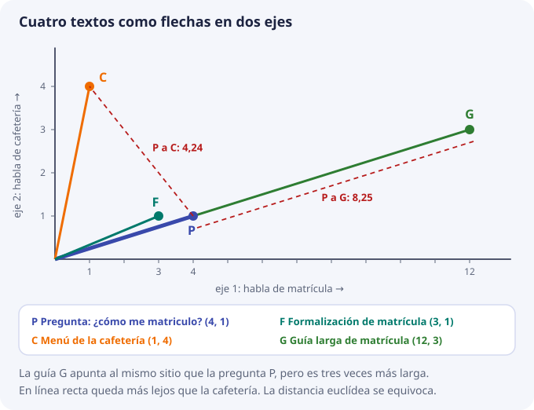
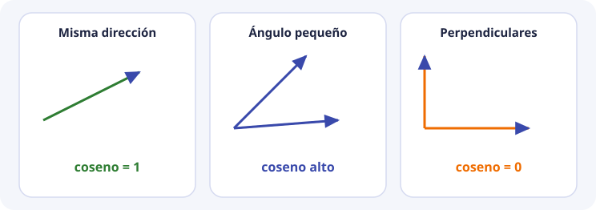
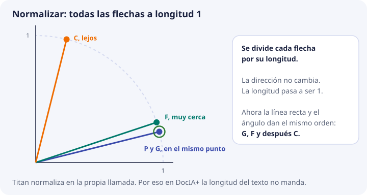
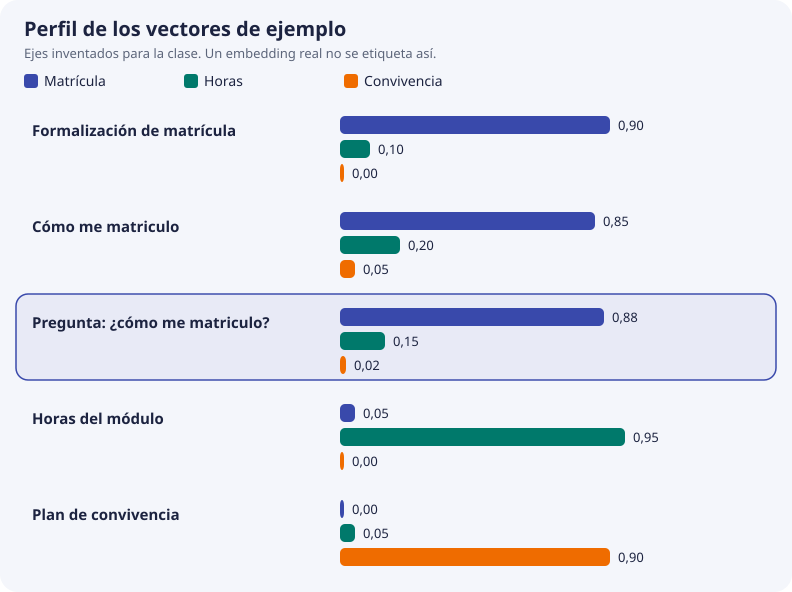

# 3. Geometría y similitud

En el tema anterior vimos que un modelo de embeddings convierte cada texto en una lista de números. Este tema responde a la pregunta siguiente: **si tengo dos listas de números, ¿cómo sé si los textos se parecen?**

La respuesta es geometría de instituto: flechas, longitudes y ángulos. No hace falta más. Vamos a hacerlo con **dos números por texto**, porque así se puede dibujar en un papel y calcular con calculadora. Al final veremos que con 3 o con 1024 números las cuentas son exactamente las mismas, solo que más largas.

El script de [geometría a mano](https://github.com/iesataulfoargentasor/DocIA-Plus/blob/main/laboratorio/01_geometria_similitud.py) hace estas cuentas en Python. Úsalo para comprobar las tuyas.

## Qué necesita la base vectorial

Cuando un usuario pregunta algo, la base vectorial tiene guardados miles de fragmentos, cada uno con su vector. Tiene que:

1. Convertir la pregunta en un vector con el mismo modelo.
2. Comparar ese vector con los vectores guardados.
3. Devolver los fragmentos **ordenados** de más parecido a menos.

El paso 2 exige una regla que, dados dos vectores, dé **un solo número** que diga cuánto se parecen. Todo este tema trata de cómo se elige esa regla y por qué no vale cualquiera.

## Un vector es una flecha

Un vector es una lista ordenada de números. Cada número se llama **componente** y la cantidad de números es la **dimensión**.

```text
(4, 1)          dimensión 2, componentes 4 y 1
(0,88, 0,15, 0,02)   dimensión 3
un vector de Titan   dimensión 1024
```

Con dimensión 2 hay una forma muy útil de verlo: el primer número es cuánto avanzas hacia la derecha y el segundo, cuánto subes. El vector `(4, 1)` es una flecha que sale del origen `(0, 0)` y acaba en el punto que está 4 a la derecha y 1 arriba.

El orden importa. `(4, 1)` y `(1, 4)` tienen los mismos números, pero son flechas distintas: una va casi tumbada y la otra casi vertical.

## El ejemplo que vamos a seguir

Imagina un modelo de juguete que solo produce **dos números** por texto:

- el primero mide cuánto habla el texto de **matrícula**;
- el segundo mide cuánto habla de **cafetería**.

Esto es un invento para la clase. En un modelo real los 1024 números no tienen un nombre que se pueda leer. Pero la idea de fondo es la misma: textos del mismo tema acaban con vectores que apuntan hacia la misma zona.

| Letra | Texto | Vector |
| --- | --- | --- |
| P | Pregunta: «¿Cómo me matriculo?» | (4, 1) |
| F | Procedimiento de formalización de matrícula | (3, 1) |
| C | Menú diario de la cafetería | (1, 4) |
| G | Guía larga de matrícula: plazos, documentos y tasas | (12, 3) |

P es la pregunta. F, C y G son los fragmentos guardados en la base. Cualquier persona diría que la respuesta buena está en F o en G, y que C no tiene nada que ver.

Fíjate en G: `(12, 3)` es exactamente el triple de `(4, 1)`. Apunta **en la misma dirección** que la pregunta, pero es una flecha **tres veces más larga**. Supongamos que este modelo de juguete da flechas más largas a los textos que repiten mucho su tema. G habla de lo mismo que P, solo que «más fuerte».



Ahora probamos tres reglas para medir el parecido y vemos cuál acierta.

## Primera regla: la distancia en línea recta

La idea más natural es medir con una regla la distancia entre las puntas de las dos flechas. Se llama **distancia euclídea**.

Se calcula con el teorema de Pitágoras: se restan las componentes una a una, se elevan al cuadrado, se suman y se hace la raíz cuadrada.

```text
distancia(a, b) = √( (a1 − b1)² + (a2 − b2)² )
```

Cuanto **menor** es la distancia, más se parecen. Paso a paso, de P a cada fragmento:

```text
P a F:  restas (4 − 3, 1 − 1)   = (1, 0)
        cuadrados 1² + 0²       = 1
        raíz √1                 = 1,00

P a C:  restas (4 − 1, 1 − 4)   = (3, −3)
        cuadrados 3² + (−3)²    = 9 + 9 = 18
        raíz √18                = 4,24

P a G:  restas (4 − 12, 1 − 3)  = (−8, −2)
        cuadrados 64 + 4        = 68
        raíz √68                = 8,25
```

Ordenando de menor a mayor distancia sale **F, C, G**. La cafetería queda por delante de la guía de matrícula. **Falla**: G habla justo de lo que pregunta P, pero como su flecha es mucho más larga, su punta queda lejos.

La lección: la distancia en línea recta mezcla dos cosas, **hacia dónde apunta** la flecha y **lo larga que es**. En texto, lo que nos interesa es lo primero.

## La longitud de un vector

Antes de seguir, necesitamos saber medir lo larga que es una flecha. Se llama **longitud** o **norma** y se escribe `‖a‖`. Otra vez es Pitágoras, ahora desde el origen hasta la punta:

```text
‖a‖ = √( a1² + a2² )
```

| Vector | Cuenta | Longitud |
| --- | --- | --- |
| P = (4, 1) | √(16 + 1) = √17 | 4,12 |
| F = (3, 1) | √(9 + 1) = √10 | 3,16 |
| C = (1, 4) | √(1 + 16) = √17 | 4,12 |
| G = (12, 3) | √(144 + 9) = √153 | 12,37 |

P y C tienen la misma longitud y apuntan a sitios muy distintos. P y G apuntan al mismo sitio y tienen longitudes muy distintas. La longitud, sola, no dice nada del tema.

## Segunda regla: el producto escalar

El **producto escalar** de dos vectores se calcula multiplicando componente a componente y sumando:

```text
a · b = a1 × b1 + a2 × b2
```

Sale un único número. Es grande cuando las dos flechas apuntan hacia el mismo lado, porque los números grandes se multiplican con números grandes. Es pequeño cuando apuntan a lados distintos, porque los números grandes de una se multiplican con los pequeños de la otra.

Cuanto **mayor** es, más se parecen:

```text
P · F = 4 × 3  + 1 × 1 = 12 + 1 = 13
P · C = 4 × 1  + 1 × 4 =  4 + 4 =  8
P · G = 4 × 12 + 1 × 3 = 48 + 3 = 51
```

Orden: **G, F, C**. Esta vez sale bien, pero por un motivo tramposo. G gana con 51, cuatro veces más que F, no porque se parezca cuatro veces más a la pregunta, sino porque es más larga. Si G fuera un texto de cafetería muy largo, también podría ganar. El producto escalar **también mezcla dirección y longitud**.

## Tercera regla: el ángulo, con el coseno

Si lo que importa es hacia dónde apuntan las flechas, lo que hay que medir es el **ángulo** que forman. Dos flechas que apuntan al mismo sitio forman un ángulo de 0°. Dos flechas perpendiculares forman 90°.

En vez del ángulo en grados se usa su **coseno**, porque es más cómodo:

| Ángulo entre las flechas | Coseno | Qué significa |
| --- | --- | --- |
| 0° | 1 | Apuntan al mismo sitio |
| unos 30° | 0,87 | Se parecen bastante |
| 60° | 0,5 | Se parecen poco |
| 90° | 0 | No tienen nada que ver |
| 180° | −1 | Apuntan a sitios opuestos |



Cuanto **mayor** es el coseno, más se parecen. Lo bueno es que no hace falta transportador. El coseno se calcula con las dos cosas que ya sabemos: el producto escalar y las longitudes.

```text
                    a · b
cos(a, b) = ─────────────────
              ‖a‖ × ‖b‖
```

Lee la fórmula así: el producto escalar dice cuánto se parecen, pero viene inflado por las longitudes, así que **se divide por las longitudes** para quitar ese efecto. Lo que queda solo depende de la dirección.

Con nuestros números, usando los productos y las longitudes de las tablas anteriores:

```text
cos(P, F) = 13 / (4,12 × 3,16)  = 13 / 13,04 = 0,997
cos(P, C) =  8 / (4,12 × 4,12)  =  8 / 17,00 = 0,471
cos(P, G) = 51 / (4,12 × 12,37) = 51 / 51,00 = 1,000
```

Orden: **G, F, C**. G sale con coseno 1 porque apunta exactamente al mismo sitio que la pregunta. Da igual que sea tres veces más larga. F sale casi igual de alto. La cafetería queda lejos, con 0,47. Esta vez sale bien **por el motivo correcto**.

## Las tres reglas, lado a lado

| Pareja | Distancia euclídea (menor = más cerca) | Producto escalar (mayor = más cerca) | Coseno (mayor = más cerca) |
| --- | --- | --- | --- |
| P y F | 1,00 | 13 | 0,997 |
| P y C | 4,24 | 8 | 0,471 |
| P y G | 8,25 | 51 | 1,000 |
| **Orden que sale** | F, C, G ❌ | G, F, C (por la longitud) | G, F, C ✅ |

Para texto se usa casi siempre el **coseno**, porque mide de qué habla el texto sin dejarse engañar por la longitud del vector.

## Normalizar: quitar la longitud de en medio

Hay una forma de que las tres reglas se pongan de acuerdo: hacer que **todas las flechas midan 1** antes de compararlas. Se llama **normalizar** y consiste en dividir cada componente por la longitud del vector.

```text
P = (4, 1)     longitud 4,12    P normalizado = (4 / 4,12,  1 / 4,12)  = (0,97, 0,24)
F = (3, 1)     longitud 3,16    F normalizado = (3 / 3,16,  1 / 3,16)  = (0,95, 0,32)
C = (1, 4)     longitud 4,12    C normalizado = (1 / 4,12,  4 / 4,12)  = (0,24, 0,97)
G = (12, 3)    longitud 12,37   G normalizado = (12 / 12,37, 3 / 12,37) = (0,97, 0,24)
```

Normalizar **no cambia la dirección**, solo la longitud. Mira G: después de normalizar es idéntico a P. Puedes comprobar que cada vector normalizado mide 1. Por ejemplo, para P: `√(0,97² + 0,24²) = √(0,94 + 0,06) = 1`.



Con vectores normalizados pasan dos cosas muy útiles:

1. **El coseno es igual al producto escalar.** En la fórmula del coseno, las dos longitudes valen 1, así que se divide entre 1 × 1. Por ejemplo, `P · F = 0,97 × 0,95 + 0,24 × 0,32 = 0,92 + 0,08 = 1,00`, que coincide con el 0,997 anterior salvo por el redondeo. Esto importa porque el producto escalar es más rápido de calcular: no hay raíces ni divisiones.
2. **La distancia euclídea deja de equivocarse.** Ahora P y G están a distancia 0, P y F a 0,08, y P y C a 1,03. El orden es G, F, C, el mismo que el del coseno.

## Qué hace Titan en DocIA+

Titan Embeddings v2 puede **normalizar en la propia llamada**. El pipeline de BDA dejará activada esa opción, de modo que todos los vectores que entren en ChromaDB medirán 1. Eso tiene tres consecuencias prácticas:

- Da igual usar coseno o producto escalar: dan el mismo número.
- **No se mezclan** vectores normalizados con vectores sin normalizar en la misma colección. Si se mezclan, vuelve el problema de G: un vector más largo gana sin parecerse más.
- Hay una comprobación fácil de que la llamada está bien configurada: la longitud de un vector recién generado tiene que salir muy cerca de 1. Si sale 7,3 o 0,02, algo está mal.

El modelo MiniLM del [cuaderno de la sesión 1](sesion-01.md) también devuelve vectores de longitud 1. Por eso, cuando allí se mide la distancia en línea recta entre dos frases, el orden que sale es el mismo que daría el coseno. Puedes comprobarlo en el cuaderno con `np.linalg.norm(vector)`, que debe dar 1,0.

## De 2 dimensiones a 3, y de 3 a 1024

Nada de lo anterior depende de que haya 2 componentes. Con más componentes, cada fórmula simplemente tiene más sumandos:

```text
producto escalar   a · b = a1 × b1 + a2 × b2 + a3 × b3 + ... + a1024 × b1024
longitud           ‖a‖   = √( a1² + a2² + a3² + ... + a1024² )
coseno             igual que antes: producto escalar dividido por las dos longitudes
```

No se puede dibujar una flecha en 1024 dimensiones, pero el ángulo entre dos flechas sigue existiendo y el coseno sigue diciendo lo mismo: 1 si apuntan igual, 0 si no tienen nada que ver.

Veamos un ejemplo con **tres** ejes inventados: `(trámites de matrícula, horas y módulos, convivencia)`. Es el ejemplo que usa el script de geometría a mano.

| Texto | Vector |
| --- | --- |
| Procedimiento de formalización de matrícula | (0,90, 0,10, 0,00) |
| Cómo me matriculo en el ciclo | (0,85, 0,20, 0,05) |
| El módulo de Big Data tiene 190 horas | (0,05, 0,95, 0,00) |
| Plan de convivencia del centro | (0,00, 0,05, 0,90) |
| **Pregunta: «¿Cómo me matriculo?»** | **(0,88, 0,15, 0,02)** |



La cuenta completa para el primer fragmento, con la pregunta `q` y el procedimiento `d`:

```text
q · d  = 0,88 × 0,90 + 0,15 × 0,10 + 0,02 × 0,00
       = 0,792 + 0,015 + 0
       = 0,807

‖q‖    = √(0,88² + 0,15² + 0,02²) = √(0,7744 + 0,0225 + 0,0004) = √0,7973 = 0,8929
‖d‖    = √(0,90² + 0,10² + 0,00²) = √(0,81 + 0,01 + 0)          = √0,82   = 0,9055

cos    = 0,807 / (0,8929 × 0,9055) = 0,807 / 0,8085 = 0,998
```

Haciendo lo mismo con los otros tres fragmentos sale el **ranking** que devolvería una base vectorial:

| Puesto | Fragmento | Coseno con la pregunta |
| --- | --- | --- |
| 1 | Procedimiento de formalización de matrícula | 0,998 |
| 2 | Cómo me matriculo en el ciclo | 0,997 |
| 3 | El módulo de Big Data tiene 190 horas | 0,220 |
| 4 | Plan de convivencia del centro | 0,032 |

Fíjate en que el primer puesto no repite las palabras de la pregunta: no dice «cómo» ni «me matriculo». Gana porque su vector apunta hacia el mismo sitio. Eso es la búsqueda semántica del tema 1, vista por dentro.

Ejecuta el script y cambia alguna coordenada, por ejemplo sube el componente de convivencia de la pregunta. Verás cómo se mueve el ranking. En 1024 dimensiones pasa lo mismo cuando un fragmento está mal cortado, solo que allí no podremos ver qué componente tiene la culpa.

## De la similitud a la lista de resultados

La base vectorial no contesta «sí» o «no». Calcula el parecido de la pregunta con los fragmentos y devuelve una lista ordenada. Falta decidir **cuántos** fragmentos se usan. Hay dos maneras, y se suelen combinar:

- **Top-k.** Quedarse con los k primeros de la lista, por ejemplo los 3 mejores. DocIA+ usará entre 3 y 5. Con más fragmentos hay más contexto, pero también más fragmentos que no vienen a cuento.
- **Umbral.** Quedarse solo con los que superan un parecido mínimo, por ejemplo coseno mayor que 0,6. Sirve para cuando la pregunta no tiene respuesta en los documentos. Top-k siempre devuelve algo, aunque sea malo; el umbral permite decir «no hay documentación suficiente».

En el ejemplo de tres ejes, con top-3 entraría el texto de las 190 horas, que no sirve para la pregunta. Con top-3 **y** un umbral de 0,6 solo entran los dos textos de matrícula.

El valor del umbral **no se copia de otro proyecto**. Depende del modelo y de la colección. En DocIA+ se fija en el tema 9, probando con preguntas cuya respuesta ya conocemos.

## Lo que devuelve ChromaDB: distancia, no similitud

Hay un detalle que confunde mucho la primera vez. El coseno es una **similitud**: cuanto **mayor**, más se parecen. ChromaDB, en cambio, devuelve una **distancia**: cuanto **menor**, más se parecen. Van al revés.

Con la colección configurada en espacio coseno, que es lo que usan el script de [ChromaDB local](https://github.com/iesataulfoargentasor/DocIA-Plus/blob/main/laboratorio/02_chromadb_coleccion.py) y DocIA+, ChromaDB 1.1.0 calcula:

```text
distancia = 1 − coseno
```

| Coseno | Distancia que muestra ChromaDB | Lectura |
| --- | --- | --- |
| 1,000 | 0,000 | Apuntan al mismo sitio |
| 0,998 | 0,002 | Casi idénticos |
| 0,471 | 0,529 | Poco parecidos |
| 0,000 | 1,000 | Nada que ver |

Así que, si ChromaDB devuelve una distancia de 0,002, eso es un parecido altísimo, no bajísimo.

El espacio (coseno, euclídeo o producto escalar) se elige **al crear la colección** y no se puede cambiar después sin crearla de nuevo. Si en una prueba los números no cuadran con la tabla de arriba, lo primero que hay que mirar es el espacio con el que se creó la colección y la versión de ChromaDB, no el texto.

## La dimensión alta, sin mito

A veces se lee que en dimensión muy alta «todos los puntos quedan igual de lejos» y las distancias dejan de servir. Eso pasa con puntos colocados **al azar**. Los vectores de un modelo entrenado no están al azar: el modelo aprendió a juntar los textos parecidos y a separar los que no lo son. Por eso el coseno funciona también con 1024 números.

Lo que sí cambia es que ya no podemos mirar un dibujo para saber si va bien. Nos fiamos de la cuenta y de un conjunto de preguntas de prueba cuya respuesta conocemos.

Una advertencia práctica: no se quitan componentes a mano para que el vector ocupe menos. Si recortas un vector de 1024 a sus primeros 256 números, cambias su dirección y los cosenos dejan de significar lo que significaban. Si se quiere un vector más corto, se le pide a Titan en la llamada (admite 256 o 512), porque está entrenado para producir vectores de ese tamaño, y se vuelve a generar el vector de todos los fragmentos.

## Comprueba que lo has entendido

??? question "1. ¿Qué dos cosas mezcla la distancia en línea recta?"
    Hacia dónde apunta la flecha y lo larga que es. Por eso, sin normalizar, la guía larga G queda más lejos de la pregunta que la cafetería, aunque hable de lo mismo que la pregunta.

??? question "2. Calcula el coseno entre (1, 0) y (0, 1). ¿Qué significa?"
    Producto escalar: `1 × 0 + 0 × 1 = 0`. Las dos longitudes valen 1. Coseno `0 / 1 = 0`. Son perpendiculares: en nuestro modelo de juguete, un texto que solo habla de matrícula y otro que solo habla de cafetería no tienen nada en común.

??? question "3. Calcula el coseno entre (2, 0) y (1, 1)."
    Producto escalar: `2 × 1 + 0 × 1 = 2`. Longitudes: `√4 = 2` y `√2 = 1,414`. Coseno `2 / (2 × 1,414) = 0,707`, que corresponde a un ángulo de 45°. El producto escalar vale 2 y el coseno 0,707: no coinciden porque los vectores no están normalizados. Es el último ejemplo que imprime el script de geometría a mano.

??? question "4. ChromaDB devuelve distancias 0,15 y 0,40 para dos fragmentos. ¿Cuál se parece más a la pregunta y qué coseno tiene cada uno?"
    El de 0,15, porque en una distancia menor es más cerca. Con espacio coseno, `coseno = 1 − distancia`: 0,85 y 0,60.

??? question "5. Si Titan devuelve vectores normalizados, ¿por qué da igual usar coseno o producto escalar?"
    Porque el coseno es el producto escalar dividido por las dos longitudes, y si las dos valen 1 la división no cambia nada.
