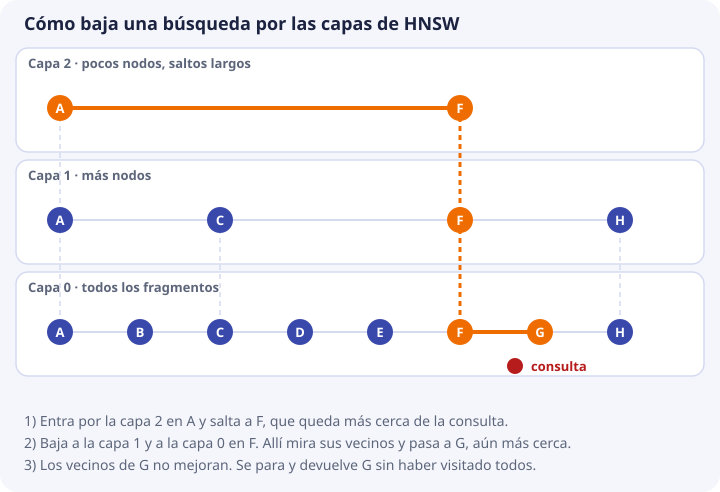

# 4. Búsqueda del vecino más cercano e índices

En el tema 3 aprendimos a medir el parecido entre **dos** vectores. Pero una base de datos no tiene dos: tiene cientos, miles o millones. Este tema responde a la pregunta que sigue: **dada una pregunta, ¿cómo se encuentran los fragmentos más parecidos entre todos los guardados?**

Veremos primero la solución más simple (comparar con todos), luego por qué a veces no basta, y después la idea de los **índices**: estructuras que permiten no mirarlo todo. También veremos algo que suele sorprender: en DocIA+, con el tamaño real del proyecto, comparar con todos **sí** basta.

## El problema, con nombre

Volvemos al ejemplo de los temas anteriores. La pregunta P y cuatro fragmentos guardados, con sus vectores de juguete:

| Letra | Texto | Vector |
| --- | --- | --- |
| P | Pregunta: «¿Cómo me matriculo?» | (4, 1) |
| F | Procedimiento de formalización de matrícula | (3, 1) |
| I | Plazo de inscripción en el ciclo | (5, 0) |
| C | Menú diario de la cafetería | (1, 4) |
| B | Precio del bocadillo | (0, 3) |

Lo que queremos es: **los 2 fragmentos más cercanos a P**. Ese problema tiene nombre: **k vecinos más cercanos** (en inglés *k-nearest neighbors*, k-NN).

- **Vecino** es un vector guardado que está cerca de la consulta.
- **k** es cuántos queremos. Aquí k = 2. En DocIA+ será entre 3 y 5.
- **Consulta** es el vector de la pregunta.

Dicho de forma completa: dado un vector consulta y una colección de N vectores, devolver los k más cercanos.

## La solución directa: comparar con todos

La forma más simple de resolverlo es la que haría una persona con una calculadora:

1. Calcular la similitud de P con **cada** fragmento.
2. Ordenar de mayor a menor.
3. Quedarse con los k primeros.

Los cosenos ya los calculamos en el tema 3 (los del fragmento B se calculan igual: `P · B = 0×4 + 3×1 = 3`, longitudes 4,12 y 3, y `3 / (4,12 × 3) = 0,243`):

| Fragmento | Similitud con P | Puesto |
| --- | --- | --- |
| F | 0,997 | 1 |
| I | 0,970 | 2 |
| C | 0,471 | 3 |
| B | 0,243 | 4 |

Con k = 2 la respuesta es **F e I**. Esta forma de buscar se llama **búsqueda exacta** (o «fuerza bruta»), porque mira todos los candidatos y por eso **nunca se equivoca**: devuelve exactamente los k más cercanos que existen.

## Cuánto cuesta comparar con todos

Hemos hecho 4 comparaciones con 2 componentes cada una. El coste crece de dos formas: con el número de fragmentos **N** y con el número de componentes **d** (la dimensión). Por cada fragmento hay que multiplicar d parejas de números, así que:

```text
multiplicaciones por consulta ≈ N × d
```

Recuerda del tema 3 que con vectores normalizados (como los de Titan) el coseno es solo el producto escalar, así que basta con multiplicar y sumar. Vamos con cifras. Cada vector de 1024 números ocupa unos 4 KB (tema 2):

| Situación | N (fragmentos) | Multiplicaciones por consulta (d = 1024) | Memoria de los vectores | Lectura |
| --- | --- | --- | --- | --- |
| **DocIA+ (estimación inicial)** | 1.200 | 1,2 millones | 5 MB | Milisegundos |
| Un centro grande | 100.000 | 100 millones | 400 MB | Décimas de segundo |
| Un buscador de una empresa | 10 millones | 10.000 millones | 40 GB | Segundos y ya no cabe en un portátil |

Los tiempos son órdenes de magnitud en un ordenador normal, no una medida. Lo importante es la tendencia: **el doble de fragmentos, el doble de trabajo**. En la tercera fila comparar con todos se vuelve inviable en cada pregunta; en la primera es trivial.

La primera fila sale de suponer 80 documentos con unos 15 fragmentos cada uno (`80 × 15 = 1.200`). El proyecto prevé más documentos en un hito posterior, pero seguimos en un tamaño en que el barrido completo cabe de sobra en el objetivo de latencia de la API, que es de menos de 3 segundos de punta a punta. Esos 3 segundos los gastará sobre todo el modelo que redacta la respuesta, no la búsqueda.

**Conclusión de ingeniería.** En el corpus de un IES, la corrección del sistema no depende de un índice ingenioso. Depende del fragmentado, de los metadatos, del modelo y de la evaluación. Aun así, hay que estudiar los índices por tres razones:

1. ChromaDB usa uno por defecto. Hay que saber qué garantiza y qué no.
2. El proyecto quiere poder replicarse en centros con más documentos.
3. Un índice puede **dejar fuera** el fragmento correcto. Quien no lo sepa buscará el fallo en el modelo o en los documentos cuando el problema está en los parámetros de búsqueda.

## La idea de un índice: no mirar todo

Piensa en cómo encuentras un libro en una biblioteca grande. No lees el lomo de todos los libros: vas a la sala, luego a la estantería, luego al estante. Es posible porque alguien **organizó los libros de antemano**.

Un **índice** es lo mismo para los vectores: una estructura que se construye al insertarlos y que permite, en la consulta, ir directamente a la zona donde están los vecinos, sin recorrer los demás.

Pero hay un precio. Al saltarse vectores, el índice puede saltarse justo el que era el mejor. Por eso los índices de este tipo se llaman de búsqueda **aproximada** (ANN, *approximate nearest neighbor*): aceptan devolver casi los mejores, a cambio de ser mucho más rápidos.


### Cómo se mide si un índice acierta

La calidad de un índice se mide con el **recall del índice**: de los k vecinos que habría devuelto la búsqueda exacta, cuántos devuelve el índice.

```text
Búsqueda exacta, k = 5:   F, I, X, Y, Z
Índice aproximado, k = 5: F, I, X, Y, W      (falta Z, sobra W)

recall del índice = 4 aciertos / 5 = 0,8
```

Un recall de 1 significa que el índice coincide con la búsqueda exacta.

No lo confundas con el **acierto de recuperación** del [tema 9](09-calidad-y-fallos.md). Este otro compara con lo que una **persona** sabe que es la respuesta correcta: mide si el documento adecuado está entre los devueltos. El recall del índice solo compara al índice con la búsqueda exacta, sin importar si esta acierta o no.

**Para DocIA+** el objetivo es un recall de índice indistinguible de 1. Con 1.200 vectores se consigue con la búsqueda exacta o con un índice holgado. No vamos a afinar un índice para ganar microsegundos y perder el fragmento que cita la norma de acceso.

## HNSW, el índice de ChromaDB

El índice que usa ChromaDB se llama **HNSW** (*Hierarchical Navigable Small World*, «mundo pequeño navegable jerárquico»). Los nombres asustan; la idea es la de un viaje por carretera:

- Para ir de una ciudad a otra tomas primero la **autopista**, con pocas salidas y trayectos largos.
- Cuando ya estás cerca, pasas a una **carretera** comarcal.
- Y al final, a la **calle**, donde llegas al portal exacto.

HNSW organiza los vectores igual, en varias capas:

- Cada fragmento es un **nodo**.
- Cada nodo se enlaza con los nodos más cercanos a él, hasta un máximo de **M** enlaces. El conjunto de nodos y enlaces es un **grafo**.
- La **capa de abajo** contiene todos los nodos (son las calles). Las **capas de arriba** contienen solo unos pocos, elegidos al azar, y tienen enlaces largos (son las autopistas).

### Una búsqueda, paso a paso



El esquema tiene 8 fragmentos (A a H). Están dibujados de izquierda a derecha para que la cercanía se vea; la posición horizontal representa el parecido. El punto rojo es la consulta.

1. **Se entra por la capa de arriba**, que tiene solo A y F. Se compara la consulta con los dos y F está más cerca. Un salto largo y ya se está en la zona buena.
2. **Se baja a la capa siguiente**, sin moverse de F. Sus vecinos son C y H, que están más lejos, así que se sigue en F.
3. **Se baja a la capa completa.** F tiene por vecinos a E y a G. G está más cerca de la consulta y se pasa a G.
4. **Se mira a los vecinos de G**, que son F y H. Ninguno mejora. Se para y se devuelve G.

Se han comparado unos pocos nodos en lugar de los ocho. Con 10 millones de nodos la diferencia es enorme: se visitan unos cientos.

### Por qué puede fallar

El camino es «siempre voy al vecino más cercano de los que veo». Si el mejor fragmento solo se alcanza pasando antes por uno peor, la búsqueda puede pararse antes de llegar. Es como tomar una calle que parece llevar al destino y termina sin salida.

Para reducir ese riesgo, la búsqueda no sigue solo un camino: mantiene una lista de candidatos prometedores. El tamaño de esa lista es el parámetro **ef** (*search ef*). Cuanto mayor es, más candidatos se examinan, más se parece el resultado a la búsqueda exacta y más tarda la consulta.

Al construir el índice hay un parámetro parecido, **ef de construcción**: con un valor alto, el grafo queda mejor conectado, se construye más despacio y luego se busca mejor.

| Parámetro | Qué controla | Más alto significa |
| --- | --- | --- |
| **M** | Enlaces máximos por nodo | Grafo más conectado, más memoria, mejor búsqueda |
| **ef de construcción** | Cuánto esfuerzo se pone al insertar | Índice de más calidad, inserción más lenta |
| **ef de búsqueda** | Candidatos que se examinan al consultar | Resultado más cercano al exacto, consulta más lenta |

### Cómo lo configura ChromaDB

ChromaDB construye este índice al insertar y lo guarda en disco junto con la colección. Los parámetros se dan como metadatos de la colección, con nombres que empiezan por `hnsw:`. En el laboratorio de [ChromaDB local](https://github.com/iesataulfoargentasor/DocIA-Plus/blob/main/laboratorio/02_chromadb_coleccion.py) la única que se fija es el espacio:

```python
cliente.create_collection(
    name="docia_lab",
    metadata={"hnsw:space": "cosine"},
)
```

`hnsw:space` dice **qué medida de cercanía** usa el índice. Con `cosine`, ChromaDB devuelve una distancia igual a 1 menos el coseno, como vimos en el tema 3. Esa elección se hace **al crear la colección** y no se cambia después: si hay que cambiarla, se crea una colección nueva.

Los valores que usaremos en DocIA+:

| Parámetro | Qué haremos |
| --- | --- |
| `hnsw:space` | `cosine`. Titan entrega vectores normalizados y la similitud de texto se basa en el ángulo |
| `M` y `ef` | Los que trae ChromaDB por defecto mientras el corpus sea el del IES. Solo se tocan si una medida demuestra que el índice pierde vecinos que la búsqueda exacta sí encuentra |

**Cómo se comprueba.** Con datos reales, para un puñado de preguntas se compara el top-5 de ChromaDB con el top-5 calculado en Python recorriendo todos los vectores. Si difieren, se sube `search_ef` antes de tocar el modelo. Esa comprobación es la del recall del índice de arriba.

## Otros índices, solo para reconocerlos

No los vamos a implementar. Aparecen en la documentación y en las ofertas de productos, y hay que saber qué son.

| Índice | Idea | Por qué no es nuestra pieza |
| --- | --- | --- |
| **IVF** | Divide los vectores en «salas» (celdas) y, al consultar, solo mira las salas más cercanas | Otra familia de índices aproximados. ChromaDB no la usa por defecto |
| **Cuantización de producto (PQ)** | Comprime cada vector para ahorrar memoria, perdiendo algo de precisión | Con vectores de 4 KB y unos miles de fragmentos la memoria no es el problema. El servidor del proyecto tiene 4 GB y le sobra |
| **Índice invertido de palabras** | El de la búsqueda literal del [tema 1](01-busqueda-literal-y-semantica.md) | Sigue siendo útil para códigos y nombres propios, pero no es el índice de la colección vectorial |

OpenSearch, con su motor vectorial, fue la alternativa nombrada en el proyecto y se descartó por su coste fijo en un contexto educativo. La comparación de productos está en el [tema 5](05-anatomia-bd-vectorial.md). El problema de fondo, en todos ellos, es el mismo k-NN de este tema.

## Filtros e índice

En DocIA+ casi toda consulta llevará un filtro de metadatos, o podrá llevarlo: «solo oferta educativa», «solo este curso». El índice tiene que poder **restringir** la búsqueda a los fragmentos que cumplen el filtro. No basta con buscar y filtrar después.

Un ejemplo con números. Pedimos k = 5 con el filtro «solo oferta educativa»:

| Estrategia | Qué pasa |
| --- | --- |
| **Filtrar después** | La base busca los 5 más cercanos: resultan ser 5 de programaciones. El filtro los descarta. Quedan **0 resultados**, aunque el sexto más cercano era el fragmento correcto de oferta educativa |
| **Filtrar dentro de la búsqueda** | La base solo considera fragmentos de oferta educativa y devuelve los 5 más cercanos **entre ellos**. Quedan **5 resultados válidos** |

Por eso el filtro va **dentro** de la consulta a la base, y k significa «k resultados que ya cumplen el filtro». ChromaDB lo hace con el parámetro `where` de la consulta. Esto se estudia en el [tema 6](06-metadatos-y-filtros.md).

## Comprueba que lo has entendido

??? question "1. Un centro tiene 3.000 fragmentos con vectores de 1024 componentes. ¿Cuántas multiplicaciones hace una búsqueda exacta?"
    `N × d = 3.000 × 1.024 = 3.072.000`, unos 3 millones. Sigue siendo del orden de milisegundos.

??? question "2. ¿Por qué la búsqueda exacta nunca se equivoca y un índice HNSW sí puede?"
    Porque la exacta compara con todos los fragmentos, y HNSW solo visita algunos siguiendo un camino de vecinos. Si el mejor fragmento no está en ese camino, se pierde.

??? question "3. La búsqueda exacta devuelve F, I, X, Y, Z con k = 5 y el índice devuelve F, I, X, Y, W. ¿Cuál es el recall del índice?"
    4 de 5 coinciden: 4 / 5 = 0,8.

??? question "4. ¿En qué se diferencia el recall del índice del acierto de recuperación?"
    El del índice compara el índice con la búsqueda exacta. El de recuperación compara con la respuesta correcta que conoce una persona (el documento que debería salir). Un índice perfecto puede tener mal acierto de recuperación si el modelo o el fragmentado son malos.

??? question "5. En DocIA+ tenemos unos 1.200 vectores. ¿Por qué no se dedica tiempo a afinar M y ef?"
    Porque con ese tamaño la búsqueda exacta ya tarda milisegundos, y el fallo más probable no está en el índice sino en el fragmentado, los metadatos o el modelo. Solo se tocan si una medida demuestra que el índice pierde vecinos.

??? question "6. ¿Por qué el filtro va dentro de la consulta y no después de recibir los resultados?"
    Porque si se filtra después de pedir los k más cercanos, puede que todos sean de otra categoría y se queden 0 resultados aunque el fragmento correcto existiera un poco más abajo.

??? question "7. Se creó la colección con `hnsw:space` en `l2` y ahora se quiere pasar a `cosine`. ¿Qué hay que hacer?"
    Crear una colección nueva con `cosine` y volver a insertar los fragmentos, porque el espacio se fija al crear la colección y no se cambia en caliente.
