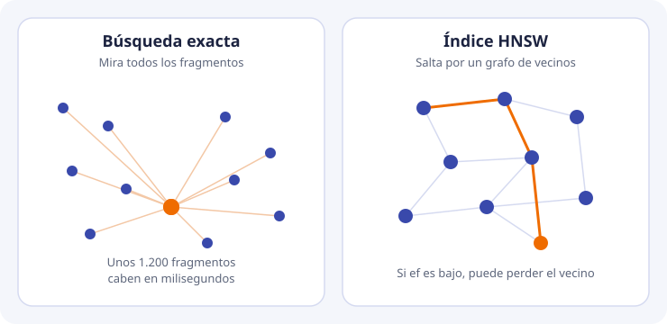

# 4. Búsqueda del vecino más cercano e índices

El problema que resuelve el índice tiene nombre: **k vecinos más cercanos** (k-NN). Dados un vector consulta y una colección de N vectores, devolver los k de menor distancia.

## La solución exacta

La solución exacta calcula la distancia al vector consulta de los N almacenados, ordena y se queda con k. No se equivoca. Su coste crece con N y con la dimensión d: del orden de N · d operaciones, más el ordenar.

Hay que ponerle cifras de DocIA+ antes de hablar de índices exóticos.

Supongamos 80 documentos y, de media, 15 fragmentos por documento. Son unos **1.200 vectores**. Con d = 1024, cada consulta exacta hace del orden de un millón de multiplicaciones. Un portátil las hace en unos pocos milisegundos. Aunque el hito posterior del proyecto hable de varios cientos de documentos indexados, seguimos en un tamaño en el que el barrido completo cabe de sobra en el objetivo de latencia de la API, que el proyecto sitúa por debajo de 3 segundos de punta a punta. Esos 3 segundos los consumirá sobre todo la redacción del modelo de lenguaje, no la búsqueda.

Conclusión, y es una conclusión de ingeniería: **en el corpus de un IES la corrección del sistema no depende de un índice aproximado ingenioso**. Depende del fragmentado, de los metadatos, del modelo y de la evaluación. El índice aproximado importa por otras tres razones, que sí justifican estudiarlo:

1. ChromaDB lo usa por defecto. Hay que saber qué garantiza y qué no.
2. El proyecto quiere ser replicable en centros con un corpus mayor, y en la fase local puede convivir con otros usos.
3. Un índice aproximado puede **dejar fuera** el fragmento correcto. Quien no lo sepa, depurará el modelo o los documentos cuando el fallo está en los parámetros de búsqueda.

## La solución aproximada

La búsqueda **ANN** (*approximate nearest neighbor*) deja de prometer los k vecinos exactos a cambio de no recorrer todo. La calidad del índice se mide con el **recall del índice**: de los k vecinos que habría devuelto la búsqueda exacta, cuántos devuelve el índice. Un recall de índice de 1 significa que coincide con la búsqueda exacta. No lo confundas con el recall de recuperación del tema 9, que mide si el documento correcto está entre los devueltos, comparado con un conjunto de pruebas humano.

Para DocIA+, el objetivo operativo es un recall de índice indistinguible de 1. Con 1.200 vectores se consigue con el barrido exacto o con un HNSW holgado. No vamos a tunear un índice para arañar microsegundos y perder el fragmento que cita la norma de acceso.

## HNSW, que es el índice de ChromaDB

HNSW (*Hierarchical Navigable Small World*) construye un grafo por capas.

- Cada fragmento es un nodo.
- Cada nodo enlaza con los más cercanos, hasta un máximo de **M** enlaces.
- Las capas superiores tienen pocos nodos y sirven para saltar rápido a la zona buena. La capa inferior contiene todos.
- Una búsqueda entra por la capa alta y baja, en cada capa, hacia el vecino más prometedor. El parámetro **ef** (*search ef*) es el ancho de la lista de candidatos que se mantiene durante el descenso. A mayor `ef`, más candidatos se examinan, más se parece el resultado al exacto, y más tarda la consulta.
- Durante la construcción, **ef de construcción** juega un papel análogo: grafos mejor conectados, construcción más lenta, búsquedas mejores.

ChromaDB crea este índice al insertar y lo guarda en disco junto a la colección. Los nombres de parámetro en la colección son metadatos de índice, por ejemplo `hnsw:space`, `hnsw:M` y `hnsw:search_ef`. El espacio (`cosine` en nuestro caso) se elige **al crear la colección** y no se cambia en caliente.

Valores de partida sensatos, no un tuning:

| Parámetro | Qué haremos en DocIA+ |
| --- | --- |
| `hnsw:space` | `cosine`, porque Titan entrega vectores normalizados y la similitud de texto es angular |
| `M` y `ef` | Los de defecto de ChromaDB mientras el corpus sea el del IES. Solo se tocan si una medida demuestra que el índice pierde vecinos que el barrido exacto sí encuentra |

La comprobación es directa y entra en el laboratorio cuando la colección tenga datos reales: para un puñado de preguntas, comparar el top-5 de ChromaDB con el top-5 calculado en Python recorriendo todos los vectores. Si difieren, se sube `search_ef` antes de tocar el modelo.

## Otros índices, solo para situarlos

No los vamos a implementar. Aparecen en documentación y en ofertas de productos, y hay que reconocerlos.

| Índice | Idea breve | Por qué no es nuestra pieza |
| --- | --- | --- |
| IVF | Agrupa los vectores en celdas y solo busca en las celdas cercanas a la consulta | Otra familia ANN. ChromaDB no es quien lo usa por defecto |
| Cuantización de producto (PQ) | Comprime el vector para ahorrar memoria, perdiendo precisión | Con 1024 floats y unos miles de fragmentos, la memoria no es el problema. EC2 del proyecto tiene 4 GB y le sobra |
| Índice invertido de palabras | El de la búsqueda literal | Sigue siendo útil para códigos y nombres propios. No es el índice de la colección vectorial |

OpenSearch con su motor vectorial fue la alternativa nombrada en el proyecto y se descartó por coste fijo en un contexto educativo. La comparación de productos está en el tema 5. El algoritmo de fondo, en todos ellos, es el mismo problema k-NN.

## Filtros y el índice

En DocIA+ casi toda consulta llevará un filtro de metadatos, o podrá llevarlo: «solo en oferta educativa», «solo en este curso». El índice tiene que poder **restringir** la búsqueda, no solo acercarse en el grafo y filtrar después.

Si se filtra después de pedir k = 5, puede ocurrir esto: los 5 más cercanos son de programaciones, el filtro se queda con cero, y el fragmento correcto de oferta educativa —que era el sexto— se ha perdido. Por eso el filtro va **dentro** de la consulta a la base, y k se interpreta como «k resultados que ya cumplen el filtro». ChromaDB lo hace con el parámetro `where` de la consulta. Es el tema 6, y es parte de la estructura que define SBD.
