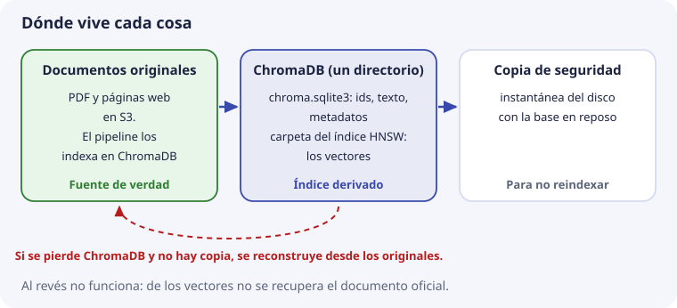

# 5. Anatomía de una base de datos vectorial

Hasta aquí hemos visto las piezas por separado: qué es un vector (tema 2), cómo se mide el parecido entre dos (tema 3) y cómo se encuentran los más cercanos entre muchos (tema 4). Este tema las junta y responde a la pregunta: **¿qué hay dentro de una base de datos vectorial, y qué guarda exactamente por cada fragmento?**

Lo haremos apoyándonos en algo que ya conoces de SBD: las bases de datos relacionales. Una base vectorial se parece mucho más a ellas de lo que el nombre sugiere.

## Un índice no es todavía una base de datos

En el tema 4 vimos HNSW, que encuentra vectores cercanos muy rápido. Existen librerías, como FAISS, que hacen solo eso: les das vectores y te devuelven los más cercanos a otro. Pero imagina usarla sola en DocIA+:

- Te devuelve «los vectores 17 y 243». ¿Qué texto era el 17? La librería no lo sabe: solo guarda números.
- La persona pregunta solo por oferta educativa. ¿Cuáles de los vectores son de oferta educativa? Tampoco lo sabe.
- Cambia el calendario escolar. ¿Cómo sustituyes sus fragmentos y borras los que sobran?
- Se reinicia el servidor. ¿Dónde quedó todo guardado?

Una **base de datos vectorial** es un índice como HNSW **más** todo lo que hace falta para usarlo en una aplicación real:

| Necesidad | Qué aporta la base |
| --- | --- |
| Saber de qué texto es cada vector | Guarda el texto junto al vector |
| Filtrar por categoría, curso o fichero | Guarda metadatos y permite condiciones sobre ellos |
| Cambiar o quitar fragmentos | Operaciones de actualizar y borrar |
| No perder nada al reiniciar | Persistencia en disco |
| Recuperarse de un desastre | Copias de seguridad |

## Comparada con una base relacional

Si has trabajado con MySQL o PostgreSQL, casi todo tiene un equivalente:

| Base relacional | ChromaDB | Qué cambia |
| --- | --- | --- |
| Base de datos | Cliente con un directorio | Nada importante |
| Tabla | **Colección** | Todos sus vectores comparten modelo, dimensión y espacio |
| Fila | **Registro** (un fragmento) | Nada importante |
| Clave primaria | **Identificador** (`id`) | Lo elegimos nosotros, no es autonumérico |
| Columnas | **Metadatos** | Sin esquema fijo: cada registro lleva un diccionario |
| Índice B-tree | **Índice HNSW** | Ordena por cercanía, no por valor |
| `WHERE` | `where` | Igual idea, otra sintaxis |
| `ORDER BY columna` | Orden por distancia | Siempre se ordena por parecido con la pregunta |
| `LIMIT 5` | `n_results=5` | Es la k del tema 4 |

La diferencia de fondo está en las dos últimas filas. En SQL eliges por qué columna ordenar. En una base vectorial el orden es **siempre** la distancia al vector de la pregunta. Todo lo demás se parece mucho.

## Las cuatro piezas de un registro

Cada fragmento indexado en DocIA+ será un registro con cuatro piezas:


Así se ve el fragmento F de los temas anteriores, «Procedimiento de formalización de matrícula», escrito como lo guardaría ChromaDB:

```python
{
    "id":        "oferta-iabd-2026_000",
    "embedding": [0.021, -0.087, 0.154, ...],   # 1024 números en DocIA+
    "document":  "Procedimiento de formalización de matrícula del curso de especialización.",
    "metadata":  {"categoria": "g4", "doc_id": "oferta-iabd-2026", "chunk": 0, "curso": "2026-2027"},
}
```

Es el mismo registro que inserta el laboratorio de [ChromaDB local](https://github.com/iesataulfoargentasor/DocIA-Plus/blob/main/laboratorio/02_chromadb_coleccion.py), salvo el vector, que allí es de juguete (3 números). Veamos cada pieza.

### 1. Identificador

Es el nombre único del registro dentro de la colección, como una clave primaria. En DocIA+ se construye así:

```text
{doc_id}_{chunk}      →   oferta-iabd-2026_000
                          oferta-iabd-2026_001
                          calendario-2026_003
```

Es decir: de qué documento viene y qué número de fragmento es dentro de él. ¿Por qué no un número automático o un código aleatorio? Porque el identificador tiene que ser **estable**: si se vuelve a indexar el mismo documento, el mismo fragmento debe recibir el mismo identificador.

Así, al reindexar se usa `upsert` («inserta, o sustituye si ya existe») y el fragmento se escribe **encima** del anterior. Con un código aleatorio nuevo en cada ejecución, reindexar dos veces dejaría el fragmento **duplicado**, y la búsqueda devolvería el mismo párrafo dos veces. El procedimiento completo está en el [tema 8](08-operaciones-de-gestion.md).

### 2. Vector

La lista de números que produce el modelo (tema 2). Todos los vectores de una colección tienen **la misma dimensión**: 1024 en DocIA+. Es lo que usa el índice HNSW para ordenar.

### 3. Documento (el texto)

El texto del fragmento, tal cual. Puede parecer redundante guardar el texto si ya tenemos el vector, pero es imprescindible: **un vector no se puede convertir de vuelta en texto**. Los 1024 números dicen «de qué habla» el fragmento, no sus palabras exactas. Y la respuesta de DocIA+ tiene que **citar el texto real**, no una reconstrucción.

(ChromaDB llama `document` a este campo. Ojo: es el texto del **fragmento**, no el documento PDF completo.)

### 4. Metadatos

Datos adicionales sobre el fragmento, para filtrar y para citar: categoría, de qué documento viene, número de fragmento, curso, página… ChromaDB los permite vacíos, pero en DocIA+ son obligatorios, porque sin ellos no hay ni filtro ni cita. El esquema completo se define en el [tema 6](06-metadatos-y-filtros.md).

## Una colección de ejemplo

Con los textos de los temas anteriores, una colección pequeña quedaría así (el vector, en la versión de juguete de dos ejes):

| id | vector | document | categoria | doc_id |
| --- | --- | --- | --- | --- |
| `oferta-iabd-2026_000` | (3, 1) | Procedimiento de formalización de matrícula | `g4` | `oferta-iabd-2026` |
| `oferta-iabd-2026_001` | (5, 0) | Plazo de inscripción en el ciclo | `g4` | `oferta-iabd-2026` |
| `menu-2026_000` | (1, 4) | Menú diario de la cafetería | `g5` | `menu-2026` |
| `menu-2026_001` | (0, 3) | Precio del bocadillo | `g5` | `menu-2026` |

Mira la tabla como si fuera SQL: cuatro filas, una clave primaria, una columna de texto y dos columnas para filtrar. La única columna «rara» es la del vector, y es la que permite ordenar por parecido.

## Qué pasa en una consulta

Cuando la aplicación hace una consulta, algo así:

```python
coleccion.query(
    query_embeddings=[vector_de_la_pregunta],
    n_results=3,
    where={"categoria": "g4"},
)
```

dentro de la base pasa, en esquema, lo siguiente:

1. **Filtro.** Con los metadatos, se limita la búsqueda a los registros que cumplen `categoria = g4`.
2. **Búsqueda de vecinos.** Con el índice HNSW, se buscan los vectores más cercanos al de la pregunta entre esos registros.
3. **Recogida.** Para cada vecino encontrado se leen su identificador, su texto y sus metadatos.
4. **Respuesta.** Se devuelven listas alineadas: la posición 0 de cada lista es el mejor resultado, la posición 1 el segundo, etc.

Esta es la salida real del laboratorio de ChromaDB local para la pregunta «¿cómo me matriculo?» sin filtro, con `n_results=3`:

```text
distancia=0.0019  categoria=g4  Procedimiento de formalización de matrícula del curso de especialización.
distancia=0.7804  categoria=g4  El módulo de Big Data Aplicado tiene una duración de 190 horas.
distancia=0.7804  categoria=g5  Calendario escolar, fragmento 1, versión antigua.
```

Recuerda del tema 3 que la distancia es 1 menos el coseno: 0,0019 es un coseno de 0,998, casi idéntico. Los otros dos están lejos (coseno 0,22), pero salen porque se han pedido 3 resultados y la base siempre devuelve 3 si los hay. Esto es lo que el umbral del tema 3 permite descartar.

Fíjate en la tercera línea: sin filtro, se ha colado un fragmento de otra categoría (`g5`). Con el filtro `where={"categoria": "g4"}` no saldría.

## La colección

Una colección es el conjunto de registros que comparten tres cosas:

- **el mismo modelo** de embeddings;
- **la misma dimensión**;
- **el mismo espacio de distancia** (`cosine`, euclídeo o producto escalar).

Las tres se deciden al crear la colección. La dimensión la fija el primer vector que se inserta, y el espacio se da con `metadata={"hnsw:space": "cosine"}` (tema 4). Cambiar cualquiera de las tres implica **crear otra colección** y volver a insertar los fragmentos.

### ¿Una colección o varias?

En DocIA+ hay cinco grupos (G1 a G5), cada uno con su categoría de documentos. Hay dos maneras de organizarlo:

| Opción | Ventaja | Inconveniente |
| --- | --- | --- |
| **Una colección por grupo** | Cada grupo experimenta sin pisar a los demás | Una pregunta que toca dos categorías obliga a buscar en varias colecciones y juntar resultados |
| **Una sola colección**, con la categoría como metadato | Una pregunta puede buscar en todo o filtrar por categoría con `where` | Hay que coordinarse para no pisarse |

El ejemplo del proyecto es justo una pregunta que cruza categorías: «¿puedo acceder y cuántas horas tiene el módulo?». El acceso está en oferta educativa y las horas, según el documento, quizá también en programaciones.

**Decisión de partida**, revisable cuando los cinco grupos integren su trabajo:

- **Durante el desarrollo**, cada grupo puede usar una colección propia en su ordenador para no pisarse.
- **En el sistema integrado**, una sola colección. Se filtra por categoría cuando la pregunta es de un tema concreto y no se filtra cuando cruza temas.

## Qué hay en disco

ChromaDB, en el modo que usamos (`PersistentClient`), guarda todo en un directorio. Esto es lo que deja el laboratorio en `laboratorio/data` al ejecutarse:

```text
data/
├── chroma.sqlite3                          identificadores, textos y metadatos
└── 5df65e6f-3be9-48a6-ab4c-fb2dbcffb673/   una carpeta por colección, con el índice HNSW
    ├── data_level0.bin                     los vectores y la capa de abajo del grafo
    ├── link_lists.bin                      los enlaces de las capas de arriba
    ├── header.bin
    └── length.bin
```

Es decir, dos partes: una base **SQLite** (una base relacional en un solo fichero) con el texto y los metadatos, y los ficheros del **índice HNSW** con los vectores. Las dos tienen que estar de acuerdo entre sí.



De aquí salen tres reglas prácticas:

1. **Ese directorio es la base.** Si se borra, se pierde la colección.
2. **No se copia a mano mientras se escribe.** Si alguien copia los ficheros mientras el pipeline indexa, puede copiar SQLite de un momento y el índice de otro, y la copia queda incoherente. El proyecto prevé copias periódicas hechas con la base en reposo o con una instantánea del disco.
3. **La base vectorial no es la fuente de verdad.** Los documentos originales viven en otro sitio (en el proyecto, S3). Si ChromaDB se pierde sin copia, se reconstruye volviendo a indexar desde los originales. Al revés no se puede: de los vectores no se recupera el documento oficial.

## Comparación breve de productos

ChromaDB no es la única base vectorial. Estos son los nombres que vas a encontrar:

| Producto | Qué es | Encaje con DocIA+ |
| --- | --- | --- |
| **ChromaDB** | Base vectorial de código abierto, que puede ir dentro de la propia aplicación o como servicio | Es la elección del proyecto. Corre en la misma máquina que la API, sin licencia, y se puede usar en local el mismo día |
| **pgvector** | Extensión que añade vectores a PostgreSQL. Es la que usan los vídeos de CodelyTV | Tiene sentido si el sistema ya usa PostgreSQL. Aquí añadiría un servicio que el proyecto no necesita |
| **FAISS** | Librería de índices, muy rápida, sin metadatos ni servidor | Buena para experimentar con k-NN. Por sí sola no filtra, no persiste de forma operativa ni gestiona borrados |
| **Qdrant o Weaviate** | Servicios vectoriales con filtros muy completos | Válidos técnicamente, pero son una pieza más de infraestructura que el proyecto no quiere operar |
| **OpenSearch vectorial** | Motor de búsqueda con soporte de vectores | El proyecto lo descartó por su coste fijo mensual frente a ChromaDB en la máquina que ya aloja la API |

La fila de FAISS es la que vale la pena recordar, porque resume el principio de este tema: un índice de vectores no es todavía una base de datos. La base aparece cuando, además del índice, hay identificadores, texto, metadatos, actualización, borrado y copias.

## Lo que la colección no guarda

Tan importante como lo que se guarda es lo que **no**:

- **Las preguntas de los usuarios.** Se procesan en memoria y no se insertan. La colección contiene documentación del centro, no un historial de quién preguntó qué. Los registros de actividad del proyecto se anonimizan.
- **Credenciales** ni datos personales.
- **El documento completo además de sus fragmentos.** Los fragmentos ya son la unidad que se cita. Guardar también el documento entero duplica datos y tienta a calcularle un vector, y ese vector de «todo el documento» se parecería un poco a cualquier pregunta (lo vimos en el tema 1 con las portadas).

## Comprueba que lo has entendido

??? question "1. ¿Qué le falta a una librería como FAISS para ser una base de datos vectorial?"
    Guardar el texto y los metadatos de cada vector, filtrar, actualizar y borrar registros, persistir en disco y hacer copias. FAISS solo busca vectores cercanos.

??? question "2. ¿Cuáles son las cuatro piezas de un registro y para qué sirve cada una?"
    Identificador (encontrar y sustituir el registro), vector (ordenar por parecido), texto (citarlo en la respuesta) y metadatos (filtrar y citar la fuente).

??? question "3. ¿Por qué se guarda el texto si ya se tiene el vector?"
    Porque un vector no se puede convertir de vuelta en texto. Dice de qué habla el fragmento, no sus palabras, y la respuesta tiene que citar el texto real.

??? question "4. ¿Qué pasaría si el identificador fuera un código aleatorio distinto en cada indexación?"
    Que al reindexar, `upsert` no encontraría el registro anterior y crearía uno nuevo. El fragmento quedaría duplicado y saldría dos veces en las búsquedas.

??? question "5. ¿Cuál es el identificador del fragmento 4 del documento `calendario-2026`?"
    `calendario-2026_004`, siguiendo el formato `{doc_id}_{chunk}` con el número de fragmento a tres cifras, como en el laboratorio.

??? question "6. En la salida del laboratorio, el segundo resultado tiene distancia 0,7804. ¿Por qué aparece, si no tiene que ver con la matrícula?"
    Porque se pidieron 3 resultados y la base siempre devuelve los 3 más cercanos, aunque estén lejos. Un umbral de similitud (tema 3) lo descartaría.

??? question "7. ¿Qué tres cosas comparten todos los registros de una colección?"
    El modelo de embeddings, la dimensión y el espacio de distancia.

??? question "8. Se pierde el directorio de ChromaDB y no hay copia. ¿Se pierde la información?"
    No, si los documentos originales siguen en S3: se vuelve a indexar desde ellos. Por eso la fuente de verdad está fuera de la base vectorial.
