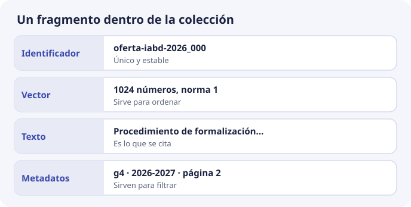

# 5. Anatomía de una base de datos vectorial

Una base de datos vectorial guarda registros que se buscan por cercanía de un vector y, a la vez, por condiciones sobre otros campos. No es un tipo de dato mágico dentro de un fichero: es un almacén con unas pocas piezas estables. ChromaDB, pgvector, Qdrant o FAISS les ponen nombres distintos. Las piezas son las mismas.

## Las cuatro piezas de un registro

Cada fragmento indexado en DocIA+ será un registro con:

| Pieza | Obligatorio | Ejemplo |
| --- | --- | --- |
| Identificador | Sí, único en la colección | `g4_oferta_2026_acceso_003` |
| Vector | Sí, dimensión fija de la colección | 1024 números |
| Documento | Sí, el texto del fragmento | El párrafo que citaremos |
| Metadatos | Sí en DocIA+, aunque ChromaDB los permita vacíos | categoría, fichero, página, curso |

El identificador lo elegimos nosotros. No es un autonumérico opaco si podemos evitarlo. Un identificador estable permite reindexar: el mismo fragmento, si no ha cambiado, se vuelve a escribir encima con `upsert` y no deja un duplicado. El criterio para construirlo está en el tema 8.

El documento se guarda junto al vector porque la respuesta tiene que **citar texto real**, no reconstruir el párrafo desde los números. Los números no se decodifican a texto.

## La colección

La colección es el conjunto de registros que comparten dimensión, modelo y espacio de distancia. Es el análogo de una tabla, con dos diferencias:

- el orden de una consulta por defecto no es una columna, es la distancia al vector de la pregunta;
- crear la colección fija el espacio (`cosine`, euclídeo o producto interno). Cambiarlo implica crear otra colección y copiar los datos.

En DocIA+ la propuesta de partida es **una colección** para todo el corpus, y la categoría como metadato filtrable. La alternativa —una colección por grupo G1…G5— aísla mejor los experimentos de cada grupo durante el desarrollo y complica la pregunta que cruza categorías («¿puedo acceder y cuántas horas tiene el módulo?», que es justo el ejemplo del proyecto: toca oferta educativa y, según el documento, quizá también programaciones).

Decisión de partida, revisable cuando los cinco grupos integren:

- desarrollo de cada grupo: puede usar una colección propia en local para no pisarse;
- sistema integrado: **una colección**, filtro por categoría cuando la pregunta vaya acotada, sin filtro cuando la pregunta cruce temas.

## Qué hay en disco

ChromaDB, en el modo que usaremos, persiste en un directorio:

- una base SQLite con identificadores, documentos y metadatos;
- los ficheros del índice HNSW con los vectores.

Ese directorio es la base. Copiarlo en caliente, con escrituras a medias, puede dejar un índice incoherente con SQLite. El proyecto prevé **copias periódicas** de ChromaDB (instantáneas del volumen y copia de respaldo en el almacenamiento de objetos). Operativamente: se hace la copia con la base en reposo, o con el mecanismo de instantánea del disco, no copiando ficheros a mano mientras el alumnado indexa.

Perder el directorio obliga a reindexar desde los documentos originales. Por eso los originales viven en otro almacén (en el proyecto, S3) y no solo dentro de ChromaDB. La base vectorial es un índice derivado. La fuente de verdad del texto institucional es el documento oficial.

## Comparación breve de productos

| Producto | Qué es | Encaje con DocIA+ |
| --- | --- | --- |
| **ChromaDB** | Servicio y librería open source, pensados para embeber el índice junto a la aplicación | Es la elección del proyecto. Corre en la misma máquina que la API, sin licencia, y el alumnado puede usarlo en local el mismo día |
| pgvector | Extensión de PostgreSQL | Tiene sentido si el sistema ya vive en Postgres. Aquí añadiríamos un servicio que el proyecto no necesita para el volumen del IES |
| FAISS | Librería de índices, muy rápida, sin metadatos ni servidor | Excelente para experimentar el k-NN. No cubre por sí sola filtros, persistencia operativa y borrados, que sí necesitamos |
| Qdrant o Weaviate | Servicios vectoriales con filtros maduros | Válidos técnicamente. Más pieza de infraestructura de la que el proyecto quiere operar |
| OpenSearch vectorial | Motor de búsqueda con vectores | El proyecto lo descartó por el coste fijo mensual frente a ChromaDB en la instancia que ya aloja la API |

Conocer la fila de FAISS evita un error de concepto: un índice de vectores no es todavía una base de datos. La base aparece cuando, además del índice, hay identificadores, texto, metadatos, actualización, borrado y copia de seguridad.

## Lo que la colección no almacena

Las preguntas de los usuarios no se insertan como documentos. El proyecto fija que la consulta se procesa en memoria y que los registros de actividad se anonimizan. La colección contiene **documentación del centro**, que es información institucional pública o interna de trabajo, no un historial de quién preguntó qué.

Tampoco se guardan credenciales, ni el texto completo de un documento si el fragmento ya es la unidad de cita. Guardar el documento entero además del fragmento duplica datos y tienta a alguien a embeber las dos cosas y a recuperar portadas enteras.
