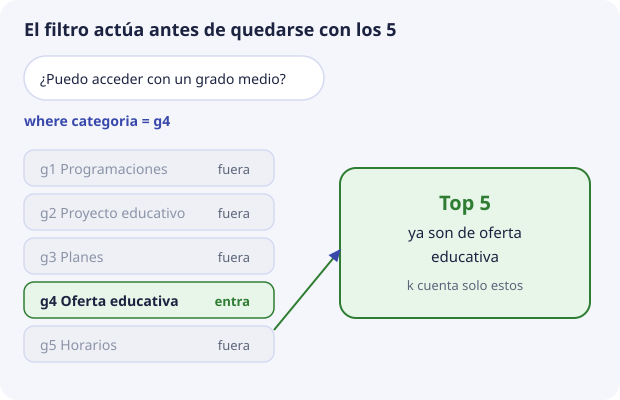

# 6. Metadatos, filtros y categorías

El vector encuentra párrafos parecidos. Los metadatos dicen **qué** párrafo es, de qué documento sale y si entra en esta consulta. Sin metadatos, DocIA+ podría recuperar un fragmento brillante y no saber citarlo, o mezclar el calendario de este curso con una programación de hace tres años.

Este tema es el núcleo del encargo de SBD: definir la estructura de la base vectorial.

## Filtro y similitud no son lo mismo

Una consulta de DocIA+ tiene dos partes independientes:

```text
vector de la pregunta     →  ordena por cercanía
filtro sobre metadatos    →  decide qué registros participan
```

El filtro no se codifica como una dimensión más del embedding. Si se mete la palabra «G4» dentro del texto para «ayudar» al modelo, el vector se ensucia y el filtro sigue sin ser exacto. La categoría va en un campo, y la consulta la expresa como condición.

En ChromaDB la condición es el argumento `where`. Ejemplo de intención, no todavía el código del proyecto:

```text
buscar el vector de "¿puedo acceder con un grado medio?"
donde categoria = g4
devolver 5
```



Los cinco resultados ya son de oferta educativa. Si ninguno se parece lo bastante, se dice que no hay evidencia. No se rellena con un fragmento de convivencia que casualmente contiene la palabra «acceso».

Varios campos se combinan. ChromaDB expresa la conjunción con un operador lógico en el propio `where`. Lo usaremos para «esta categoría **y** este curso», por ejemplo. El detalle de sintaxis se practica en el laboratorio 2 y se fija cuando escribamos el cliente definitivo.

## Las cinco categorías

El valor de `categoria` es un código estable, no el título largo. El título puede cambiar en una memoria; el código no debería cambiar, porque rompe filtros y cuadros de mando.

| Código | Grupo | Contenido |
| --- | --- | --- |
| `g1` | G1 | Programaciones educativas |
| `g2` | G2 | Proyecto educativo de centro |
| `g3` | G3 | Planes y programas |
| `g4` | G4 | Oferta educativa |
| `g5` | G5 | Actividades, orientación y horarios |

Un documento pertenece a una categoría. Si un PDF mezcla oferta y calendario, SBD lo parte **antes** de indexar y cada fragmento lleva la categoría que le corresponde. Un fragmento con dos categorías es una señal de que el corte está mal hecho, no de que el campo deba ser una lista.

## Esquema de partida

Propuesta para discutir en el aula y cerrar en la fase de diseño. Los tipos son los que ChromaDB filtra con comodidad: texto, número y booleano. Las fechas van como texto ISO `YYYY-MM-DD`, para poder ordenarlas como cadena, o como número `YYYYMMDD` si más adelante hace falta un rango. No guardamos objetos anidados.

| Campo | Tipo | Ejemplo | Para qué |
| --- | --- | --- | --- |
| `categoria` | texto | `g4` | Filtro de grupo y de tema |
| `doc_id` | texto | `oferta-iabd-2026` | Agrupar todos los fragmentos de un mismo fichero |
| `titulo` | texto | Oferta del curso de especialización | Cita legible |
| `fuente` | texto | `oferta_iabd_2026.pdf` | Nombre del fichero que ve el usuario |
| `curso` | texto | `2026-2027` | No mezclar vigencias |
| `pagina` | número | `2` | Localizar la cita dentro del PDF. Vacío si no aplica |
| `seccion` | texto | Acceso | Encabezado más cercano |
| `chunk` | número | `3` | Orden del fragmento dentro del documento |
| `hash` | texto | hex del texto del fragmento | Saber si hay que recalcular el vector |
| `indexado` | texto | `2026-11-15` | Cuándo se escribió este registro |

Campos que **no** se añaden:

- nombre de la persona que consulta, dirección IP o texto de la pregunta;
- el vector repetido dentro de los metadatos;
- un campo libre `notas` donde cada grupo invente una estructura distinta.

Si un grupo necesita un campo extra, se propone aquí, se documenta y pasa a ser de todos. Cinco esquemas incompatibles no se integran en marzo.

## Identificador del registro

El identificador no es un metadato filtrable en el mismo sentido, pero forma parte de la estructura. Propuesta:

```text
{doc_id}_{chunk}
```

Ejemplo: `oferta-iabd-2026_003`.

Es único, reproducible y humano. Quien vuelva a indexar el documento genera los mismos identificadores para los mismos fragmentos y puede hacer `upsert`. Si el documento se acorta y desaparece el fragmento 9, ese identificador se **borra**; si no, queda un huérfano que sigue recuperándose. El tema 8 lo escribe como procedimiento.

## Qué permite este esquema el día del cuadro de mando

BDA tiene más adelante un panel de analítica. La colección no es ese panel, pero los metadatos bien puestos permiten contestar, con una lectura de la propia base, preguntas de explotación que SBD sí puede hacer desde el primer día:

- cuántos fragmentos hay por categoría;
- qué documentos no se han reindexado desde una fecha;
- si alguna categoría se ha quedado vacía;
- si hay hashes repetidos, es decir, el mismo párrafo indexado dos veces.

Esas cuentas son agregaciones sobre metadatos, no búsquedas semánticas. ChromaDB permite recuperar registros con `get` y un `where`, sin vector. Sirve para auditar la carga. No sustituye al cuadro de mando, y no se usa para guardar estadísticas de las preguntas de los usuarios.
