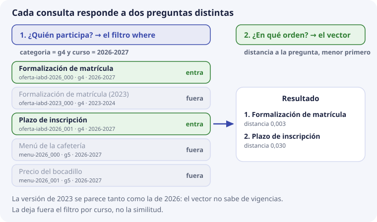

# 6. Metadatos, filtros y categorías

En el tema 5 vimos que cada registro tiene cuatro piezas: identificador, vector, texto y **metadatos**. Este tema trata de la cuarta. Responde a dos preguntas: **¿para qué sirven los metadatos si ya tenemos el vector?** y **¿qué metadatos lleva cada fragmento de DocIA+?**

Es también el núcleo del encargo de SBD: definir la estructura de la base vectorial. Lo que se decida aquí lo usarán los cinco grupos, así que tiene que quedar claro y ser igual para todos.

## Qué son los metadatos

**Metadatos** son «datos sobre los datos». El dato es el texto del fragmento; los metadatos dicen cosas **sobre** ese texto: de qué documento sale, de qué categoría es, de qué curso, en qué página está.

Un ejemplo de la vida diaria: en una foto del móvil, el dato es la imagen, y los metadatos son la fecha, el lugar y el modelo de cámara. Gracias a ellos puedes pedir «fotos de agosto en Santander» sin mirar las imágenes.

En ChromaDB los metadatos de cada registro son un diccionario de Python:

```python
{"categoria": "g4", "doc_id": "oferta-iabd-2026", "chunk": 0, "curso": "2026-2027"}
```

Si lo comparas con SQL (tema 5), cada clave es como una **columna** de la tabla.

## Por qué no basta con el vector

El vector sabe **de qué habla** un texto. Pero hay preguntas que el vector no sabe responder, porque no tratan del tema, sino de circunstancias del documento.

Lo probamos en ChromaDB con los textos de siempre y un quinto: la versión **antigua** del procedimiento de matrícula, del curso 2023-2024. Pregunta: «¿cómo me matriculo?», sin filtro. Esta es la salida real:

```text
distancia  id                     texto
0.003      oferta-iabd-2026_000   Procedimiento de formalización de matrícula
0.003      oferta-iabd-2023_000   Procedimiento de formalización de matrícula (2023)
0.030      oferta-iabd-2026_001   Plazo de inscripción en el ciclo
0.529      menu-2026_000          Menú diario de la cafetería
0.757      menu-2026_001          Precio del bocadillo
```

Las dos versiones del procedimiento **empatan**. Es lógico: hablan de lo mismo, y el vector solo mide eso. Lo vimos en el tema 2: el embedding es flojo con los detalles finos, y el curso escolar es un detalle fino. Si DocIA+ respondiera con el fragmento de 2023, daría un plazo o un requisito que ya no vale.

¿Cómo se sabe cuál es el vigente? **No por el vector**, sino por un dato que tiene que estar guardado aparte: el curso. Eso es un metadato.

## Cada consulta responde a dos preguntas

Una consulta de DocIA+ tiene dos partes que hacen trabajos distintos:

```text
filtro sobre metadatos   →  ¿quién participa?   (decide qué registros entran)
vector de la pregunta    →  ¿en qué orden?      (ordena los que han entrado)
```

Es igual que en SQL, donde `WHERE` decide qué filas entran y `ORDER BY` las ordena. La diferencia es que aquí el orden es siempre la distancia al vector.



Con el filtro `categoria = g4` **y** `curso = 2026-2027`, la misma consulta da:

```text
0.003      oferta-iabd-2026_000   Procedimiento de formalización de matrícula
0.030      oferta-iabd-2026_001   Plazo de inscripción en el ciclo
```

La versión de 2023 ha desaparecido, y la cafetería también. Ninguna de las dos cosas la ha hecho el vector: las ha hecho el filtro.

### Por qué la categoría no se mete en el texto

Una tentación habitual es escribir «G4» o «curso 2026-2027» dentro del propio texto del fragmento, para que el modelo «lo tenga en cuenta». No funciona, por dos motivos:

1. **El vector se ensucia.** Esas palabras cambian un poco la posición del fragmento en el mapa, y no para mejor: lo acercan a otros fragmentos que también digan «G4», hablen de lo que hablen.
2. **El filtro sigue sin ser exacto.** El vector ordena por parecido, no dice «sí» o «no». Un fragmento de 2023 seguiría pudiendo salir, solo que un poco más abajo.

Un filtro es una condición exacta: el fragmento cumple o no cumple. Por eso va en un campo aparte.

## Cómo se escribe un filtro en ChromaDB

El filtro es el argumento `where` de `query`. Todos estos ejemplos se han probado con ChromaDB 1.1.0, la versión del repositorio:

```python
coleccion.query(
    query_embeddings=[vector_de_la_pregunta],
    n_results=5,
    where={"categoria": "g4"},
)
```

| Lo que quieres | Cómo se escribe el `where` |
| --- | --- |
| Solo una categoría | `{"categoria": "g4"}` |
| Todas menos una | `{"categoria": {"$ne": "g4"}}` |
| Una de varias | `{"categoria": {"$in": ["g4", "g5"]}}` |
| Dos condiciones a la vez | `{"$and": [{"categoria": "g4"}, {"curso": "2026-2027"}]}` |
| Una condición u otra | `{"$or": [{"categoria": "g4"}, {"categoria": "g5"}]}` |
| Un número a partir de un valor | `{"indexado": {"$gte": 20261101}}` |

Los operadores de comparación (`$gt`, `$gte`, `$lt`, `$lte`) **solo funcionan con números**. Si se intenta con texto, ChromaDB da un error: `Expected operand value to be an int or a float for operator $gt`. Esto condiciona cómo se guardan las fechas, como veremos en el esquema.

### Un filtro sobre el propio texto

Además de `where`, ChromaDB tiene `where_document`, que filtra por **palabras del texto**:

```python
coleccion.query(
    query_embeddings=[vector_de_la_pregunta],
    n_results=5,
    where_document={"$contains": "matrícula"},
)
```

Solo entran los fragmentos cuyo texto contiene «matrícula», y luego se ordenan por el vector. Es la búsqueda literal del tema 1, usada como filtro. Sirve para buscar un código exacto (un número de resolución, por ejemplo), pero no para la categoría: la categoría va en un metadato.

### Qué pasa si el filtro deja fuera casi todo

El filtro manda. Si ningún registro lo cumple, la consulta devuelve una lista **vacía**. En la prueba, `where={"categoria": "g2"}` no devuelve nada porque no hay ningún fragmento g2.

Y si solo hay registros que lo cumplen pero no se parecen a la pregunta, **la base los devuelve igualmente**. En el laboratorio de [ChromaDB local](https://github.com/iesataulfoargentasor/DocIA-Plus/blob/main/laboratorio/02_chromadb_coleccion.py), «¿cómo me matriculo?» filtrada a `g2` devuelve el plan de convivencia a distancia 0,968, que es casi «nada que ver».

Por eso el filtro va acompañado del **umbral** del tema 3: si el mejor resultado no se parece lo bastante, DocIA+ dice que no tiene documentación suficiente. No rellena la respuesta con un fragmento de convivencia que casualmente contenga la palabra «acceso».


Recuerda también, del tema 4, que el filtro va **dentro** de la consulta y no después. Si se pidieran los 5 más cercanos y luego se tiraran los que no son g4, podrían quedar cero.

## Las cinco categorías

Cada grupo del proyecto se encarga de un tipo de documentos. La categoría del fragmento es un **código corto y estable**, no el título largo:

| Código | Grupo | Contenido |
| --- | --- | --- |
| `g1` | G1 | Programaciones educativas |
| `g2` | G2 | Proyecto educativo de centro |
| `g3` | G3 | Planes y programas |
| `g4` | G4 | Oferta educativa |
| `g5` | G5 | Actividades, orientación y horarios |

¿Por qué un código y no «Oferta educativa»? Porque el título puede cambiar en una memoria («Oferta formativa», «Oferta de enseñanzas»…) y cada cambio rompería los filtros ya escritos. `g4` no cambia.

**Cada fragmento tiene una sola categoría.** Si un PDF mezcla oferta y calendario, SBD lo parte **antes** de indexar, y cada fragmento lleva la categoría que le toca. ChromaDB, además, no admite listas como valor de un metadato: `{"categorias": ["g1", "g2"]}` da un error. Un fragmento que parece necesitar dos categorías es una señal de que el corte está mal hecho.

## El esquema de partida

Esta es la propuesta de metadatos para todos los fragmentos de DocIA+. Es para discutir en el aula y cerrar en la fase de diseño.

| Campo | Tipo | Ejemplo | Para qué |
| --- | --- | --- | --- |
| `categoria` | texto | `g4` | Filtrar por grupo y tema |
| `doc_id` | texto | `oferta-iabd-2026` | Agrupar todos los fragmentos de un mismo documento |
| `titulo` | texto | `Oferta del curso de especialización` | Citar de forma legible |
| `fuente` | texto | `oferta_iabd_2026.pdf` | Nombre del fichero que ve el usuario |
| `curso` | texto | `2026-2027` | No mezclar vigencias |
| `pagina` | número | `2` | Localizar la cita dentro del PDF. Si no aplica, **se omite** |
| `seccion` | texto | `Acceso` | Encabezado más cercano |
| `chunk` | número | `3` | Orden del fragmento dentro del documento |
| `hash` | texto | huella del texto (SHA-256) | Saber si el texto ha cambiado y hay que recalcular el vector |
| `indexado` | número | `20261115` | Fecha en que se escribió el registro, como `AAAAMMDD` |

Y así queda un registro completo:

```python
{
    "categoria": "g4",
    "doc_id":    "oferta-iabd-2026",
    "titulo":    "Oferta del curso de especialización",
    "fuente":    "oferta_iabd_2026.pdf",
    "curso":     "2026-2027",
    "pagina":    2,
    "seccion":   "Acceso",
    "chunk":     3,
    "hash":      "9f2c…",
    "indexado":  20261115,
}
```

### Reglas de tipos

ChromaDB solo admite cuatro tipos de valor: **texto, número entero, número decimal y booleano** (verdadero o falso). De ahí salen estas reglas, comprobadas en la versión del repositorio:

- **Nada de listas ni diccionarios dentro.** No hay objetos anidados. Si parece hacer falta, es que el dato está mal pensado.
- **Nada de valores vacíos.** `{"pagina": None}` da un error. Si un fragmento no tiene página (una web, por ejemplo), el campo **no se pone**.
- **Las fechas que se filtran por rango van como número.** Como `$gte` solo compara números, `indexado` se guarda como `20261115`. Así «indexado a partir del 1 de noviembre» es `{"indexado": {"$gte": 20261101}}`. Escrito como número `AAAAMMDD`, el orden numérico coincide con el orden de fechas.
- **El curso va como texto** (`2026-2027`), porque solo se filtra por igualdad, nunca por rango.

### Campos que no se añaden

- Nada de la persona que consulta: ni nombre, ni dirección IP, ni el texto de la pregunta.
- El vector repetido dentro de los metadatos: ya está en su sitio.
- Un campo libre `notas` donde cada grupo invente su propia estructura.

Si un grupo necesita un campo más, se propone aquí, se documenta y pasa a ser de todos. Cinco esquemas distintos no se integran en marzo.

## El identificador

El identificador no es un metadato, pero forma parte de la misma estructura y se construye con dos de ellos:

```text
{doc_id}_{chunk}     →   oferta-iabd-2026_003
```

Como vimos en el tema 5, es único, se puede reproducir y lo entiende una persona. Quien vuelva a indexar el documento genera los mismos identificadores y puede usar `upsert`. Si el documento se acorta y desaparece el fragmento 9, ese identificador hay que **borrarlo**: si no, queda un fragmento «huérfano» que se sigue recuperando. El [tema 8](08-operaciones-de-gestion.md) lo escribe como procedimiento.

## Los metadatos también sirven para auditar

Los metadatos no solo filtran consultas. Permiten revisar la carga sin buscar nada. Para eso ChromaDB tiene `get`, que devuelve registros que cumplen un `where` **sin usar ningún vector**:

```python
coleccion.get(where={"categoria": "g5"})
# ids: ['menu-2026_000', 'menu-2026_001']
```

Con ese tipo de lecturas, SBD puede responder desde el primer día a preguntas como:

- ¿cuántos fragmentos hay de cada categoría?
- ¿alguna categoría se ha quedado vacía?
- ¿qué documentos no se han reindexado desde una fecha? (con `indexado`)
- ¿hay el mismo párrafo indexado dos veces? (dos registros con el mismo `hash`)

Son recuentos sobre metadatos, no búsquedas por significado. BDA tendrá más adelante un panel de analítica; esto no lo sustituye, y **nunca** se usa para guardar estadísticas de las preguntas de los usuarios.

## Comprueba que lo has entendido

??? question "1. Las versiones de 2023 y de 2026 del mismo procedimiento salen con la misma distancia. ¿Por qué, y cómo se evita que salga la de 2023?"
    Porque hablan de lo mismo, y el vector solo mide de qué habla el texto. Se evita con un filtro por el metadato `curso`: `{"curso": "2026-2027"}`.

??? question "2. ¿Qué hace el filtro y qué hace el vector en una consulta?"
    El filtro decide qué registros participan (cumplen o no cumplen). El vector ordena los que han entrado, por distancia a la pregunta.

??? question "3. ¿Por qué no se escribe «G4» dentro del texto del fragmento?"
    Porque cambia el vector sin mejorarlo y no da un filtro exacto: el vector ordena por parecido, no dice sí o no.

??? question "4. Escribe el `where` para «oferta educativa del curso 2026-2027»."
    `{"$and": [{"categoria": "g4"}, {"curso": "2026-2027"}]}`

??? question "5. Un fragmento sale de una página web y no tiene número de página. ¿Qué se pone en `pagina`?"
    Nada: el campo se omite. ChromaDB no admite `None` como valor.

??? question "6. ¿Por qué `indexado` se guarda como `20261115` y no como `\"2026-11-15\"`?"
    Porque ChromaDB solo permite comparaciones de rango (`$gte`, `$lt`…) con números. Como número `AAAAMMDD`, el orden numérico coincide con el de las fechas.

??? question "7. Se filtra por `g2`, hay un solo fragmento g2 y no tiene nada que ver con la pregunta. ¿Qué devuelve la base?"
    Ese fragmento, aunque esté lejos (en el laboratorio, a distancia 0,968). La base devuelve lo que cumple el filtro. Por eso hace falta además el umbral de similitud.

??? question "8. Un PDF habla de oferta educativa y de horarios. ¿Qué categoría lleva?"
    Ninguna de las dos para el PDF entero: se parte antes de indexar y cada fragmento lleva la suya, `g4` o `g5`. Un fragmento tiene una sola categoría.
