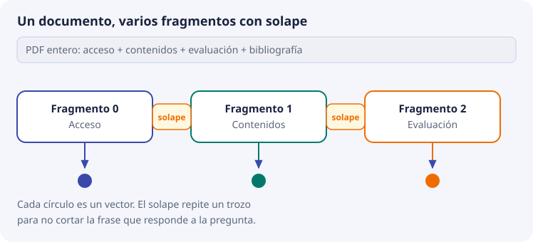

# 7. Del documento al vector

El embedding se calcula sobre el texto que de verdad se guarda. Si ese texto es una portada, un pie de página repetido en las cuarenta hojas o un PDF leído en el orden equivocado, el vector será fiel a ese ruido. Este tema fija el recorrido desde el fichero hasta el registro.

## Por qué no se embebe el documento entero

Titan admite entradas largas, del orden de ocho mil tokens. Una programación didáctica puede acercarse o pasar de ahí, y aunque quepa, un solo vector de todo el documento es una media de temas distintos: acceso, contenidos, evaluación y bibliografía quedan en el mismo punto. La pregunta «¿puedo entrar con un grado medio?» se parece poco a esa media y se parece mucho a un párrafo concreto.

Además, la cita tiene que señalar un sitio, no un PDF de treinta páginas. La unidad de almacenamiento es el **fragmento**.



## Qué es un fragmento bueno

Un fragmento bueno cabe en el modelo con margen, habla de un solo asunto y, leído solo, sigue entendiéndose.

El tamaño se mide en tokens, no en páginas. Como orientación de partida, no como norma cerrada:

| | Demasiado corto | Zona de trabajo | Demasiado largo |
| --- | --- | --- | --- |
| Tamaño orientativo | Una línea, un título | Unos pocos cientos de tokens | Se acerca al máximo del modelo o mezcla apartados |
| Efecto | El vector es pobre y se parece a muchos títulos | Se puede citar y suele tener un tema | El vector promedia varios temas y la cita es imprecisa |

El número exacto se cierra midiendo con las preguntas de prueba, no el primer día. Sí se cierra el primer día la regla de no superar un techo cómodo, muy por debajo de 8.192 tokens, para no depender de si el contador de tokens del SDK coincide con el del modelo.

### El solapamiento

Si se corta por un número fijo de caracteres, una frase queda partida y cada mitad, sola, puede no responder. El **solapamiento** repite un trozo del final del fragmento anterior al principio del siguiente, para que la frase sobreviva en al menos uno de los dos.

El solapamiento tiene coste: más fragmentos, más llamadas a Titan, más casi-duplicados en el resultado. Un solape del orden del 10 % al 15 % del tamaño del fragmento es un punto de partida habitual. Si en las pruebas los top-5 son tres veces el mismo párrafo, el solape es excesivo o el identificador no está agrupando bien la cita.

### Cortar por estructura cuando existe

En una programación o en una norma, el corte natural es el apartado: un resultado de aprendizaje, un artículo, una sección con su título. Ese corte produce mejores citas que una ventana ciega de caracteres. La ventana ciega es la red de seguridad cuando el documento no tiene estructura (un escaneo con texto seguido, una página web mal convertida).

SBD decide el corte de cada tipo de fichero. BDA no «arregla» un mal corte generando el embedding: se lo devuelve a SBD.

## Qué texto entra al modelo

Entra el texto del fragmento más el mínimo contexto que lo hace interpretable fuera del PDF. Propuesta:

```text
{titulo del documento}
{sección}
{texto del fragmento}
```

El título y la sección viajan también en metadatos. Repetirlos en el texto ayuda al embedding, porque el párrafo «Duración: 190 horas» suelto no dice de qué módulo habla, y junto al título del documento sí. No se pega el documento entero como prefijo: volveríamos al vector promedio.

No entra el número de página como texto relevante, ni la ruta del fichero, ni el código `g4`. Eso son metadatos.

## El orden del pipeline

Responsabilidades en el orden en que ocurren:

```text
1. SBD  Inventario del fichero: categoría, título, curso, vigencia.
2. SBD  Extracción del texto. Si el PDF es un escaneo sin texto, se detecta aquí, no en ChromaDB.
3. SBD  Limpieza: pies repetidos, guiones de partición de palabra, páginas vacías, duplicados.
4. SBD  Fragmentación y metadatos de cada fragmento, incluido el hash del texto que se va a embeber.
5. BDA  Si el hash coincide con el ya almacenado para ese identificador, no se llama a Titan.
6. BDA  Llamada a Titan Embeddings v2, dimensión 1024, normalizado.
7. BDA  Comprobación: dimensión correcta y norma cercana a 1.
8. BDA  upsert en la colección, con el texto y los metadatos.
9. BDA  Borrado de los identificadores de ese doc_id que ya no se han generado.
```

El paso 5 ahorra dinero y tiempo, y evita reescrituras inútiles. El paso 9 evita huérfanos. Los dos son gestión del almacén, no detalles opcionales.

## La fuente de verdad

El PDF o el DOCX oficial no se guarda dentro de ChromaDB. Se guarda en el almacén de documentos (S3 en la fase cloud). ChromaDB guarda el fragmento ya preparado. Si hay duda entre lo que dice la cita y lo que dice el fichero, manda el fichero, y el fragmento se regenera.

Una consecuencia: el alumnado no edita «a mano» un vector para corregir una respuesta. Corrige el texto de origen o el corte, y deja que el pipeline reescriba el registro.
