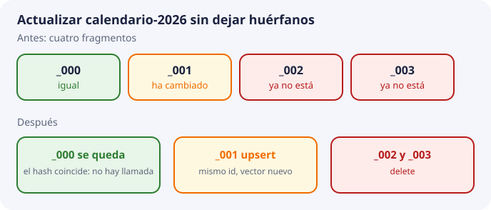

# 8. Operaciones de gestión

Estas son las operaciones que el pipeline de BDA va a usar sobre la colección definida por SBD. El script `laboratorio/02_chromadb_coleccion.py` las ejecuta con vectores escritos a mano, para ver el efecto sin Titan. No es el cuaderno de Colab de la sesión 1.

## Alta e inserción idempotente

`add` inserta. Si el identificador ya existe, ChromaDB lo rechaza. En un pipeline que puede ejecutarse dos veces —un fallo a medias, un alumno que relanza el script— ese rechazo es una fuente de errores.

`upsert` inserta o sustituye el registro con ese identificador. Es la operación por defecto de DocIA+. Indexar dos veces el mismo fragmento deja un solo registro, con el vector y los metadatos de la última ejecución.

La idempotencia solo es real si el identificador se calcula, no si se inventa un UUID nuevo en cada ejecución. Por eso el identificador es `{doc_id}_{chunk}`.

## Consulta

Hay dos lecturas distintas:

| Operación | Lleva vector | Para qué |
| --- | --- | --- |
| `query` | Sí | Recuperar los k fragmentos más cercanos, con filtro opcional |
| `get` | No | Auditoría: listar lo que hay de un `doc_id` o de una categoría |

`query` devuelve identificadores, documentos, metadatos y distancias, alineados por posición. La distancia se interpreta con el espacio de la colección (tema 3). El texto devuelto es el que se citará. No se vuelve a leer el PDF en el camino caliente de la consulta; por eso el texto guardado tiene que ser el texto citable.

La consulta de producción, cuando exista la API, tendrá este contrato mínimo:

```text
entrada:  texto de la pregunta, k, filtros opcionales
proceso:  embedding de la pregunta con el mismo modelo y las mismas opciones
salida:   k registros que cumplen el filtro, ordenados de menor a mayor distancia
```

k y los filtros los decide quien llama. La colección no los adivina.

## Actualización de un documento

Un documento institucional cambia: nueva duración de un módulo, nuevo calendario. El procedimiento completo, para un `doc_id`, es:



1. Volver a extraer y fragmentar el fichero nuevo.
2. Calcular el conjunto de identificadores nuevos.
3. Para cada fragmento, si el hash guardado coincide, no llamar a Titan; si no coincide, `upsert` con el vector nuevo.
4. `delete` de los identificadores que estaban en la colección para ese `doc_id` y no están en el conjunto nuevo.

El paso 4 es el que se olvida. El síntoma, semanas después, es una respuesta que cita un párrafo que ya no existe en el PDF. En el protocolo de incidencias del proyecto, un error de embeddings de este tipo es una incidencia alta: se revisa el pipeline y se reindexa.

Sustituir solo el metadato `curso` sin recalcular nada es legítimo cuando el texto no ha cambiado y únicamente se reclasifica. Para eso sirve un `update` de metadatos. No sirve para «corregir el significado». El significado, en esta arquitectura, es el vector, y el vector sale del texto.

## Borrado

Hace falta poder borrar:

- un registro, por identificador;
- todos los fragmentos de un documento, con un `where` de `doc_id`, cuando el documento se retira;
- una categoría entera solo de forma deliberada, en una operación revisada, nunca como efecto lateral de un script de pruebas contra la colección compartida.

Durante el desarrollo, cada grupo trabaja en una colección local o en un prefijo de `doc_id` propio. Nadie prueba un `delete` masivo contra la colección que ya tiene los 80 documentos.

## Copias y restauración

La colección es reproducible desde los documentos, pero reconstruirla gasta las llamadas a Titan y el tiempo del pipeline. El proyecto prevé copias periódicas.

Reglas de la copia:

- se copia el directorio de ChromaDB en un momento sin escrituras, o se instantánea el disco;
- la copia vive fuera de la máquina de la API, en el almacén de objetos, junto a los originales pero **separada** de ellos;
- restaurar es volver a poner ese directorio y comprobar con `get` que el número de fragmentos por categoría coincide con el que había en el momento de la copia;
- después de restaurar, se lanza una muestra de las preguntas de prueba del tema 9 antes de dar el servicio por bueno.

Una copia de solo los vectores, sin SQLite de documentos y metadatos, no sirve. Una copia de solo el texto, sin el índice, obliga a reindexar. Se copian las dos piezas.

## Qué queda registrado de la propia operación

Cada ejecución del pipeline deja, fuera de la colección o en un registro de la ejecución, lo siguiente: `doc_id`, número de fragmentos escritos, número de llamadas a Titan ahorradas por el hash, número de borrados y error si lo hubo. Eso es explotación del proceso de carga, que sí corresponde a BDA, y no es un registro de las preguntas de los usuarios.
