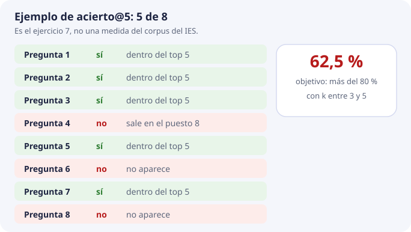
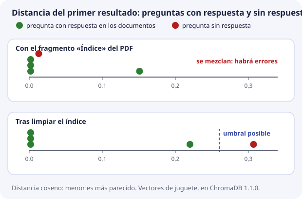

# 9. Calidad, fallos y qué mediremos

En los temas 1 a 8 hemos construido la base vectorial pieza a pieza. Queda la pregunta que decide si el trabajo ha valido: **¿cómo sabemos si la búsqueda funciona bien?**

«Funciona bien» no puede ser una impresión («he probado tres preguntas y parece que va»). El proyecto lo concreta en una frase:

> Precisión de recuperación **por encima del 80 %** en pruebas controladas, devolviendo de **3 a 5 fragmentos**.

Este tema convierte esa frase en una cuenta que se puede hacer, la calcula con un ejemplo real, y termina con una lista de fallos típicos y el orden en que se buscan.

## Dos calidades que no se mezclan

DocIA+ hace dos cosas seguidas (tema 1): primero **recupera** fragmentos y después **redacta** una respuesta con ellos. Cada una se mide por separado:

| Medida | Pregunta que contesta | Quién la mira |
| --- | --- | --- |
| Calidad de la recuperación | ¿El fragmento que contiene la respuesta está entre los k devueltos? | SBD y BDA, sobre la base vectorial |
| Calidad de la respuesta redactada | ¿El texto final es fiel a esos fragmentos y cita la fuente? | PIA, sobre el sistema completo |

Se puede recuperar bien y redactar mal. Lo contrario es muy raro: si el fragmento correcto no ha llegado, el redactor no tiene de dónde sacar la respuesta, y cita otra cosa o inventa. Por eso la recuperación se mide primero. **Esta unidad solo mide recuperación.**

## El conjunto de pruebas

Para medir hace falta un **conjunto de pruebas**: una lista de preguntas de las que ya sabemos, de antemano, en qué documento está la respuesta. Es como el solucionario de un examen: se escribe **antes** de corregir, no mirando lo que ha contestado el alumno.

Cada fila tiene estos campos:

| Campo | Ejemplo |
| --- | --- |
| Pregunta, con palabras distintas a las del documento | ¿Puedo acceder con un grado medio de informática? |
| `doc_id` que debe aparecer | `oferta-iabd-2026` |
| Sección que debe aparecer | Acceso |
| Categoría | `g4` |

Tres reglas para que el conjunto sea útil:

1. **Lo escribe quien conoce el documento**, no se saca del propio buscador. Si eliges las preguntas mirando lo que ya devuelve, siempre acertará.
2. **Las preguntas no copian las palabras del documento.** Si la pregunta es «procedimiento de formalización de matrícula», acierta hasta la búsqueda literal del tema 1. Se pregunta como preguntaría una familia: «¿cómo me matriculo?».
3. **Tamaño suficiente.** Veinte preguntas (cuatro por categoría) ya permiten discutir. Ochenta, con el corpus cerrado, dan una cifra que se puede presentar. Con menos de diez no se distingue un sistema bueno de la suerte: cada pregunta vale un 10 %.

### Preguntas sin respuesta

Además, se añaden aparte unas cuantas **preguntas negativas**: preguntas cuya respuesta **no** está en ningún documento, como «¿hay beca de transporte este año?». Para esas, lo correcto no es recuperar nada, sino que la base no encuentre nada lo bastante parecido y DocIA+ diga que no tiene documentación suficiente. No cuentan para el acierto; sirven para fijar el umbral, como veremos.

## La medida: acierto@k

La medida inicial es **acierto@k**, también llamada **Hit@k**: la proporción de preguntas con al menos un resultado relevante entre los k primeros. La cuenta es sencilla:

```text
                preguntas en las que el doc_id esperado aparece entre los k primeros
acierto@k  =  ─────────────────────────────────────────────────────────────────────────
                                 preguntas del conjunto
```

Para cada pregunta solo se mira una cosa: ¿está el documento esperado entre los k resultados? Sí o no. Luego se cuentan los síes.



Con k = 5, el objetivo del proyecto se lee así: **en más del 80 % de las preguntas controladas, el documento correcto está entre los cinco primeros fragmentos.**

Tres aclaraciones:

- **Es una tasa de acierto sobre documentos**, distinta del recall del índice del tema 4. Aquel comparaba HNSW con la búsqueda exacta; este compara con lo que una persona sabe que es la respuesta.
- **Al principio basta con el `doc_id`.** Si se quiere afinar, se exige también la sección correcta. Empezar por el `doc_id` evita bloquear la medida discutiendo en qué página exacta está cada cosa.
- **k se escribe siempre junto a la cifra.** Con k más grande, el acierto siempre sube o se queda igual, porque se miran más resultados. Un 80 % con k = 20 no cumple el objetivo: el proyecto habla de 3 a 5. Subir k para mejorar la cifra empeora lo que ve la persona, que recibe más ruido.

### Acierto, precisión y exhaustividad

Acierto@k pregunta si encontramos **algún** resultado relevante. Precision@k mide qué proporción de los resultados recuperados es relevante. Recall@k mide qué proporción de **todos los elementos relevantes anotados** se ha recuperado; se calcula por pregunta y después se promedia.

Si una pregunta tiene cuatro fragmentos relevantes y recuperamos dos entre cinco, el acierto es 1, Precision@5 es 2/5 y Recall@5 es 2/4. Con un único documento relevante por pregunta, el acierto y el recall sobre documentos coinciden. No se mezclan documentos y fragmentos al contar.

Encontrar cualquier fragmento del documento esperado es una primera comprobación. Para aceptar el sistema, SBD verifica que el fragmento contiene la información necesaria. Una pregunta que requiere dos apartados puede acertar por documento y seguir teniendo contexto incompleto.

### Ajustar y evaluar con preguntas distintas

Separamos preguntas de ajuste y preguntas reservadas para la evaluación final. El umbral, el modelo y el fragmentado se deciden con las primeras. Las reservadas se usan después, sin retocar el sistema para favorecerlas. Registramos corpus, modelo, configuración y k junto a cada medida. Incluimos preguntas literales, paráfrasis, ambiguas y sin respuesta; las negativas se evalúan aparte.

## Un ejemplo completo, ejecutado

Montamos una evaluación pequeña en ChromaDB con los vectores de juguete del tema 3, con tres ejes (matrícula, horas, convivencia). La colección tiene cuatro fragmentos. El cuarto es el **índice** del PDF del proyecto educativo, que habla un poco de todo:

| id | texto | vector |
| --- | --- | --- |
| `oferta-iabd-2026_000` | Procedimiento de formalización de matrícula | (0,90, 0,10, 0,00) |
| `oferta-iabd-2026_001` | El módulo de Big Data Aplicado tiene 190 horas | (0,05, 0,95, 0,00) |
| `pec-2026_000` | El plan de convivencia regula la vida del centro | (0,00, 0,05, 0,90) |
| `pec-2026_001` | Índice: matrícula, horarios, convivencia | (0,55, 0,55, 0,55) |

El conjunto de pruebas: cuatro preguntas con respuesta y una sin respuesta.

| Pregunta | Documento esperado |
| --- | --- |
| ¿Cómo me matriculo? | `oferta-iabd-2026` |
| ¿Cuántas horas tiene el módulo? | `oferta-iabd-2026` |
| ¿Qué normas de convivencia hay? | `pec-2026` |
| ¿Cuándo hay que matricularse y cuántas horas son? | `oferta-iabd-2026` |
| ¿Hay beca de transporte? | *(ninguno: pregunta negativa)* |

Resultados reales, los tres primeros de cada pregunta con su distancia:

```text
¿Cómo me matriculo?                    oferta-iabd-2026_000 0.002   pec-2026_001 0.321   oferta-iabd-2026_001 0.780
¿Cuántas horas tiene el módulo?        oferta-iabd-2026_001 0.002   pec-2026_001 0.360   oferta-iabd-2026_000 0.835
¿Qué normas de convivencia hay?        pec-2026_000 0.002           pec-2026_001 0.360   oferta-iabd-2026_000 0.939
¿Cuándo hay que matricularse y ...?    pec-2026_001 0.151           oferta-iabd-2026_000 0.220   oferta-iabd-2026_001 0.258
¿Hay beca de transporte?               pec-2026_001 0.013           pec-2026_000 0.307   oferta-iabd-2026_000 0.360
```

Contamos:

- **acierto@1 = 3/4 = 75 %.** En la cuarta pregunta, el primer resultado es el **índice** del PDF, no la oferta.
- **acierto@3 = 4/4 = 100 %.** Con tres resultados, la oferta aparece en todas.

Y hay algo peor en la última línea: la pregunta **sin respuesta** encuentra el índice a distancia **0,013**, casi como si fuera la respuesta perfecta. El índice «habla un poco de todo» y por eso se parece un poco a cualquier pregunta (lo anunciamos en el tema 1 con las portadas).

### Lo mismo, tras limpiar

El índice de un PDF es ruido: debería haberse quitado en la limpieza del tema 7. Repetimos la evaluación sin él:

```text
¿Cómo me matriculo?                    oferta-iabd-2026_000 0.002   oferta-iabd-2026_001 0.780   pec-2026_000 0.968
¿Cuántas horas tiene el módulo?        oferta-iabd-2026_001 0.002   oferta-iabd-2026_000 0.835   pec-2026_000 0.889
¿Qué normas de convivencia hay?        pec-2026_000 0.002           oferta-iabd-2026_000 0.939   oferta-iabd-2026_001 0.942
¿Cuándo hay que matricularse y ...?    oferta-iabd-2026_000 0.220   oferta-iabd-2026_001 0.258   pec-2026_000 0.902
¿Hay beca de transporte?               pec-2026_000 0.307           oferta-iabd-2026_000 0.360   oferta-iabd-2026_001 0.523
```

- **acierto@1 = 4/4 = 100 %.**
- La pregunta sin respuesta ahora queda a **0,307** del fragmento más cercano: lejos.

La mejora no ha venido de tocar el modelo, ni el índice HNSW, ni k. Ha venido de **limpiar el texto**. Esa es la lección más importante del tema.

Los vectores son de juguete, y la pregunta sin respuesta tiene un vector inventado a propósito. Pero la ChromaDB y las cuentas son reales, y muestran un fallo posible. Su frecuencia y magnitud deben medirse con documentos y embeddings reales; estas cifras no predicen el resultado de Titan.

## El umbral

El top-k devuelve hasta k fragmentos disponibles que cumplen el filtro, aunque ninguno responda a la pregunta (tema 6). Para saber cuándo **no** hay respuesta se usa un **umbral**: si el primer resultado está a una distancia mayor que el umbral, DocIA+ dice que no tiene documentación suficiente.

¿Dónde se pone? Se mira la distancia del **primer resultado** de cada pregunta, separando las que tienen respuesta de las que no:

| | Preguntas con respuesta (peor caso) | Pregunta sin respuesta |
| --- | --- | --- |
| Con el índice | 0,151 | **0,013** |
| Tras limpiar | 0,220 | **0,307** |



- **Con el índice**, la pregunta sin respuesta queda **más cerca** que algunas con respuesta. Los dos grupos se mezclan y no existe ningún umbral que los separe: cualquier valor que deje pasar las buenas deja pasar también la mala.
- **Tras limpiar**, hay un **hueco** entre 0,220 y 0,307. El umbral se coloca en ese hueco, por ejemplo en 0,26.

En este ejemplo hay una separación perfecta después de limpiar. **En datos reales puede haber solapamiento incluso con un corpus bien preparado.** Un umbral puede seguir siendo útil: hay que elegir qué errores se aceptan y medirlos.

- **Aceptación indebida:** se permite responder a una pregunta sin respaldo documental.
- **Rechazo indebido:** se rechaza una pregunta cuya respuesta sí estaba disponible.

Registramos ambos errores sobre preguntas reservadas. Revisamos también limpieza, fragmentado, modelo y relevancia del contexto. Una distancia baja no demuestra que se pueda responder. PIA debe comprobar el apoyo documental y permitir la abstención.

El umbral se aplica a cada fragmento antes de enviarlo al redactor. Si no queda ninguno, se devuelve el mensaje de falta de contexto; si quedan algunos, todavía se debe valorar si son suficientes.

El número del umbral de DocIA+ **no se fija en esta unidad**. Se decidirá con el conjunto de pruebas real, sobre la colección real con Titan, y se anotará en la documentación del pipeline. El 0,26 del ejemplo solo vale para estos vectores de juguete.

## Fallos típicos

Cuando la medida sale mal, casi nunca es que «el modelo se haya vuelto tonto». Cada fallo tiene un síntoma y un sitio donde se corrige. Todos se han visto en algún tema de la unidad:

| Síntoma | Causa frecuente | Dónde se corrige | Tema |
| --- | --- | --- | --- |
| El top-5 son pies de página, índices o portadas | Se ha indexado el ruido del PDF | Limpieza, SBD | 7 |
| Una pregunta sin respuesta sale a distancia muy baja | Un fragmento «de todo» (índice, portada) se parece a cualquier cosa | Limpieza, SBD | 7 y 9 |
| Sale un párrafo de otro curso | Falta el filtro de `curso`, o conviven dos versiones | Metadatos y borrado de la versión vieja | 6 y 8 |
| El documento es el correcto pero el párrafo no responde | Fragmento demasiado largo, que mezcla apartados | Corte, SBD | 7 |
| Tres resultados son el mismo párrafo | Solape excesivo | Fragmentación y presentación | 7 |
| Ayer funcionaba y hoy las distancias no tienen sentido | Se consulta con otro modelo, otra dimensión u otra normalización | Pipeline de BDA; hay que reindexar | 2 |
| Un documento corregido sigue citando el texto viejo | Quedaron fragmentos huérfanos, o se usó `add` en lugar de `upsert` | Procedimiento de actualización | 8 |
| HNSW no devuelve lo mismo que un recorrido completo en Python | `search_ef` demasiado bajo | Parámetro del índice, no el texto | 4 |
| Dos grupos no se pueden integrar | Metadatos distintos para la misma idea | Esquema único | 6 |

Ninguno se arregla «pidiendo el vector otra vez» sin cambiar el texto o la configuración. Como vimos en el tema 2, el mismo texto con el mismo modelo y las mismas opciones produce el mismo vector.

## En qué orden se busca un fallo

Cuando la medida baja, se revisa siempre en este orden, de lo más probable a lo menos:

1. **El texto guardado.** Con un `get` por `doc_id` (tema 8): ¿es texto que se puede citar, o basura de la extracción?
2. **Los metadatos.** ¿La categoría, el curso y el hash son los esperados?
3. **La llamada al modelo.** ¿El mismo modelo, la misma dimensión, longitud del vector cercana a 1?
4. **La consulta.** ¿El `where` y la k son los de la prueba?
5. **Solo entonces, el índice**, comparándolo con una búsqueda exacta (tema 4).

Ese orden evita pasar una tarde ajustando parámetros de HNSW cuando el problema era que el PDF se había leído al revés. En el ejemplo de arriba, el fallo estaba en el paso 1.

## Comprueba que lo has entendido

??? question "1. ¿Por qué se mide la recuperación por separado de la respuesta redactada?"
    Porque si el fragmento correcto no se recupera, la redacción no tiene de dónde sacar la respuesta. Medir por separado dice en qué parte está el fallo.

??? question "2. ¿Por qué las preguntas de prueba no deben copiar las palabras del documento?"
    Porque entonces acertaría hasta una búsqueda literal y la prueba no mediría la búsqueda por significado, que es lo que DocIA+ tiene que hacer bien.

??? question "3. Diez preguntas; el documento esperado aparece en el top 5 en siete. ¿Acierto@5? ¿Se cumple el objetivo?"
    7 / 10 = 70 %. No se cumple: el proyecto pide más del 80 %.

??? question "4. Con k = 20 el acierto sube al 90 %. ¿Se cumple el objetivo?"
    No. El objetivo está definido para k entre 3 y 5. Subir k siempre sube el acierto o lo deja igual, y da más ruido a quien pregunta.

??? question "5. En el ejemplo, ¿por qué la pregunta «¿hay beca de transporte?» encontraba un fragmento a distancia 0,013?"
    Porque el fragmento «Índice» habla un poco de todo y se parece un poco a cualquier pregunta. Es ruido de extracción que debía haberse limpiado.

??? question "6. Las preguntas con respuesta tienen su primer resultado entre 0,002 y 0,30, y las negativas entre 0,25 y 0,40. ¿Dónde pones el umbral?"
    No hay un umbral que separe perfectamente ambos grupos. Se comparan los errores de aceptación y rechazo con varios valores, se revisan datos y modelo y se valida la decisión con preguntas reservadas.

??? question "7. Un documento corregido sigue citando el texto antiguo. ¿Qué dos causas del tema 8 revisarías?"
    Que hayan quedado fragmentos huérfanos sin borrar, o que el pipeline haya escrito con `add`, que ignora en silencio los identificadores que ya existen.

??? question "8. Baja el acierto. Un compañero propone subir `search_ef`. ¿Qué revisarías antes?"
    El texto guardado, los metadatos, la llamada al modelo y la consulta, en ese orden. El índice es lo último.
