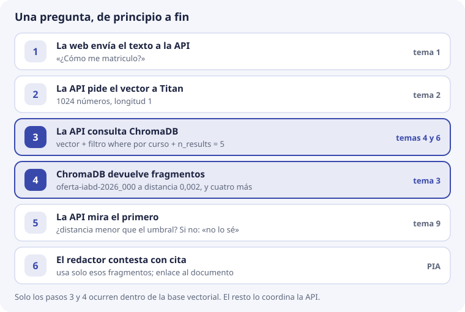
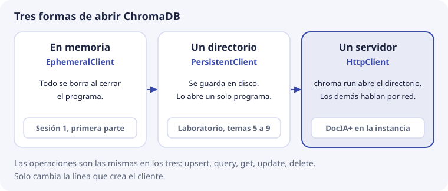
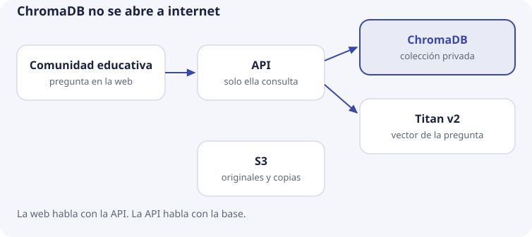

# 10. ChromaDB en DocIA+

En los temas 1 a 9 hemos visto las piezas de una base vectorial por separado: el vector, la distancia, el índice, el registro, el filtro, el fragmento, las operaciones y la medida. Este último tema las **monta juntas** y responde a una pregunta práctica: **¿cómo va a usar DocIA+ ChromaDB el día que funcione?**

No hay teoría nueva. Cada decisión remite al tema donde se explicó. Lo que se afirma de ChromaDB se ha comprobado con la versión 1.1.0, la misma del laboratorio.

## Las decisiones, en una tabla

| Decisión | Valor | Por qué, en una frase | Tema |
| --- | --- | --- | --- |
| Producto | ChromaDB, en la misma máquina que la API | Código abierto, sin coste fijo, y se puede usar en local desde el primer día | 5 |
| Modelo | Amazon Titan Embeddings v2, 1024 números, normalizado | Documentos y preguntas se convierten con el mismo modelo | 2 |
| Espacio | Coseno | Con vectores de longitud 1, ordena igual que el producto escalar. La distancia es 1 − coseno | 3 |
| Índice | HNSW con los parámetros por defecto | Solo se tocan si la medida del tema 9 lo pide | 4 |
| Colecciones | Una, con `categoria` de `g1` a `g5` | Los cinco grupos buscan juntos y filtran cuando hace falta | 5 y 6 |
| Unidad | Fragmento por secciones, con título delante | Lo que se recupera tiene que poder citarse | 7 |
| Identificador | `{doc_id}_{chunk}`, por ejemplo `oferta-iabd-2026_000` | Reindexar el mismo documento sustituye, no duplica | 7 y 8 |
| Escritura | `upsert` y borrado de huérfanos | `add` ignora en silencio los ids que ya existen | 8 |
| Qué no se guarda | Preguntas de los usuarios y datos personales | La colección solo contiene documentos públicos o internos del centro | 5 |
| Copias | Instantánea del directorio, guardada fuera de la máquina | Restaurar es más rápido que reindexar | 8 |

Estas decisiones se revisan con una medida del tema 9 en la mano, no por preferencia. Y dos de ellas, **el modelo y el espacio**, no se pueden cambiar sobre una colección que ya existe. Lo comprobaremos más abajo.

## Una pregunta, de principio a fin

Seguimos la pregunta de siempre, «¿Cómo me matriculo?», desde que alguien la escribe en la web hasta que recibe la respuesta:



Así lo haría la API, en Python. `titan()` y `redactar()` son funciones que todavía no existen: representan la llamada a Titan y el trabajo de PIA.

```python
UMBRAL = 0.26                                   # el del ejemplo del tema 9; el real se medirá

vector = titan("¿Cómo me matriculo?")           # paso 2: lista de 1024 números

resultado = coleccion.query(                    # paso 3
    query_embeddings=[vector],
    n_results=5,
    where={"curso": "2026-2027"},
)

distancias = resultado["distances"][0]          # paso 4: [0.002, ...]
if distancias[0] > UMBRAL:                      # paso 5
    respuesta = "No tengo documentación suficiente para contestar."
else:
    respuesta = redactar(resultado["documents"][0], resultado["metadatas"][0])  # paso 6
```

Con los números del ejemplo:

- **Paso 4.** El primer fragmento es `oferta-iabd-2026_000`, «Procedimiento de formalización de matrícula», a distancia **0,002**. Es decir, coseno 0,998 (tema 3).
- **Paso 5.** 0,002 es menor que 0,26, así que hay respuesta. Si la pregunta fuera «¿Hay beca de transporte?», el primer fragmento estaría a **0,307**, por encima del umbral, y DocIA+ contestaría que no lo sabe (tema 9).
- **Paso 6.** El redactor recibe los fragmentos y sus metadatos. Con `doc_id` y `pagina` puede citar el documento.

Fíjate en que **la base vectorial solo interviene en los pasos 3 y 4**. Titan no sabe nada de ChromaDB y ChromaDB no sabe nada de Titan: la base solo recibe listas de 1024 números y devuelve los registros más cercanos. Quien une las piezas es la API.

## Un documento, de principio a fin

El camino contrario es el de un documento que entra en la base. Es el pipeline de nueve pasos del [tema 7](07-chunking-y-ciclo-de-indexacion.md): el original se lee de S3, se extrae y limpia el texto, se trocea, se calcula el hash, Titan convierte cada fragmento en vector, se comprueba la dimensión y la longitud, se hace `upsert` y se borran los huérfanos.

La regla que une los dos caminos: **el modelo que convierte los documentos y el que convierte las preguntas tiene que ser el mismo**, con la misma dimensión y la misma normalización. Si no, las distancias del paso 4 no significan nada (tema 2).

## Tres formas de abrir ChromaDB

Hasta ahora hemos abierto ChromaDB de dos maneras. Existe una tercera, que es la que usará DocIA+:



```python
import chromadb

cliente = chromadb.EphemeralClient()                          # en memoria
cliente = chromadb.PersistentClient(path="laboratorio/data")  # un directorio
cliente = chromadb.HttpClient(host="localhost", port=8000)    # un servidor
```

El tercero necesita un **servidor** en marcha: un programa que se queda encendido, abre el directorio y atiende peticiones de otros programas. Se arranca así:

```text
chroma run --path /datos/chroma --host localhost --port 8000
```

En SBD ya conocéis esta diferencia con las bases relacionales:

| Relacional | ChromaDB | Quién abre los ficheros |
| --- | --- | --- |
| SQLite | `PersistentClient` | El propio programa |
| Servidor MySQL o PostgreSQL | `chroma run` más `HttpClient` | El servidor. Los demás le piden cosas por la red |

**¿Por qué un servidor en DocIA+?** Porque dos programas necesitan la misma colección: la **API**, que consulta, y el **indexador**, que escribe. Si los dos abrieran el directorio con `PersistentClient`, habría dos programas modificando por su cuenta los mismos ficheros de SQLite y de HNSW. ChromaDB no está pensado para eso. Con un servidor, **solo un programa abre el directorio** y los demás le hacen peticiones.

Al probarlo en Windows se ve muy claro: con el servidor en marcha, los ficheros del directorio no se pueden ni borrar, porque los tiene abiertos el servidor.

Lo que **no cambia** es todo lo demás. `upsert`, `query`, `get`, `update` y `delete` se escriben igual con los tres clientes: solo cambia la línea que crea el cliente. Por eso el laboratorio puede usar `PersistentClient` y el código servir después con `HttpClient`.

## Quién habla con quién



En el proyecto, todo lo de DocIA+ vive en una instancia EC2 pequeña, de 2 vCPU y 4 GB de RAM:

- **La web del IES solo habla con la API.** Es lo único abierto a internet.
- **La API solo lee** de ChromaDB (`query` y `get`). Nunca escribe.
- **El indexador escribe** (`upsert` y `delete`). Es un script del pipeline que se ejecuta en la propia máquina, cuando hay documentos nuevos. Lee los originales de S3 y pide los vectores a Titan.
- **El servidor de ChromaDB escucha solo en `localhost`**, es decir, solo atiende a programas de la misma máquina. Es lo que hace `chroma run` por defecto, y no hay que cambiarlo.

¿Por qué no abrir el puerto 8000 y que la web consulte ChromaDB directamente, sin API? Porque, tal como se arranca arriba, **el servidor no pide contraseña**: en la prueba, `HttpClient` se conectó sin ninguna credencial. Cualquiera que llegara al puerto podría hacer un `get()` y llevarse todos los fragmentos, o borrar la colección. Es el mismo motivo por el que no se abre a internet el puerto 3306 de un MySQL: la aplicación web es la que se conecta a la base, no el navegador.

## Cuánto ocupa y cuánto tarda

En el tema 2 estimamos unos 1.200 fragmentos para el corpus del IES. Lo hemos medido: 1.200 vectores de 1024 números, cada uno con un texto de 600 caracteres y sus metadatos, en ChromaDB 1.1.0.

| Pieza en disco | Tamaño |
| --- | --- |
| `data_level0.bin`, el índice HNSW con los vectores | 5,1 MB |
| `chroma.sqlite3`: textos, metadatos y el registro de escrituras, que también guarda los vectores | 9,9 MB |
| **Total del directorio** | **15 MB** |

La cuenta a mano del índice coincide:

```text
1.200 vectores × 1.024 números × 4 bytes = 4.915.200 bytes ≈ 4,9 MB
```

El directorio completo ocupa unas tres veces eso, porque cada vector se guarda también en SQLite, junto con el texto. Aun así, 15 MB frente a 4 GB de RAM es menos del 0,4 %. El índice cabe en memoria de sobra.

Los tiempos, en un portátil normal:

| Operación | Tiempo |
| --- | --- |
| `upsert` de los 1.200 fragmentos, en lotes de 300 | 8 s |
| Primera consulta, que carga el índice | 95 ms |
| Consultas siguientes, top 5 | 13 ms |

Con estas cifras, ChromaDB no será la parte lenta de DocIA+. Si una respuesta tarda, se mira antes la llamada a Titan y la redacción.

## Dos cosas que no se cambian sobre la marcha

### El modelo

Supongamos que en la fase de servidor local se sustituye Titan (1024 números) por un modelo de 384. Si se consulta la colección actual con un vector del modelo nuevo, ChromaDB lo rechaza:

```text
InvalidArgumentError: Collection expecting embedding with dimension of 1024, got 384
```

Eso es una suerte: el error avisa. El caso peligroso es el contrario. **Si el modelo nuevo también diera 1024 números, ChromaDB no se quejaría** y devolvería resultados sin sentido, porque las coordenadas de dos modelos no significan lo mismo (tema 2).

Para que eso no pase, el modelo se apunta en los **metadatos de la colección**, además de en los de cada fragmento:

```python
coleccion = cliente.create_collection(
    name="docia_titan_v2",
    metadata={
        "hnsw:space": "cosine",
        "modelo": "amazon.titan-embed-text-v2:0",
        "dimensiones": 1024,
    },
)
```

Antes de consultar, la API comprueba que `coleccion.metadata["modelo"]` es el modelo que está usando. Si no coincide, se para y no responde.

El nombre de la colección también lleva el modelo. Tiene que tener entre 3 y 512 caracteres, solo letras, números, puntos, guiones y guiones bajos, y empezar y acabar por letra o número.

### El espacio

La distancia se fija al crear la colección. Si se intenta cambiar después:

```python
coleccion.modify(metadata={"hnsw:space": "l2"})
```

ChromaDB responde:

```text
ValueError: Changing the distance function of a collection once it is created is not supported currently.
```

### Qué se hace entonces

Cambiar de modelo o de espacio significa **crear otra colección y reindexar desde los originales**. En orden:

1. Se crea la colección nueva al lado de la vieja, con otro nombre (por ejemplo, `docia_local_384`).
2. El indexador la llena desde S3.
3. Se repite la medida del tema 9 sobre la nueva.
4. Si la medida es igual o mejor, la API pasa a usarla y la vieja se borra.

Mientras tanto, la API sigue contestando con la colección vieja.

## Copias y restauración, probadas

El procedimiento del tema 8, aplicado a DocIA+:

1. Se para el servidor, o se hace una instantánea del disco.
2. Se copia el directorio **entero**: `chroma.sqlite3` y la carpeta del índice (tema 5).
3. La copia se sube a S3.
4. Se vuelve a arrancar el servidor.

Lo hemos probado: se copió el directorio con los 1.200 vectores, se arrancó `chroma run` sobre la copia y `HttpClient` encontró la colección `docia_titan_v2` con sus 1.200 registros y sus metadatos (modelo y dimensiones incluidos).

Así se comprueba que una copia sirve: **se restaura**, se arranca sobre ella y se compara `count()` con el que anotó el registro de ejecución del tema 8. Una copia que nunca se ha restaurado no se sabe si funciona. Por eso el proyecto exige probar las dos vías de recuperación, restaurar la copia y reindexar desde los originales, antes de dar el hito por cumplido.

## Los laboratorios, en orden

1. **[Sesión 1](sesion-01.md)**, en Colab. Un modelo de verdad (`all-MiniLM-L6-v2`, 384 números), ChromaDB en memoria y después en disco, con frases de ejercicio y las categorías `g1` a `g5`. Ojo: la distancia del primer cuaderno, «ver el vector», es una resta de listas, no la distancia coseno de ChromaDB. No se comparan.
2. **Geometría**, en Python puro, con vectores escritos a mano: producto escalar, longitud y coseno (tema 3).
3. **ChromaDB local**, con los mismos vectores escritos a mano y `PersistentClient`.

Instrucciones: [laboratorio/README.md](https://github.com/iesataulfoargentasor/DocIA-Plus/blob/main/laboratorio/README.md).

Esta es la salida real del tercero, `python laboratorio/02_chromadb_coleccion.py`, con el tema que explica cada línea:

```text
Distancia de un vector consigo mismo: 0.0000                                   ← tema 3

¿Cómo me matriculo? Sin filtro de categoría
  distancia=0.0019  categoria=g4  Procedimiento de formalización de matrícula  ← tema 3: 1 − 0,998
  distancia=0.7804  categoria=g4  El módulo de Big Data Aplicado ... 190 horas
  distancia=0.7804  categoria=g5  Calendario escolar, fragmento 3, ...

La misma pregunta, solo proyecto educativo (g2)
  distancia=0.9683  categoria=g2  El plan de convivencia regula la vida ...    ← tema 6: el filtro manda

Fragmentos que quedan de calendario-2026:                                      ← tema 8
  calendario-2026_000  Calendario escolar, fragmento 0.
  calendario-2026_001  Calendario escolar, fragmento 1, versión nueva.
```

Cuando el script sale bien, se han visto todas las operaciones de la base sin depender de la nube. El salto a DocIA+ consiste en cambiar dos cosas: el vector escrito a mano por el de Titan, y el texto de ejercicio por fragmentos de documentos reales. El esquema de metadatos y las operaciones no cambian.

## Qué viene después

Cuando se cierre esta unidad, el trabajo sigue este orden:

1. Cerrar en el aula el esquema de metadatos del tema 6, con los cinco grupos delante.
2. Elegir un documento real corto de cada categoría y escribir a mano cinco preguntas cuya respuesta esté en él, más unas cuantas preguntas sin respuesta.
3. Pasar esos cinco documentos por el pipeline del tema 7, todavía en local, en una colección que lleve en el nombre y en los metadatos el modelo usado.
4. Calcular el recall@5 del tema 9 y ver si hay hueco para un umbral.
5. Solo con esa medida, decidir si el corte y los metadatos aguantan el paso a la colección compartida.

Hasta tener el punto 4, no compensa discutir la instancia, el dominio ni el chatbot.

## Comprueba que lo has entendido

??? question "1. En el recorrido de una pregunta, ¿qué pasos ocurren dentro de ChromaDB y cuáles no?"
    Dentro de ChromaDB solo ocurren la búsqueda y la devolución de fragmentos (pasos 3 y 4). El vector lo calcula Titan, y la comparación con el umbral y el reparto de los fragmentos al redactor los hace la API.

??? question "2. ¿Por qué DocIA+ usa un servidor ChromaDB en lugar de `PersistentClient` dentro de la API?"
    Porque dos programas necesitan la colección: la API, que lee, y el indexador, que escribe. Con un servidor, un único programa abre el directorio y los demás le hacen peticiones. Es la misma diferencia que hay entre SQLite y un servidor MySQL.

??? question "3. Un compañero propone abrir el puerto 8000 a internet para que la web consulte ChromaDB sin pasar por la API. ¿Qué problemas tiene?"
    El servidor, tal como se arranca, no pide contraseña: cualquiera podría leer todos los fragmentos con `get()` o borrar la colección. Además, la web tendría que calcular el vector con Titan, lo que exige credenciales en el navegador, y aplicar ella misma el umbral.

??? question "4. El corpus crece a 3.000 fragmentos. ¿Cuánto ocupará aproximadamente el índice? ¿Y el directorio?"
    3.000 × 1.024 × 4 bytes = 12.288.000 bytes, unos 12,3 MB de índice. El directorio, unas tres veces más: alrededor de 37 MB. Sigue cabiendo de sobra en 4 GB.

??? question "5. Se cambia a un modelo local de 384 números y se consulta la colección actual. ¿Qué pasa? ¿Y si el modelo nuevo diera 1024?"
    Con 384, ChromaDB da un error: la colección espera 1024. Con 1024 no hay error y los resultados no tienen sentido, porque las coordenadas de dos modelos no significan lo mismo. Por eso el modelo se guarda en los metadatos de la colección y la API lo comprueba antes de consultar.

??? question "6. ¿Se puede pasar una colección de coseno a `l2` con `modify`? ¿Qué se hace entonces?"
    No, ChromaDB devuelve un error. Hay que crear otra colección con el nuevo espacio, reindexar desde los originales, medir, y solo entonces cambiar la API a la colección nueva.

??? question "7. ¿Cómo sabes que una copia de seguridad de la base sirve?"
    Restaurándola: se arranca el servidor sobre la copia y se comprueba que `count()` coincide con el del registro de ejecución. Una copia que no se ha restaurado nunca no se sabe si funciona.

??? question "8. En la salida del laboratorio, el fragmento de las 190 horas y el del calendario salen a la misma distancia, 0,7804. ¿Por qué?"
    Porque en el script tienen el mismo vector escrito a mano (el de «horas»). La base solo compara vectores, no textos. Con un modelo real, dos textos distintos darían vectores distintos y distancias distintas.
