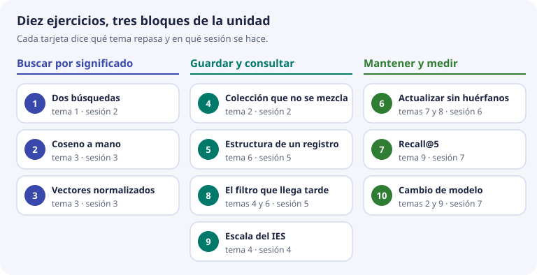
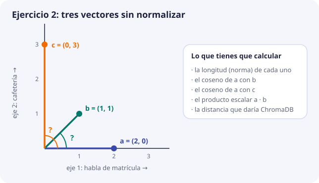
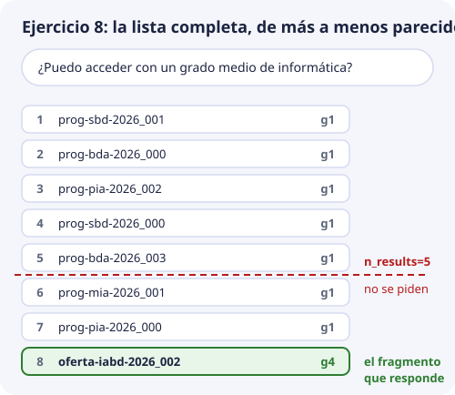

# Ejercicios

Diez ejercicios para cerrar la unidad. Cada uno repasa uno o dos temas con el mismo ejemplo de siempre: los textos de la matrícula, los documentos `oferta-iabd-2026`, `pec-2026` y `calendario-2026`, y los unos 1.200 fragmentos que se esperan en DocIA+.

## Cómo trabajarlos

- **Se hacen en papel**, con calculadora. Las cuentas son pequeñas a propósito. Si quieres, compruébalas después en Python o con los laboratorios. No hace falta AWS.
- **Primero inténtalo sin mirar nada.** Si te atascas, abre la **pista**. La pista no da la respuesta: te dice qué parte del tema releer.
- **Escribe el razonamiento, no solo el resultado.** En la puesta en común se corrige el porqué. Las soluciones las tiene el profesorado y se ven en clase después de intentarlo.
- **Se hacen en la sesión indicada**, cuando ya se ha visto el tema. La tabla de la [presentación de la unidad](index.md) dice cuáles tocan en cada sesión.



| Ejercicio | Qué repasa | Tema | Sesión |
| --- | --- | --- | --- |
| 1. Dos búsquedas | Búsqueda literal frente a búsqueda semántica | [1](01-busqueda-literal-y-semantica.md) | 2 |
| 2. Coseno a mano | Norma, coseno, producto escalar y distancia | [3](03-geometria-y-similitud.md) | 3 |
| 3. Vectores normalizados | Por qué con longitud 1 basta el producto escalar | [3](03-geometria-y-similitud.md) | 3 |
| 4. Colección que no se mezcla | Dimensión y modelo iguales al indexar y al consultar | [2](02-embeddings.md) y [5](05-anatomia-bd-vectorial.md) | 2 |
| 5. Estructura de un registro | Identificador y esquema de metadatos | [6](06-metadatos-y-filtros.md) | 5 |
| 6. Actualizar sin huérfanos | Hash, `upsert` y borrado | [7](07-chunking-y-ciclo-de-indexacion.md) y [8](08-operaciones-de-gestion.md) | 6 |
| 7. Recall@5 | Medir si la búsqueda cumple el objetivo | [9](09-calidad-y-fallos.md) | 7 |
| 8. El filtro que llega tarde | Filtro dentro de la consulta y umbral | [4](04-busqueda-e-indices.md) y [6](06-metadatos-y-filtros.md) | 5 |
| 9. Escala del IES | Cuándo hace falta un índice aproximado | [4](04-busqueda-e-indices.md) | 4 |
| 10. Cambio de modelo | Reindexar y volver a medir | [2](02-embeddings.md) y [9](09-calidad-y-fallos.md) | 7 |

Recuerda la regla de lectura de las distancias, que se usa en varios ejercicios. En una colección en espacio coseno, ChromaDB devuelve **distancia = 1 − coseno**: 0 es idéntico y cuanto más pequeña, más parecido. El laboratorio lo muestra: el fragmento de matrícula sale a 0,002, que es un coseno de 0,998.

## 1. Dos búsquedas

El documento `oferta-iabd-2026` tiene este fragmento: «Procedimiento de formalización de matrícula del curso de especialización».

Una alumna escribe: «¿Cómo me matriculo en el ciclo de IA?».

1. Escribe las palabras de la pregunta y las del fragmento. Marca las que coinciden **letra por letra**. ¿Son palabras que ayuden a encontrar el fragmento?
2. Explica por qué una búsqueda literal, como un `LIKE '%matriculo%'` en SQL, no devuelve ese fragmento.
3. Explica qué tiene que ser igual al indexar el fragmento y al consultar la pregunta para que la búsqueda semántica tenga sentido.
4. Di una pregunta para la que, al revés, la búsqueda literal sería la herramienta correcta.

??? tip "Pista"
    Fíjate en «matriculo» y «matrícula»: para un ordenador que compara letras son palabras distintas. Para el apartado 3, relee en el tema 1 las dos fases, indexar y consultar. Para el 4, piensa en algo que se escribe siempre igual, como un código.

## 2. Coseno a mano

Tres vectores **sin normalizar**, con los dos ejes de juguete del tema 1: cuánto habla de matrícula y cuánto de cafetería.

```text
a = (2, 0)     solo habla de matrícula
b = (1, 1)     mitad matrícula, mitad cafetería
c = (0, 3)     solo habla de cafetería
```



1. Calcula la norma (la longitud) de `a`, de `b` y de `c`.
2. Calcula el coseno de `a` con `b` y el de `a` con `c`.
3. Ordena `b` y `c` de más a menos parecido a `a`. ¿Cuadra con lo que dice cada texto?
4. Calcula el producto escalar de `a` con `b`. ¿Por qué no coincide con el coseno?
5. Normaliza `a` y `b` (divide cada uno por su norma) y vuelve a hacer el producto escalar. ¿Qué obtienes ahora?
6. ¿Qué distancia devolvería ChromaDB, en espacio coseno, para `b` y para `c`?

??? tip "Pista"
    La norma de `(x, y)` es `√(x² + y²)`. El coseno es el producto escalar dividido entre el producto de las dos normas. Rehaz primero el ejemplo resuelto del tema 3, el de «¿Cómo me matriculo?», que sale 0,998.

## 3. Vectores ya normalizados

Titan se usa con la opción de normalizar, así que todos sus vectores miden 1. Con dos ejes y redondeando, una pregunta y dos fragmentos quedan así:

```text
q  = (0,6, 0,8)     la pregunta
d1 = (0,6, 0,8)
d2 = (0,8, 0,6)
```

1. Comprueba que la norma de `q` es 1.
2. Calcula el producto escalar de `q` con `d1` y con `d2`. Explica por qué, aquí, eso ya es el coseno.
3. ¿Qué fragmento devuelve primero una colección en espacio coseno? ¿Qué distancia da ChromaDB para cada uno?
4. El cuaderno 1 de la sesión 1 no mide la distancia coseno: mide la «resta» entre los dos vectores, la longitud de `q − d2`. Calcúlala y comprueba que es igual a `√(2 × distancia)`. Por eso los números del cuaderno 1 no se comparan con los de ChromaDB.
5. Un compañero guarda un fragmento sin normalizar: `d4 = (3, 4)`. Calcula `q · d4`. ¿Por qué ese número no puede ser un coseno? ¿Cuál es el coseno de verdad?

??? tip "Pista"
    Con longitud 1, la división del coseno es entre `1 × 1`, así que no cambia nada. En el apartado 5, un coseno nunca pasa de 1. Calcula la norma de `d4` y mira hacia dónde apunta comparado con `q`.

## 4. Una colección que no se puede mezclar

El grupo de BDA ha indexado los unos 1.200 fragmentos de DocIA+ (80 documentos por unos 15 fragmentos cada uno) con Titan a **1024 dimensiones**. Otro grupo quiere «probar rápido» consultando con vectores de Titan a **256 dimensiones**, porque ocupan menos.

1. Calcula cuánto ocupan los vectores de la colección con 1024 dimensiones y cuánto ocuparían con 256. Cada número ocupa 4 bytes. ¿Es un ahorro que importe?
2. ¿Por qué la consulta de 256 dimensiones contra la colección de 1024 no es válida?
3. Si de verdad se quisiera trabajar con 256, ¿qué habría que hacer con la colección?
4. Alguien propone quedarse con los primeros 256 números de cada vector de 1024, en vez de volver a llamar a Titan. ¿Por qué no vale?

??? tip "Pista"
    Relee en el tema 2 que un embedding depende del trío texto, modelo y opciones. La dimensión es una de esas opciones. La cuenta del apartado 1 está hecha en el mismo tema, para 1024.

## 5. Estructura de un registro

El grupo G3 indexa el documento `plan-igualdad-2026.pdf`, «Plan de igualdad», del curso 2026-2027. El fragmento que nos interesa es de la sección «Medidas», está en la página 4 y es el tercero del documento (número 2, contando desde 0). Se indexa el 15 de noviembre de 2026.

1. Escribe su identificador siguiendo la regla `{doc_id}_{chunk}` de la unidad, con tres cifras.
2. Escribe su diccionario de metadatos completo, con los diez campos del esquema del tema 6 y el tipo correcto de cada valor.
3. Otro documento es una página web del centro, sin número de página. ¿Qué haces con el campo `pagina`?
4. Di dos datos que **no** deben guardarse en los metadatos, aunque parezcan cómodos para depurar.

??? tip "Pista"
    Toma como modelo el registro completo de `oferta-iabd-2026` del tema 6. Fíjate en qué campos son número y cuáles texto, y en cómo se escribe la fecha de `indexado`. La sección «Reglas de tipos» responde al apartado 3.

## 6. Actualizar sin dejar huérfanos

Es el caso del tema 8. El documento `calendario-2026` tenía **4 fragmentos** indexados: `calendario-2026_000` a `calendario-2026_003`. Llega una versión nueva, más corta. Al trocearla solo salen `_000` y `_001`. El hash de `_000` coincide con el guardado. El de `_001` ha cambiado.

1. Describe, en orden, lo que se hace con cada identificador: cuál no se envía a Titan, cuál se envía y se escribe con `upsert`, y cuáles se borran.
2. ¿Cuántas llamadas a Titan se hacen? ¿Cuántas se ahorran gracias al hash?
3. Al terminar, ¿cuántos registros tiene que devolver un `get` por `doc_id`, y cuáles?
4. ¿Qué pasa si el pipeline se olvida del borrado y un alumno pregunta por una fecha que solo estaba en `_003`?

??? tip "Pista"
    El procedimiento del tema 8 tiene cuatro pasos para cada `doc_id`. El paso que se olvida con facilidad es el último: los identificadores que había antes y ya no se han generado.

## 7. Recall@5

El conjunto de pruebas tiene ocho preguntas, cada una con el `doc_id` que debería aparecer. Resultado de la búsqueda:

- En las preguntas 1, 2, 3, 5 y 7, el documento esperado aparece entre los cinco primeros.
- En la 4, aparece en la posición 8.
- En la 6 y la 8, no aparece.

1. Calcula el recall@5.
2. ¿Se cumple el objetivo del proyecto?
3. Si se midiera con k = 10, la pregunta 4 pasaría a contar como acierto. ¿Cuánto saldría? Razona si esa forma de medir respeta lo que pide el proyecto.
4. ¿Por qué preguntas empezarías a investigar, y qué mirarías primero?

??? tip "Pista"
    El tema 9 tiene la fórmula y el esquema con estas mismas ocho preguntas. Para el apartado 3, relee qué dice el proyecto sobre cuántos fragmentos se devuelven. Para el 4, la tabla de diagnóstico del mismo tema.

## 8. El filtro que llega tarde

La colección tiene programaciones (`g1`) y oferta educativa (`g4`), entre otras categorías. Una persona pregunta: «¿Puedo acceder con un grado medio de informática?». La respuesta está en `oferta-iabd-2026_002`, de `g4`.

El programa pide a ChromaDB los 5 más cercanos, **sin filtro**, y **después**, en Python, se queda con los que son `g4`. Esta es la lista completa, de más a menos parecido:



1. ¿Qué devuelve ese procedimiento? ¿Llega a ver alguna vez `oferta-iabd-2026_002`?
2. Escribe la llamada a `query` para que no ocurra. ¿Qué cambia en el significado de «los 5 más cercanos»?
3. Con el filtro bien puesto, otra persona pregunta «¿Hay beca de transporte?» y el primer resultado `g4` sale a distancia 0,97. ¿Qué debe hacer DocIA+ con él?
4. La pregunta «¿Cuándo empiezan las clases del curso de especialización?» necesita la oferta (`g4`) y el calendario (`g5`). ¿Qué `where` escribirías?

??? tip "Pista"
    El tema 4 explica por qué el filtro va dentro de la consulta y el tema 6 tiene la tabla de cómo se escribe cada `where`. Para el apartado 3, relee qué pasa cuando el filtro deja solo registros que no se parecen: el tema 6 tiene un caso a 0,968.

## 9. Escala del IES

DocIA+ tendrá unos 1.200 fragmentos con vectores de 1024 dimensiones.

1. Calcula cuántas multiplicaciones hace una búsqueda exacta, que compara la pregunta con todos los fragmentos. ¿Hace falta un índice aproximado para responder en décimas de segundo?
2. Haz la misma cuenta con 1.000.000 de fragmentos, el tamaño con el que nació Faiss en [Por qué existen](00-por-que-existen.md). ¿Qué cambia?
3. ChromaDB usa HNSW de todas formas. Si su top 5 no coincide con el de un recorrido completo escrito en Python, ¿qué parámetro mirarías?
4. ¿Qué **no** tocarías todavía mientras no se haya resuelto el apartado 3?

??? tip "Pista"
    La tabla de tamaños del tema 4 tiene la primera cuenta. Para el apartado 3, busca en ese tema cómo se comprueba el índice con datos reales.

## 10. Cambio de modelo en la fase local

En la fase final del proyecto, Titan se sustituye por un modelo que se ejecuta en el servidor del centro. Supón que es el de la sesión 1, `paraphrase-multilingual-MiniLM-L12-v2`, que da vectores de **384** números.

1. ¿Se pueden dejar los vectores de Titan en la colección y cambiar solo el modelo de la pregunta? Da dos motivos.
2. ¿Qué parte de cada registro permite reconstruir la colección sin volver a pedir nada a Titan?
3. ¿Qué medida hay que repetir antes de dar por buena la sustitución, y con qué preguntas?
4. El umbral de distancia se había fijado con Titan. ¿Sirve para el modelo nuevo?

??? tip "Pista"
    Relee en el tema 2 «El mismo texto, otro modelo, otro espacio», y en el tema 9 cómo se fija el umbral con las preguntas negativas.

## Comprueba que lo has entendido

Estas preguntas recogen las ideas que se repiten en varios ejercicios. Contesta antes de abrir la respuesta.

??? question "1. ¿Qué tiene que ser igual al indexar un fragmento y al consultar una pregunta? (ejercicios 1, 4 y 10)"
    El modelo, la dimensión y la normalización. Si cambia cualquiera de las tres, la pregunta y los fragmentos no están en el mismo mapa y la distancia deja de significar parecido.

??? question "2. ChromaDB devuelve una distancia de 0,04 en espacio coseno. ¿Qué coseno es y se parece mucho? (ejercicios 2 y 3)"
    Coseno 0,96, porque la distancia es 1 menos el coseno. Se parece mucho: 0 sería idéntico.

??? question "3. ¿Por qué el identificador se calcula con `{doc_id}_{chunk}` y no se inventa al azar? (ejercicios 5 y 6)"
    Porque al reindexar el mismo documento salen los mismos identificadores y `upsert` sustituye los registros en lugar de duplicarlos. Así también se sabe qué identificadores sobran y hay que borrar.

??? question "4. ¿Dónde va el filtro por categoría, y qué hace el umbral que no hace el filtro? (ejercicio 8)"
    El filtro va dentro de la consulta, en el `where`, para que los k resultados ya lo cumplan. El filtro decide qué registros entran. El umbral decide si el mejor de ellos se parece lo suficiente como para responder.

??? question "5. ¿Con qué k se mide el objetivo del proyecto, y por qué no se sube para mejorar la cifra? (ejercicio 7)"
    Con k entre 3 y 5, porque es lo que el proyecto devuelve a la persona. Con k más grande el recall sube siempre, pero la persona recibiría más ruido y ya no se mediría lo que pide el proyecto.

??? question "6. ¿Qué se guarda en cada registro para poder cambiar de modelo sin perder nada? (ejercicios 4 y 10)"
    El texto original y los metadatos. Los vectores se tiran y se recalculan con el modelo nuevo, en una colección nueva. Después se vuelven a medir el recall@5 y el umbral.
