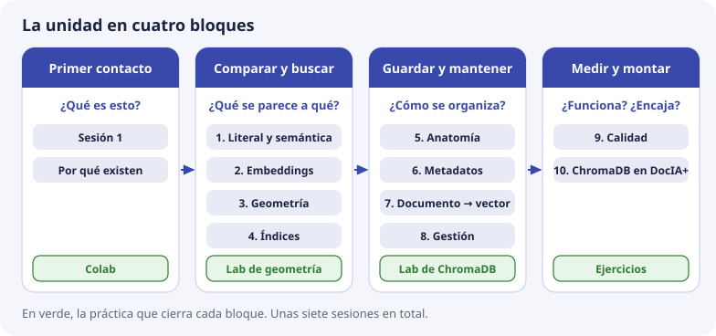

# Cómo seguir la unidad

Esta unidad enseña qué es una base de datos vectorial, cómo funciona por dentro y cómo la va a usar DocIA+, antes de implementarla con los documentos reales del centro. Está pensada para unas **siete sesiones**, compartidas o repartidas entre SBD y BDA.

## Qué hace falta saber antes

- **SQL básico:** qué es una tabla, una fila, una clave primaria, y consultas con `SELECT` y `WHERE`. Muchos temas comparan ChromaDB con una base relacional.
- **Python básico:** listas, bucles, funciones y cómo ejecutar un script. El laboratorio son dos scripts cortos.
- **Nada de inteligencia artificial.** Qué es un embedding, cómo se compara y cómo se busca se explica desde cero.

Las cuentas de los temas se pueden hacer con calculadora: sumas, multiplicaciones y alguna raíz cuadrada.

## Qué sabrás hacer al terminar

- Explicar por qué una búsqueda por palabras no encuentra «formalización de matrícula» al preguntar «¿cómo me matriculo?», y cómo lo resuelve la búsqueda por significado (temas 1 y 2).
- Calcular a mano el coseno entre dos vectores y leer la distancia que devuelve ChromaDB (tema 3).
- Crear una colección en ChromaDB, escribir fragmentos con sus metadatos, consultarlos con filtros, actualizarlos y borrarlos sin dejar restos (temas 5 a 8).
- Diseñar cómo se corta un documento y qué datos acompañan a cada fragmento (temas 6 y 7).
- Medir si la búsqueda cumple el objetivo del proyecto y encontrar la causa cuando no lo cumple (tema 9).
- Explicar cómo encaja ChromaDB en DocIA+ y qué decisiones no se pueden cambiar después (tema 10).

## El mapa

| Tema | Pregunta que responde |
| --- | --- |
| [Sesión 1. Ver la base vectorial](sesion-01.md) | ¿Qué aspecto tiene un vector y qué hace una base vectorial con él? |
| [Por qué existen](00-por-que-existen.md) | ¿Cuándo aparecieron estas bases y para qué? No nacieron para los chatbots |
| [1. Búsqueda literal y semántica](01-busqueda-literal-y-semantica.md) | ¿Por qué no basta con SQL o con buscar palabras? |
| [2. Embeddings](02-embeddings.md) | ¿Qué es el vector y qué modelo lo produce en DocIA+? |
| [3. Geometría y similitud](03-geometria-y-similitud.md) | ¿Cómo se calcula que dos textos «se parecen»? |
| [4. Búsqueda e índices](04-busqueda-e-indices.md) | ¿Cómo se encuentra el más parecido sin compararlo con todos? |
| [5. Anatomía](05-anatomia-bd-vectorial.md) | ¿Qué se guarda en una base vectorial y dónde? |
| [6. Metadatos y filtros](06-metadatos-y-filtros.md) | ¿Cómo conviven las cinco categorías en una sola colección? |
| [7. Del documento al vector](07-chunking-y-ciclo-de-indexacion.md) | ¿Cómo se corta un documento y cómo llega a la base? |
| [8. Operaciones de gestión](08-operaciones-de-gestion.md) | ¿Cómo se da de alta, se consulta, se cambia y se borra? |
| [9. Calidad y fallos](09-calidad-y-fallos.md) | ¿Cómo sabemos si la búsqueda funciona, y qué hacemos si no? |
| [10. ChromaDB en DocIA+](10-chromadb-en-docia.md) | ¿Cómo encaja todo en el proyecto? |

## Recorrido de los martes

Para el grupo que comienza con Qdrant, seguir [De Qdrant a ChromaDB](qdrant-a-chromadb.md): primero Ver el vector, después la introducción comentada y el reto, y por último ChromaDB. El segundo cuaderno de la sesión 1 se reserva para esa transición. La [planificación de los martes](../00-proyecto/martes-y-entrega.md) diferencia BDA y SBD y fija la entrega antes de la Formación en Empresa.

La tabla siguiente conserva el itinerario conceptual directo a ChromaDB. No hay que repetir ambos recorridos completos.

## Secuencia de aula

| Sesión | Qué se trabaja | Práctica | Ejercicios | Módulo con más peso |
| --- | --- | --- | --- | --- |
| 1 | [Sesión 1](sesion-01.md) | Cuaderno de Colab | — | Los dos |
| 2 | Por qué existen, temas 1 y 2, con los dos vídeos de CodelyTV que enlazan esos temas | — | 1 y 4 | Los dos |
| 3 | Tema 3 | [Laboratorio de geometría](https://github.com/iesataulfoargentasor/DocIA-Plus/blob/main/laboratorio/01_geometria_similitud.py) | 2 y 3 | Los dos |
| 4 | Tema 4 | — | 9 | Los dos, con más peso conceptual en BDA |
| 5 | Temas 5 y 6, y un primer esquema de metadatos | — | 5 y 8 | SBD |
| 6 | Temas 7 y 8 | [Laboratorio de ChromaDB](https://github.com/iesataulfoargentasor/DocIA-Plus/blob/main/laboratorio/02_chromadb_coleccion.py) | 6 | BDA, con SBD revisando metadatos |
| 7 | Temas 9 y 10 | — | 7 y 10 | Los dos |

Si el grupo ya ha visto similitud en otro módulo, las sesiones 3 y 4 se pueden juntar. Las instrucciones de los dos laboratorios están en [laboratorio/README.md](https://github.com/iesataulfoargentasor/DocIA-Plus/blob/main/laboratorio/README.md).

## Cómo trabajar cada tema

Todos los temas siguen el mismo patrón:

1. **Empiezan por un problema** con el ejemplo de la matrícula, y solo después dan el nombre técnico.
2. **Hacen las cuentas con números pequeños**, que se pueden repetir con calculadora o en Python. Rehacerlas es la mejor forma de entenderlas.
3. **Tienen esquemas**. Mira el esquema antes de leer la explicación que lo acompaña.
4. **Lo que dicen de ChromaDB está comprobado** con la versión 1.1.0, la del laboratorio. Si una versión posterior se comporta distinto, manda lo que se ve al ejecutar.
5. **Terminan con «Comprueba que lo has entendido»**. Contesta cada pregunta antes de abrir la respuesta. Si fallas una, vuelve a la sección de la que sale antes de seguir.

## El ejemplo que se repite

Casi todos los temas usan los mismos textos. Tenerlos a mano ayuda a seguir las cuentas.

**Los cinco textos del tema 1**, con dos ejes de juguete (cuánto hablan de matrícula y cuánto de cafetería):

| Letra | Texto | Vector | Coseno con P |
| --- | --- | --- | --- |
| P | ¿Cómo me matriculo? *(la pregunta)* | (4, 1) | — |
| F | Procedimiento de formalización de matrícula | (3, 1) | 0,997 |
| I | Plazo de inscripción en el ciclo | (5, 0) | 0,970 |
| C | Menú diario de la cafetería | (1, 4) | 0,471 |
| B | Precio del bocadillo | (0, 3) | 0,243 |

**El laboratorio** usa tres ejes (matrícula, horas, convivencia). Allí el fragmento de matrícula sale a distancia **0,002** de la pregunta, que es 1 menos un coseno de 0,998 (tema 3).

**Los documentos de ejemplo** y su forma de identificar cada fragmento:

| Documento | `doc_id` | Categoría | Primer fragmento |
| --- | --- | --- | --- |
| Oferta formativa del curso de especialización | `oferta-iabd-2026` | `g4` | `oferta-iabd-2026_000` |
| Proyecto educativo de centro | `pec-2026` | `g2` | `pec-2026_000` |
| Calendario escolar | `calendario-2026` | `g5` | `calendario-2026_000` |

## Vocabulario

En el aula usaremos estas palabras con un solo significado:

| Palabra | Significado en DocIA+ | Tema |
| --- | --- | --- |
| Documento | El fichero original: un PDF, un DOCX o una página web | 1 |
| Fragmento o *chunk* | Un trozo de documento, de unos pocos párrafos, que se convierte en un solo vector | 7 |
| Embedding o vector | La lista de números que representa de qué habla un fragmento o una pregunta | 2 |
| Modelo de embeddings | El programa que convierte texto en vector. En DocIA+, Titan Embeddings v2 | 2 |
| Dimensión | Cuántos números tiene el vector. Con Titan, 1024 | 2 |
| Normalizar | Ajustar el vector para que su longitud sea 1 | 3 |
| Coseno | Medida de parecido entre dos vectores, de −1 a 1. Cuanto más cerca de 1, más se parecen | 3 |
| Distancia | El número que devuelve ChromaDB para ordenar. En espacio coseno es 1 − coseno: 0 es idéntico y cuanto más pequeña, más parecido | 3 |
| Top-k | Los k resultados más cercanos. En DocIA+, k entre 3 y 5 | 4 |
| Índice HNSW | La estructura que permite encontrar los vecinos más cercanos sin comparar con todos | 4 |
| Colección | El conjunto de fragmentos guardados en ChromaDB. Es lo parecido a una tabla. DocIA+ usa una principal | 5 |
| Registro | Cada fragmento dentro de la colección: identificador, texto, vector y metadatos | 5 |
| Metadatos | Datos que acompañan al fragmento, como `categoria`, `curso` o `pagina`, y que sirven para filtrar y citar | 6 |
| Filtro (`where`) | La condición que decide qué registros participan en una consulta | 6 |
| Consulta | El vector de la pregunta, más los filtros de metadatos | 6 |
| Hash | Una huella del texto que cambia si el texto cambia. Sirve para no recalcular vectores sin necesidad | 7 |
| Indexar | Dejar el fragmento escrito en la colección, con su vector y sus metadatos, listo para recuperarse | 7 |
| `upsert` | Escribir un registro: lo crea si no existe y lo sustituye si existe | 8 |
| Huérfano | Un fragmento que sigue en la colección aunque ya no existe en la versión actual del documento | 8 |
| Conjunto de pruebas | Preguntas escritas de antemano, con el documento que debe responderlas | 9 |
| Acierto@k | Proporción de preguntas de prueba cuyo documento correcto aparece entre los k primeros | 9 |
| Umbral | La distancia a partir de la cual DocIA+ dice que no tiene documentación suficiente | 9 |
| RAG | Diseño en dos pasos: primero se recuperan fragmentos, después un modelo redacta con ellos | 1 |
