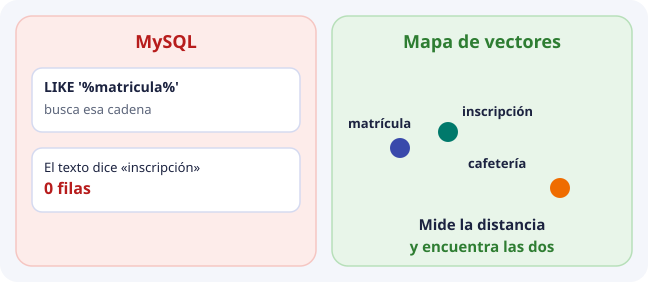
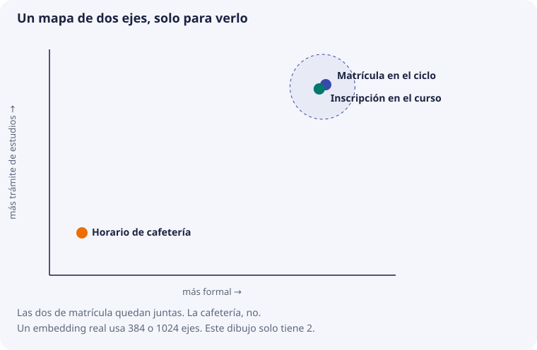

# Sesión 1. Ver qué es una base de datos vectorial

Esta es la primera sesión. No hace falta haber leído los temas 1 a 10. Esos temas vienen después, cuando el grupo ya ha visto un vector de verdad y ha hecho una consulta en ChromaDB.

La sesión dura unos 75 minutos: 15 de pizarra y 60 de cuaderno.

## 15 minutos. El mapa, sin código

Una base de datos que ya conocéis, MySQL, busca una cadena. Si el texto dice «inscripción» y la consulta pide `matricula`, no hay fila.

Una base vectorial no busca la cadena. Coloca cada frase en un mapa. Las que hablan de lo mismo quedan juntas. Buscar es medir qué punto está más cerca.

Los ejes de este dibujo los hemos puesto nosotros para poder verlo. Un modelo de embeddings hace lo mismo con muchos más ejes: 384 en el modelo pequeño de esta sesión, 1024 con Amazon Titan en el proyecto.

Cuando eso se vea claro en la pizarra, se abre el cuaderno. Si se ejecuta ChromaDB antes de este mapa, la base parece una caja que adivina textos.

## 15 minutos. Ver el vector, antes de guardarlo

Cuaderno [01_ver_el_vector.ipynb](https://github.com/iesataulfoargentasor/DocIA-Plus/blob/main/laboratorio/colab/01_ver_el_vector.ipynb).

[Abrir en Google Colab](https://colab.research.google.com/github/iesataulfoargentasor/DocIA-Plus/blob/main/laboratorio/colab/01_ver_el_vector.ipynb)

Ahí no hay base de datos. Hay un modelo pequeño y gratuito, `all-MiniLM-L6-v2`, que convierte una frase en una lista de 384 números. El alumno imprime los diez primeros. Eso es un embedding: la posición de la frase en el mapa.

Después se mide la distancia entre tres frases de práctica:

- formalización de matrícula;
- instrucciones para inscribirse;
- menú de la cafetería.

La distancia entre las dos primeras sale más pequeña que la distancia entre matrícula y cafetería. Número más pequeño, más cerca. Las frases son de ejercicio. No son documentos oficiales del centro.

En el proyecto el modelo será Titan y la lista tendrá 1024 números. No se pueden mezclar con estos 384. Es otro mapa.

## 45 minutos. ChromaDB, despacio

Cuaderno [02_chromadb_paso_a_paso.ipynb](https://github.com/iesataulfoargentasor/DocIA-Plus/blob/main/laboratorio/colab/02_chromadb_paso_a_paso.ipynb).

[Abrir en Google Colab](https://colab.research.google.com/github/iesataulfoargentasor/DocIA-Plus/blob/main/laboratorio/colab/02_chromadb_paso_a_paso.ipynb)

El orden del cuaderno es este:

1. Crear una colección. En SQL sería una tabla. Aquí se llama colección.
2. Convertir cada frase con el mismo modelo de antes y guardar cuatro cosas: identificador, texto, vector y categoría.
3. Mirar por dentro el vector que quedó guardado.
4. Hacer una pregunta con otras palabras y pedir los dos textos más cercanos. La distancia cerca de 0 es más parecida.
5. Repetir la pregunta obligando a la categoría `Secretaria`. Eso es el filtro. No es otro vector.
6. Ver la diferencia entre una colección que vive solo en memoria y una que se escribe en disco. La segunda es la que se puede apagar y volver a abrir. Por eso hablamos de base de datos, y no solo de un buscador.

Si en `add` solo se pasa el texto y no el vector, ChromaDB llama a un modelo que el alumno no ve. En este cuaderno no se hace así. El vector se calcula en una línea, se imprime y luego entra en la colección.

El cuaderno cierra con un ejercicio: añadir una frase sobre el aparcamiento de bicicletas, categoría `Servicios`, y preguntar dónde dejar la bicicleta.

## Qué no entra todavía

HNSW, el coseno a mano, Titan, AWS y el corpus real del IES. Están en los temas siguientes y en el [laboratorio con vectores escritos a mano](https://github.com/iesataulfoargentasor/DocIA-Plus/blob/main/laboratorio/README.md), que sirve cuando ya se ha visto un vector de verdad y se quiere calcular la geometría sin descargar un modelo.

## Después de esta sesión

El grupo tiene que poder decir, con el cuaderno cerrado, cuatro cosas:

1. MySQL busca la palabra. La base vectorial busca el punto más cercano.
2. Un embedding es una lista de números. La hemos impreso.
3. Cada registro guarda identificador, texto, vector y metadatos.
4. El filtro de categoría y la cercanía son dos cosas distintas.
