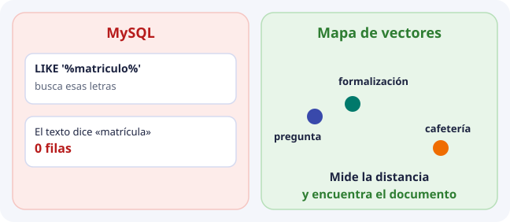
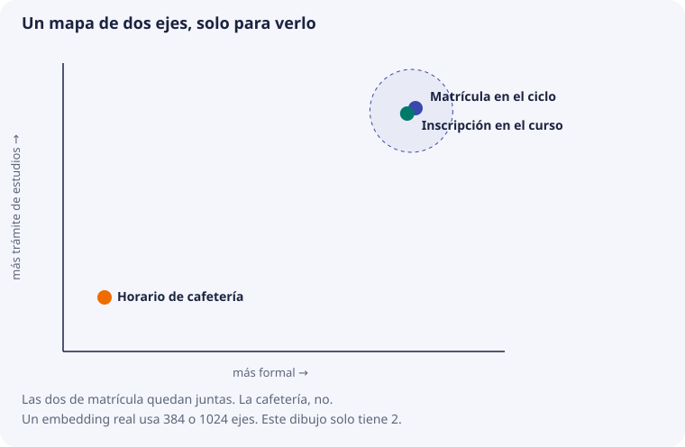
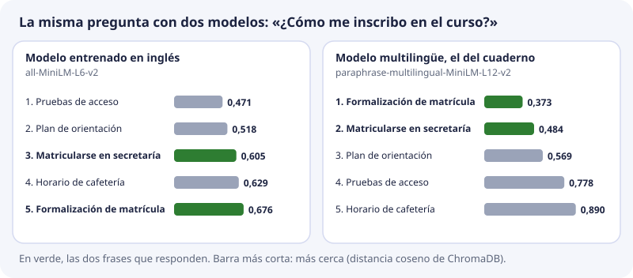

# Sesión 1. Ver qué es una base de datos vectorial

Esta es la primera sesión. No hace falta haber leído los temas 1 a 10. El grupo parte de cero: sabe consultar una tabla y no ha visto nunca un embedding.

## Qué vamos a hacer hoy

| Parte | Qué se hace | Para qué |
| --- | --- | --- |
| 1. El mapa, sin código | Trece diapositivas: del dato en bruto (texto, imagen, audio, vídeo) al vector | Entender qué hay que hacer **antes** de que exista una base vectorial |
| 2. Ver el vector | Primer cuaderno de Colab: convertir frases en 384 números y medir cuáles quedan cerca | Ver con tus ojos que un embedding es una lista de números |
| 3. ChromaDB, despacio | Segundo cuaderno: guardar cinco frases, preguntar con otras palabras, filtrar y guardar en disco | Ver qué añade la base de datos a esa lista |

Solo hace falta una cuenta de Google para abrir Colab. No hay que instalar nada en el ordenador.

La sesión explica tecnologías generales que después usaremos en DocIA+. El proyecto es el caso, no el único ejemplo.

## El mapa, sin código

Una base vectorial no acepta «el PDF», «la foto» o «el audio» como si fueran una fila de MySQL. Antes hay que convertir un trozo de ese dato en una lista de números. Esa conversión es el trabajo previo. La base, después, solo guarda la lista y busca las listas cercanas.

En clase se recorre diapositiva a diapositiva. El recuadro se selecciona con un clic y las flechas del teclado pasan de una a otra. Si el navegador no ejecuta el script, las diapositivas se leen seguidas.

<div class="dia-deck" data-dia>
  <div class="dia-slide">
    <p class="dia-kicker">1 · De dónde partimos</p>
    <h3>Ya sabéis buscar una cadena</h3>
    <p>Alguien pregunta «¿Cómo me matriculo?». En MySQL, <code>LIKE '%matriculo%'</code> busca esas letras. El documento dice «Procedimiento de formalización de matrícula», y no hay fila: «matriculo» no es un trozo de «matrícula». La base ha hecho bien su trabajo: la cadena no está.</p>
    <p>Esa búsqueda sirve para un código, un nombre propio o una fecha. No sirve cuando la persona pregunta con otras palabras y el documento responde igual.</p>
    
  </div>
  <div class="dia-slide">
    <p class="dia-kicker">2 · Qué dato tenemos</p>
    <h3>Texto, imagen, audio y vídeo no son filas</h3>
    <p>Una matrícula en una tabla tiene columnas: nombre, ciclo, fecha. Un apunte, una foto de un plano, una grabación de clase o un vídeo de taller no tienen esas columnas. El nombre del archivo no es el contenido.</p>
    <ul>
      <li><strong>Texto.</strong> Frases. El significado no coincide con las palabras de la pregunta.</li>
      <li><strong>Imagen.</strong> Píxeles. No hay una celda que diga «casco amarillo».</li>
      <li><strong>Audio.</strong> Una onda. Puede importar lo que se dice o cómo suena.</li>
      <li><strong>Vídeo.</strong> Imagen, voz y una línea de tiempo a la vez.</li>
    </ul>
  </div>
  <div class="dia-slide">
    <p class="dia-kicker">3 · El camino</p>
    <h3>Del dato en bruto al vector</h3>
    <p>Antes de abrir la base vectorial, el dato pasa por cuatro pasos. Es el mismo esquema para las cuatro modalidades. Cambia el modelo, no la idea.</p>
    <div class="dia-pasos">
      <p class="dia-paso"><strong>1. Original</strong><span>Se conserva el archivo. El vector no lo sustituye.</span></p>
      <p class="dia-paso"><strong>2. Trozo</strong><span>Una unidad que se pueda devolver: párrafo, foto, tramo, minuto.</span></p>
      <p class="dia-paso"><strong>3. Embedding</strong><span>Un modelo convierte ese trozo en n números.</span></p>
      <p class="dia-paso"><strong>4. Base vectorial</strong><span>Guarda el vector, el trozo y sus datos, y busca vecinos.</span></p>
    </div>
  </div>
  <div class="dia-slide">
    <p class="dia-kicker">4 · El original</p>
    <h3>El vector es una representación, no una copia</h3>
    <p>El modelo lee un trozo y devuelve números. Esos números no se pueden abrir como PDF ni como foto. Si más adelante se cambia el modelo, hay que volver a calcularlos, y para eso el archivo original tiene que seguir existiendo.</p>
    <p>Por eso cada registro enlaza las dos cosas: el vector, y una referencia al original (identificador, ruta, página o minuto). Buscar encuentra el vector cercano. Citar o mostrar exige el original.</p>
  </div>
  <div class="dia-slide">
    <p class="dia-kicker">5 · Trocear</p>
    <h3>No se embebe el archivo entero</h3>
    <p>Un modelo admite una entrada con un tamaño máximo. Y quien busca no quiere el manual de 80 páginas: quiere el párrafo que responde. Trocear es decidir cuál es la unidad que se va a poder recuperar.</p>
    <ul>
      <li><strong>Texto.</strong> Párrafos o fragmentos con un poco de contexto, no el libro entero ni una sola palabra.</li>
      <li><strong>Imagen.</strong> A menudo la imagen completa. A veces una zona, si la foto contiene varias cosas.</li>
      <li><strong>Audio.</strong> Un tramo. Si la pregunta es por lo que se dijo, primero se transcribe y se trocea el texto.</li>
      <li><strong>Vídeo.</strong> Un segmento con inicio y fin. La respuesta tiene que llevar a ese momento, no solo al archivo.</li>
    </ul>
  </div>
  <div class="dia-slide">
    <p class="dia-kicker">6 · Embedding</p>
    <h3>Un modelo coloca el trozo en un mapa</h3>
    <p>Un modelo de embeddings ya está entrenado. No redacta y no se entrena en esta sesión. Recibe un trozo y devuelve una lista de n números. Esa lista es el vector. n es la dimensión: la cantidad de ejes del mapa.</p>
    <p>En el dibujo hay 2 ejes, puestos por nosotros para poder verlo. Un modelo real usa cientos. Los ejes de un embedding no se llaman «matrícula» ni «color». El significado está en la posición conjunta, no en el número 37.</p>
    
  </div>
  <div class="dia-slide">
    <p class="dia-kicker">7 · Una sola regla</p>
    <h3>Mismo modelo, misma dimensión</h3>
    <p>El trozo guardado y la pregunta tienen que pasar por el mismo modelo. Si uno tiene 384 números y el otro 1024, no viven en el mismo mapa y no se pueden comparar.</p>
    <p>En el cuaderno de hoy el modelo es pequeño y gratuito: 384 números. En DocIA+, más adelante, Titan devuelve 1024. Son dos mapas. Cambiar de modelo obliga a calcular otra vez todos los vectores.</p>
    <p>Un modelo de texto y un modelo de imagen, por separado, también son mapas distintos. Solo un modelo entrenado para las dos cosas coloca una frase y una foto en el mismo espacio.</p>
  </div>
  <div class="dia-slide">
    <p class="dia-kicker">8 · Texto</p>
    <h3>Documento, fragmentos, vectores</h3>
    <p>Se lee el documento y se parte en fragmentos. Cada fragmento entra en el modelo de texto y sale un vector. En la base se guarda el identificador, el texto de ese fragmento, el vector y los metadatos: de qué documento sale, la página, la categoría.</p>
    <p>La pregunta del usuario hace el camino inverso y más corto: la frase entra en el mismo modelo, sale un vector, y la base devuelve los fragmentos más cercanos. Esos fragmentos son candidatos. Todavía no son la respuesta redactada.</p>
  </div>
  <div class="dia-slide">
    <p class="dia-kicker">9 · Imagen</p>
    <h3>Píxeles, o palabras y píxeles juntos</h3>
    <p>Una foto entra en un modelo de visión y sale un vector. Con eso se puede preguntar «qué fotos se parecen a esta foto»: las dos son imágenes y usan el mismo modelo.</p>
    <p>Si la pregunta es una frase («casco amarillo») y lo guardado es una foto, hace falta un modelo multimodal: uno que haya aprendido a poner texto e imagen en el mismo mapa. Sin ese alineado, la frase y la foto no se pueden comparar, aunque las dos sean listas de números.</p>
  </div>
  <div class="dia-slide">
    <p class="dia-kicker">10 · Audio</p>
    <h3>Lo que se dice no es lo que suena</h3>
    <p>Hay dos preguntas distintas y, por tanto, dos caminos.</p>
    <ul>
      <li><strong>Qué se dijo.</strong> Se transcribe el audio a texto, se trocea y se usa un modelo de texto. La búsqueda es la del apartado anterior.</li>
      <li><strong>Cómo suena.</strong> Un modelo de audio convierte el tramo en un vector. Sirve para parecerse a un ruido, una voz o una melodía, no para encontrar una explicación.</li>
    </ul>
    <p>Elegir mal el camino devuelve vecinos correctos para otra pregunta.</p>
  </div>
  <div class="dia-slide">
    <p class="dia-kicker">11 · Vídeo</p>
    <h3>Varias señales y un reloj</h3>
    <p>Un vídeo no es un solo dato. En cada tramo hay fotogramas, voz y sonido ambiente. Cada señal puede pasar por su modelo. El registro tiene que guardar el instante de inicio y de fin.</p>
    <p>Si alguien pregunta por una explicación dicha en el minuto 12, el resultado útil es ese segmento, con su marca de tiempo, no el archivo de una hora. El original sigue siendo el vídeo; el vector solo señala el momento.</p>
  </div>
  <div class="dia-slide">
    <p class="dia-kicker">12 · La base</p>
    <h3>Qué guarda y qué no hace</h3>
    <p>Cada registro lleva cuatro cosas: un identificador, el vector de n números, el trozo o la ruta al original, y metadatos para filtrar (categoría, página, minuto, modelo usado).</p>
    <p>La base compara vectores y devuelve los más cercanos. No entiende el organigrama del centro y no redacta. Para «solo lo de este curso» o «solo esta categoría» se usa un filtro sobre los metadatos, que funciona como un <code>WHERE</code> de SQL. El filtro acota. La cercanía ordena.</p>
  </div>
  <div class="dia-slide">
    <p class="dia-kicker">13 · Antes del cuaderno</p>
    <h3>Lo que tiene que quedar dicho</h3>
    <ul>
      <li>Sin vector no hay nada que guardar en la base vectorial.</li>
      <li>El vector sale de un trozo, no del archivo entero, y lo calcula un modelo.</li>
      <li>Texto, imagen, audio y vídeo cambian el modelo y el trozo. La base, no.</li>
      <li>La pregunta se convierte con el mismo modelo. Número de distancia más pequeño, más cerca.</li>
    </ul>
    <p>El cuaderno de ahora solo hace la parte de texto, con frases cortas que ya son un trozo. Así se ve la lista de números antes de esconderla dentro de la base.</p>
  </div>
  <div class="dia-bar">
    <button type="button" data-dia-prev>Anterior</button>
    <span class="dia-count" data-dia-count>1 / 13</span>
    <button type="button" data-dia-next>Siguiente</button>
  </div>
</div>

DocIA+ recorrerá este camino con documentos de texto del centro. Imagen, audio y vídeo quedan explicados aquí para ver que la base es la misma y la puerta de entrada no. No hace falta dominarlos para abrir el cuaderno.

## Ver el vector, antes de guardarlo

Cuaderno [01_ver_el_vector.ipynb](https://github.com/iesataulfoargentasor/DocIA-Plus/blob/main/laboratorio/colab/01_ver_el_vector.ipynb).

[Abrir en Google Colab](https://colab.research.google.com/github/iesataulfoargentasor/DocIA-Plus/blob/main/laboratorio/colab/01_ver_el_vector.ipynb)

En este cuaderno no hay base de datos. El objetivo es obtener el vector y mirarlo. Si se salta este paso, la base del cuaderno siguiente parece adivinar textos.

Las frases son de ejercicio, no documentos oficiales del centro. Ya son cortas, así que aquí no hay que trocear: cada frase es el trozo.

### Por qué se instala una librería

Python no trae un modelo de embeddings. `sentence-transformers` es la librería que sabe cargar uno ya entrenado y gratuito: `paraphrase-multilingual-MiniLM-L12-v2`. «Multilingual» significa que se entrenó con muchos idiomas, español incluido. No lo entrenamos: lo usamos como una función. Entra texto, salen números. La primera ejecución tarda un par de minutos porque tiene que bajar el modelo, unos 450 MB.

### Convertir una frase en números

`SentenceTransformer` carga el modelo. `encode` hace el embedding: la frase entra y sale una lista. Le pedimos `normalize_embeddings=True`, que ajusta la lista para que su **longitud sea 1**. Es lo que hará Titan en DocIA+, y en el [tema 3](03-geometria-y-similitud.md) se ve por qué conviene.

Esta es la salida real:

```text
Texto:
Procedimiento de formalización de matrícula en el curso de especialización.

Cuántos números tiene el vector: 384
Longitud del vector: 1.0
Los 10 primeros:
[ 0.1036848   0.09317485 -0.03956842 -0.01952359 -0.03878934  0.02332297
 -0.06079862 -0.03470635 -0.06651381 -0.01575202]
```

Tres cosas que mirar:

1. La salida es una lista de decimales, no una frase ni un resumen.
2. Tiene 384 números porque ese modelo se construyó así. No se elige en esta línea.
3. Un número suelto no se lee. El 0,1037 no significa «matrícula». El significado está en la lista completa, comparada con otras listas del mismo modelo.

### Medir quién está cerca

Se convierten tres frases con el mismo modelo: formalización de matrícula, instrucciones para inscribirse y el menú de la cafetería. Python resta dos listas y mide lo larga que queda la resta. Eso es una distancia, y no hace falta una base de datos para calcularla: la cercanía es una propiedad de los vectores.

```text
Distancia matrícula - inscripción: 0.8267
Distancia matrícula - cafetería:   1.3755

La inscripción queda más cerca de la matrícula que la cafetería.
```

Número más pequeño, más cerca. Matrícula e inscripción hablan del mismo trámite con otras palabras, y quedan más cerca que matrícula y cafetería.

### Dos formas de medir, el mismo orden

En el cuaderno siguiente, ChromaDB dará otro número: la **distancia coseno**, que es 1 menos el coseno (tema 3). Para las mismas frases:

| Pareja | Resta de listas (este cuaderno) | Coseno | Distancia coseno (ChromaDB) |
| --- | --- | --- | --- |
| Matrícula – inscripción | 0,827 | 0,658 | 0,342 |
| Matrícula – cafetería | 1,376 | 0,054 | 0,946 |

Los números son distintos, pero **ordenan igual**: la inscripción queda más cerca en las dos columnas. Con vectores de longitud 1 hay una relación exacta entre ellas:

```text
resta = √(2 × distancia coseno)
0,827 = √(2 × 0,342)
```

Por eso no se compara un número de una columna con uno de la otra: un 0,83 de la resta no es «peor» que un 0,37 de ChromaDB. Son escalas distintas.

### El modelo importa

Para ver cuánto importa el modelo, repetimos la búsqueda del cuaderno siguiente (cinco frases y la pregunta «¿Cómo me inscribo en el curso?») con otro modelo muy usado, `all-MiniLM-L6-v2`, entrenado casi solo con textos en inglés:



Con el modelo en inglés, la frase de formalización de matrícula quedaba **la última** de cinco. Con el multilingüe, las dos frases de matrícula son las dos primeras. La base de datos es la misma, y la pregunta y las frases también: solo ha cambiado el modelo.

Es la primera lección de la unidad: **una base vectorial solo encuentra lo que el modelo ha colocado bien.** Por eso DocIA+ usa Titan, que entiende español, y por eso la calidad se mide con preguntas de prueba antes de dar nada por bueno (temas 2 y 9).

En el proyecto el modelo será Titan y la lista tendrá 1024 números. No se pueden mezclar con estos 384.

## ChromaDB, despacio

Cuaderno [02_chromadb_paso_a_paso.ipynb](https://github.com/iesataulfoargentasor/DocIA-Plus/blob/main/laboratorio/colab/02_chromadb_paso_a_paso.ipynb).

[Abrir en Google Colab](https://colab.research.google.com/github/iesataulfoargentasor/DocIA-Plus/blob/main/laboratorio/colab/02_chromadb_paso_a_paso.ipynb)

Hasta aquí el vector vivía en una variable de Python y se perdía al cerrar el cuaderno. ChromaDB es el sitio donde se guarda para poder buscarlo después. El orden importa: primero el modelo, después la colección, después los vectores calculados por nosotros.

1. **El mismo modelo.** Se vuelve a cargar el modelo multilingüe y se imprime 384. Si este número no coincide con el del cuaderno anterior, las listas no se pueden comparar. Por eso no se deja que ChromaDB elija un modelo oculto.
2. **La colección.** Es el equivalente a una tabla. Se crea vacía, en memoria (`EphemeralClient`), y se le dice que compare con distancia coseno. Más pequeña, más parecido, y 0 si los vectores son iguales.
3. **Guardar cinco frases.** Cada frase ya es un trozo. `encode` calcula los cinco vectores y `add` guarda las cuatro piezas del registro: identificador, texto, vector y categoría. El texto se guarda porque el vector no se puede citar. La categoría se guarda para filtrar, no porque forme parte del vector. Los códigos son los del proyecto: `g4` oferta educativa, `g3` planes, `g5` horarios y actividades. La palabra «secretaría» puede estar en el texto y el código seguir siendo `g4`.
4. **Mirar dentro.** Se pide el registro `doc1` y se comprueba que el vector guardado tiene 384 números y los mismos valores que en el cuaderno anterior (0,1037, 0,0932…). La base no lo ha recalculado.
5. **Preguntar con otras palabras.** «¿Cómo me inscribo en el curso?» no contiene «formalización» ni «matrícula». La pregunta pasa por el mismo `encode` y la base devuelve los dos textos más cercanos:

    ```text
    1. distancia=0.3729  categoria=g4
       Procedimiento de formalización de matrícula en el curso de especialización.

    2. distancia=0.4844  categoria=g4
       Para matricularse hay que presentar la solicitud en secretaría.
    ```

    Eso es la búsqueda: el mismo camino que al guardar, y luego los vecinos.

6. **Filtrar.** Con la pregunta amplia «¿Cuándo hay que hacer los trámites?» y el filtro `categoria = g4` salen solo las frases de oferta educativa: la de matricularse en secretaría y la de las pruebas de acceso. El filtro no es otro vector. Quita registros antes de ordenar por cercanía, igual que un `WHERE` en SQL.
7. **Memoria y disco.** La colección en memoria desaparece al cerrar el cuaderno. `PersistentClient` escribe una carpeta; se abre otro cliente sobre ella y el recuento sigue siendo 5. Una base de datos tiene que seguir ahí mañana. Una variable, no.

El cuaderno cierra con un ejercicio: añadir la frase «El centro dispone de aparcamiento para bicicletas.», categoría `g5`, calcular su vector y preguntar «¿Dónde puedo dejar la bicicleta?». Tiene que salir esa frase, a una distancia de unos **0,37**. La siguiente frase más cercana queda por encima de 0,88.

Este ChromaDB de Colab no es el de la carpeta `laboratorio/`. Aquel usa vectores escritos a mano, sin descargar un modelo: la parte de geometría se hace después del tema 3 y la de ChromaDB después de los temas 7 y 8.

## Qué no entra todavía

El coseno calculado a mano, el índice HNSW, la llamada a Titan, AWS y el corpus real del IES. Están en los temas siguientes y en el [laboratorio con vectores escritos a mano](https://github.com/iesataulfoargentasor/DocIA-Plus/blob/main/laboratorio/README.md).

Esas ideas se ven también en dos vídeos de CodelyTV: la comparación entre SQL y la búsqueda por significado, en el tema de [búsqueda literal y semántica](01-busqueda-literal-y-semantica.md), y el mapa del vector, en el tema de [embeddings](02-embeddings.md). La base de los vídeos es PostgreSQL. La de esta sesión y la del proyecto es ChromaDB.

## Comprueba que lo has entendido

??? question "1. ¿Por qué una base vectorial no puede guardar directamente un PDF o una foto?"
    Porque solo guarda y compara listas de números. Antes hay que cortar el dato en trozos y pasar cada trozo por un modelo de embeddings que lo convierta en vector. El original se conserva aparte.

??? question "2. El primer cuaderno imprime un vector de 384 números. ¿Qué significa el primero, 0,1037?"
    Nada por sí solo. Un número suelto no se interpreta. El significado está en la posición de la lista completa respecto a otras listas del mismo modelo.

??? question "3. ¿Por qué la pregunta tiene que pasar por el mismo modelo que las frases guardadas?"
    Porque cada modelo coloca los textos en su propio mapa. Dos listas de modelos distintos no se pueden comparar, aunque tengan la misma cantidad de números.

??? question "4. El primer cuaderno da 0,827 entre matrícula e inscripción, y ChromaDB da 0,342 para la misma pareja. ¿Cuál es más cercana?"
    La pregunta no tiene sentido: son dos formas distintas de medir, en escalas distintas. Las dos dicen lo mismo, que la inscripción está más cerca de la matrícula que la cafetería. Con vectores de longitud 1, 0,827 = √(2 × 0,342).

??? question "5. Con el modelo en inglés, la frase de formalización de matrícula salía la última. ¿Qué había fallado: la base o el modelo?"
    El modelo. La base ordenó bien los vectores que recibió. El problema es que el modelo no había colocado bien las frases en español. Por eso se mide la calidad con preguntas de prueba.

??? question "6. En el filtro por `g4`, ¿el filtro cambia los vectores?"
    No. El filtro quita los registros que no son `g4` y, entre los que quedan, la base ordena por cercanía. Es como un `WHERE` antes del `ORDER BY`.

??? question "7. ¿Qué diferencia hay entre `EphemeralClient` y `PersistentClient`?"
    El primero guarda la colección en memoria y se pierde al cerrar el cuaderno. El segundo la escribe en una carpeta y se puede volver a abrir. En el tema 10 se ve una tercera forma, el servidor, que es la de DocIA+.
