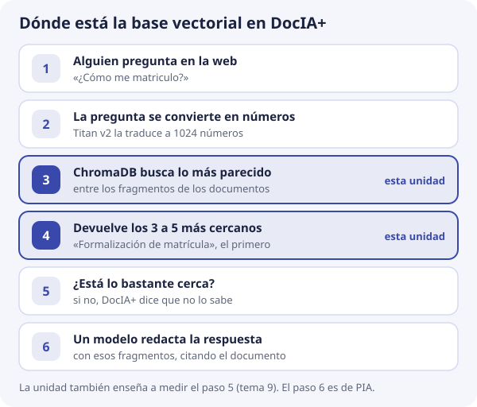

# DocIA+ · Unidad de bases de datos vectoriales

Material de aula para el Curso de Especialización en Inteligencia Artificial y Big Data del IES Ataúlfo Argenta. El proyecto de innovación DocIA+ ya está concedido. Esta unidad es el primer paso técnico de **SBD** y **BDA**: comprender la base de datos donde vivirán los embeddings, antes de construirla.

## El sistema, en una frase

Una persona escribe una pregunta sobre la documentación del IES. El sistema busca los fragmentos de documento cuyo **significado** se parece a esa pregunta y, con esos fragmentos delante, un modelo de lenguaje redacta la respuesta citando la fuente.

La pieza que hace posible la búsqueda por significado es la **base de datos vectorial**.

En esta unidad nos quedamos en el paso 3: que ChromaDB tenga fragmentos buenos. La redacción de la respuesta corresponde más adelante a PIA.

## Cómo está organizada

| Bloque | Para qué sirve |
| --- | --- |
| [Qué vamos a construir](00-proyecto/que-vamos-a-construir.md) | El producto, las cinco categorías documentales y el sitio de la base vectorial |
| [El encargo de SBD y BDA](00-proyecto/encargo-sbd-bda.md) | Qué parte del currículo cubre este trabajo y qué no |
| [Unidad 1 a 10](01-bases-vectoriales/index.md) | Las bases de datos vectoriales, con el caso DocIA+ como hilo |
| [Laboratorio](https://github.com/iesataulfoargentasor/DocIA-Plus/blob/main/laboratorio/README.md) | Dos prácticas locales, sin cuenta de AWS |

## Orden de lectura

1. Contexto del proyecto.
2. Temas 1 a 4: por qué un vector, cómo se compara y cómo se busca entre muchos.
3. Laboratorio 1 (geometría, solo Python).
4. Temas 5 a 8: qué se guarda, cómo se filtra por categoría y cómo entra y sale un documento.
5. Laboratorio 2 (ChromaDB en local).
6. Temas 9 y 10: cómo sabremos si la base está bien y qué decisión de diseño ya está tomada en el proyecto.

Los [ejercicios](01-bases-vectoriales/ejercicios.md) cierran la unidad.
